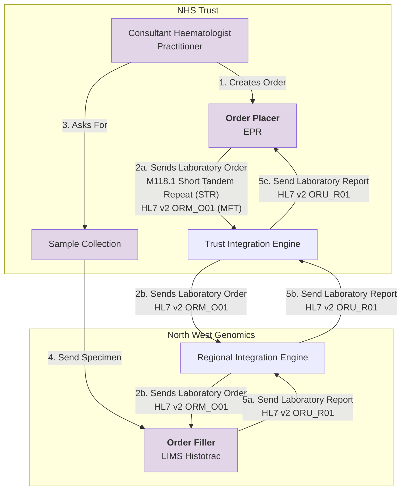
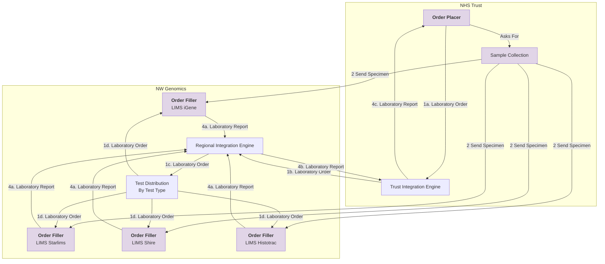

### Chimerism

The chimerism testing pathway within the NHS is used to monitor the success of a haematopoietic stem cell transplant (HSCT) and involves a specific process of sample collection, transport, and analysis guided by clinical consensus guidelines. The testing is requested by a patient's clinical team, not directly by the patient.

 

Chimerism Genomic Tests - MFT
 
 

### Automated Test Order Delivery

