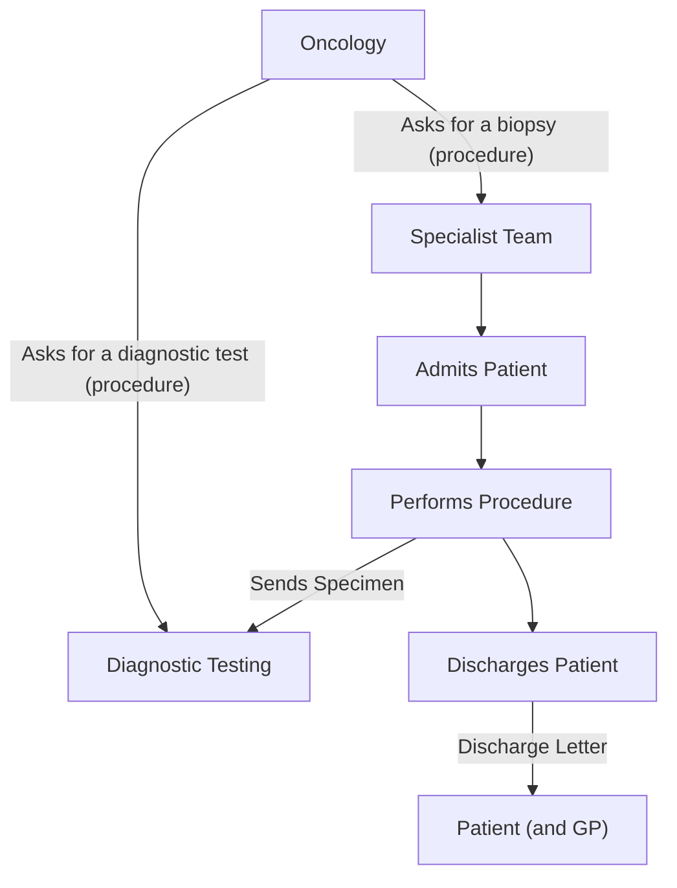

```mermaid
graph TD;

    Oncology --> |"Asks for a biopsy (procedure)"| SpecialistTeam[Specialist Team]
    Oncology --> |"Asks for a diagnostic test (procedure)"| DiagnosticTesting[Diagnostic Testing]
    SpecialistTeam --> Admits[Admits Patient]
    Admits --> Performs[Performs Procedure]
    Performs --> Discharge[Discharges Patient]
    Performs --> |Sends Specimen| DiagnosticTesting
    Discharge --> |Discharge Letter| Patient["Patient (and GP)"]

```