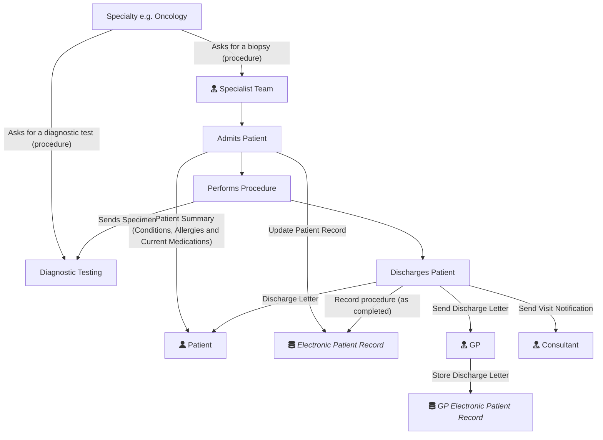

Specimen collection is not performed by a Genomics service, and this shows how genomics fits into that process. The diagram here is around a biopsy procedure, but the same principles apply to other specimen collection procedures.

