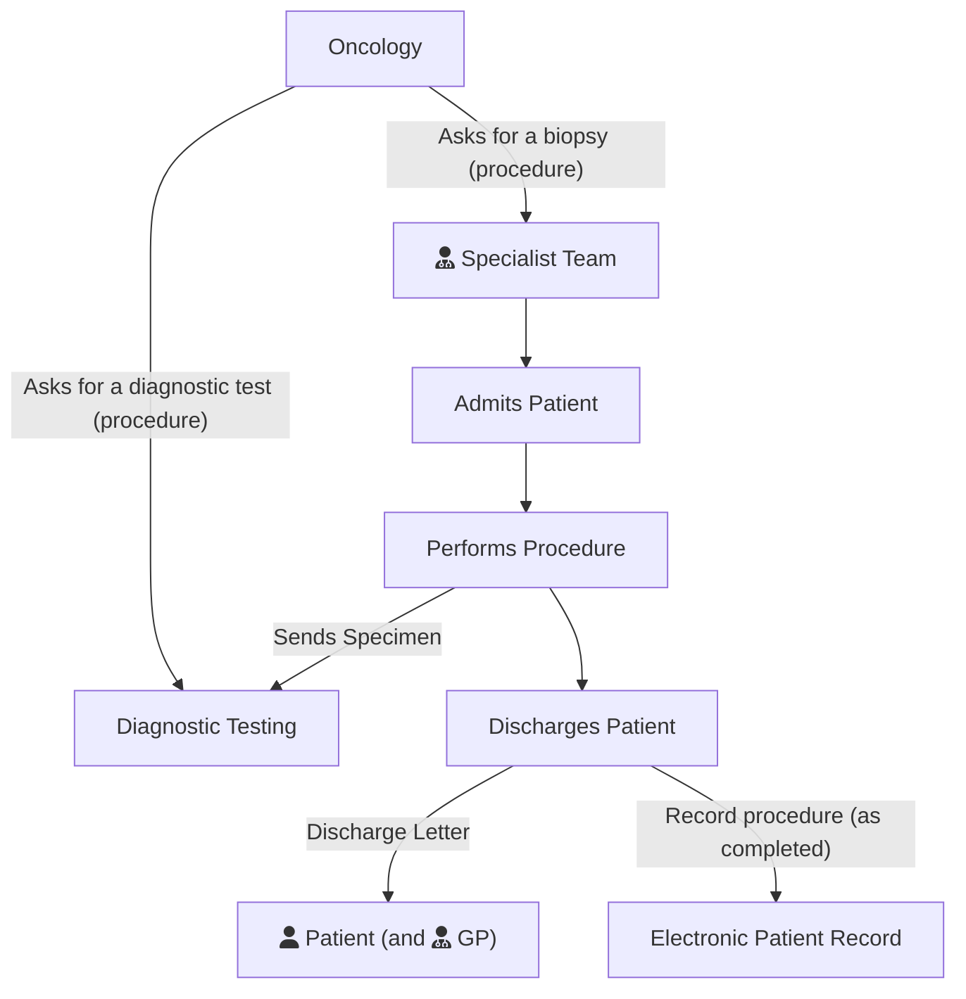

```mermaid
graph TD;

    Oncology --> |"Asks for a biopsy (procedure)"| SpecialistTeam[fas:fa-user-md Specialist Team]
    Oncology --> |"Asks for a diagnostic test (procedure)"| DiagnosticTesting[Diagnostic Testing]
    SpecialistTeam --> Admits[Admits Patient]
    Admits --> Performs[Performs Procedure]
    Performs --> Discharge[Discharges Patient]
    Performs --> |Sends Specimen| DiagnosticTesting
    Discharge --> |Discharge Letter| Patient["fas:fa-user Patient (and fas:fa-user-md GP)"]
    Discharge --> |"Record procedure (as completed)"| EPR["Electronic Patient Record"]
```