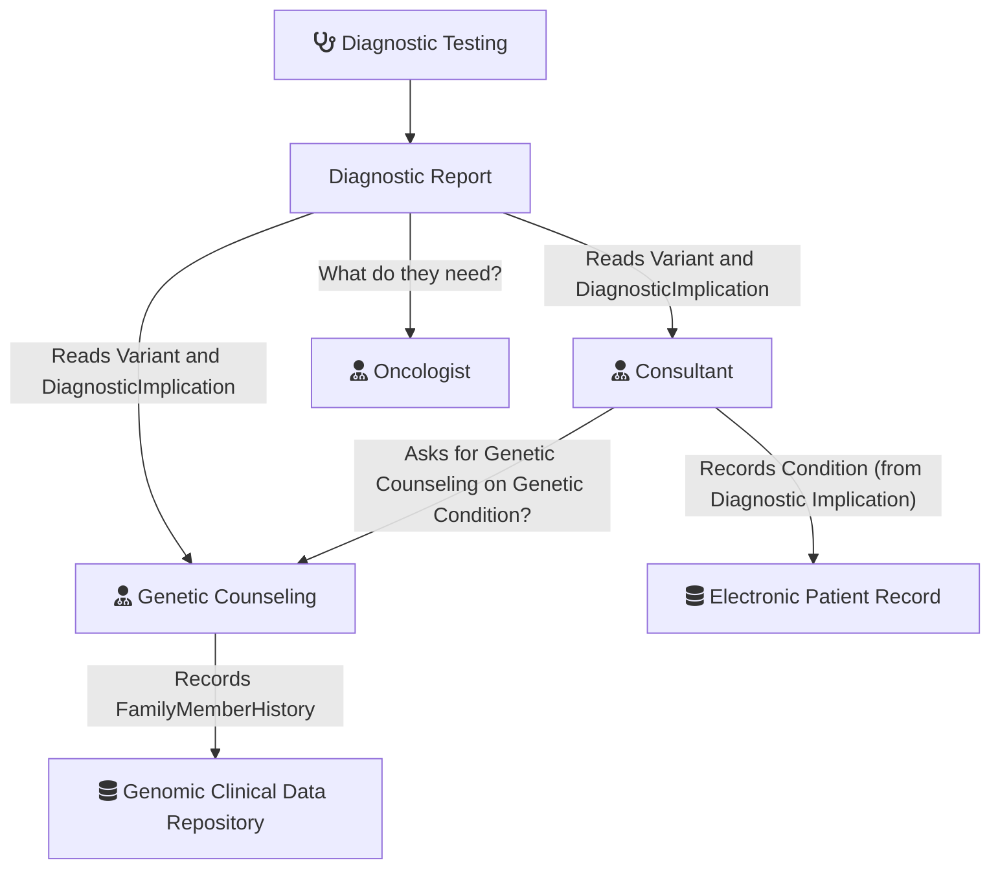

From intro.md 

```mermaid
graph TD;

    DiagnosticTesting[fas:fa-stethoscope Diagnostic Testing]  --> DiagnosticReport[Diagnostic Report]
    DiagnosticReport --> |Reads Variant and DiagnosticImplication| Consultant[fas:fa-user-md Consultant]
    DiagnosticReport --> |Reads Variant and DiagnosticImplication| GeneticCounseling[fas:fa-user-md Genetic Counseling]
    DiagnosticReport --> |What do they need?| Oncologist[fas:fa-user-md Oncologist]

    Consultant --> |"Records Condition (from Diagnostic Implication)"| EPR["<i class='fa fa-database'></i> Electronic Patient Record"]
    GeneticCounseling --> |Records FamilyMemberHistory| GenomicCDR["<i class='fa fa-database'></i> Genomic Clinical Data Repository"]
    Consultant --> |Asks for Genetic Counseling on Genetic Condition?| GeneticCounseling
```
