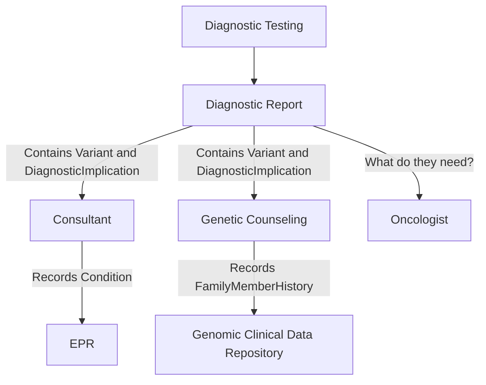

From intro.md 

```mermaid
graph TD;

    DiagnosticTesting[Diagnostic Testing]  --> DiagnosticReport[Diagnostic Report]
    DiagnosticReport --> |Contains Variant and DiagnosticImplication| Consultant
    DiagnosticReport --> |Contains Variant and DiagnosticImplication| GeneticCounseling[Genetic Counseling]
    DiagnosticReport --> |What do they need?| Oncologist

    Consultant --> |Records Condition| EPR
    GeneticCounseling --> |Records FamilyMemberHistory| GenomicCDR[Genomic Clinical Data Repository]
```
