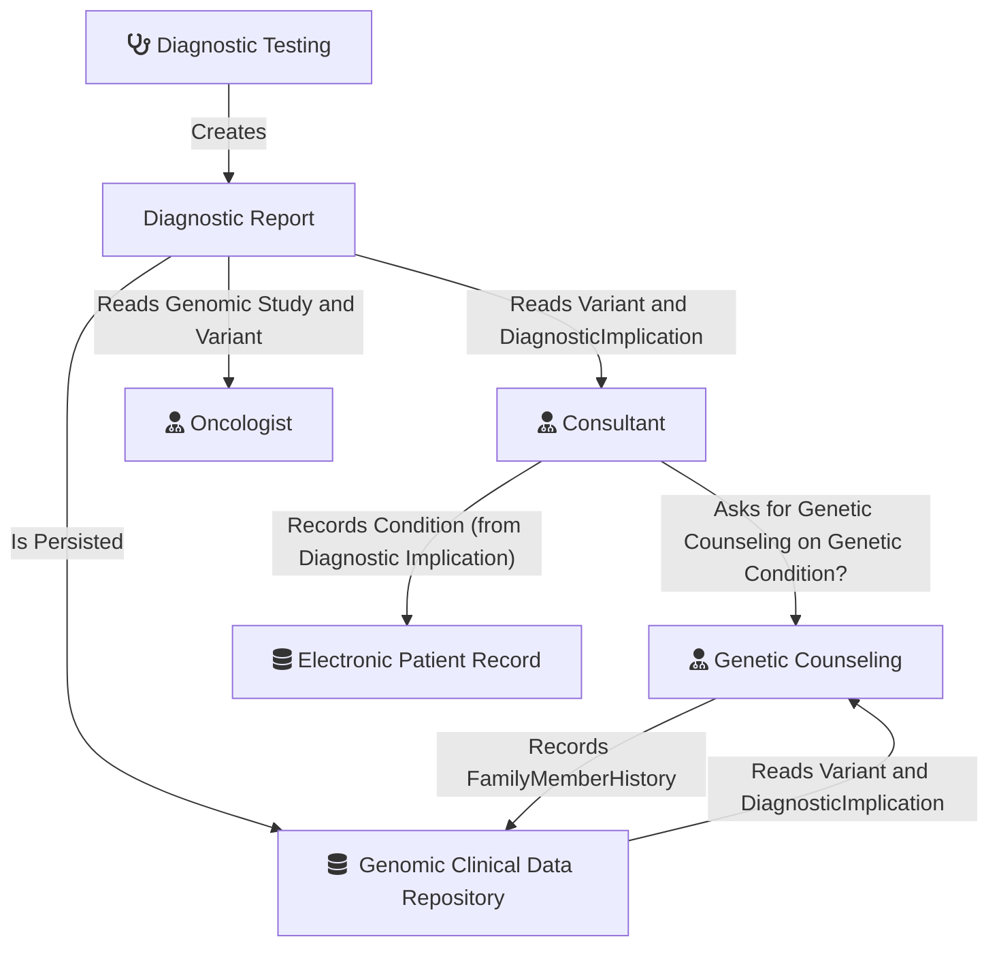

From intro.md 

```mermaid
graph TD;

    DiagnosticTesting[fas:fa-stethoscope Diagnostic Testing]  --> |Creates| DiagnosticReport[Diagnostic Report]
    DiagnosticReport --> |Reads Variant and DiagnosticImplication| Consultant[fas:fa-user-md Consultant]
    GenomicCDR --> |Reads Variant and DiagnosticImplication| GeneticCounseling[fas:fa-user-md Genetic Counseling]
    DiagnosticReport --> |Reads Genomic Study and Variant| Oncologist[fas:fa-user-md Oncologist]
    DiagnosticReport --> |Is Persisted| GenomicCDR

    Consultant --> |"Records Condition (from Diagnostic Implication)"| EPR[fas:fa-database Electronic Patient Record]
    GeneticCounseling --> |Records FamilyMemberHistory| GenomicCDR[fas:fa-database  Genomic Clinical Data Repository]
    Consultant --> |Asks for Genetic Counseling on Genetic Condition?| GeneticCounseling
```
