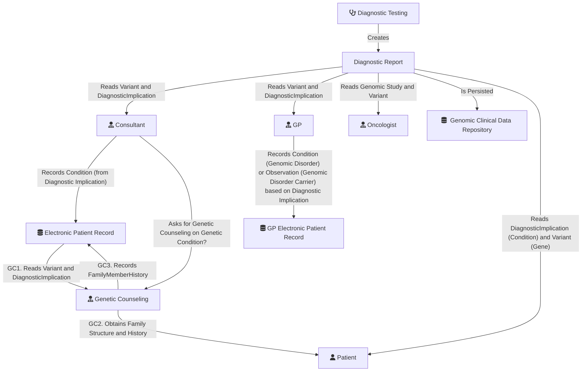

Not validated - elaboration use only for potential future use with Gen-O

```mermaid
graph TD;

    DiagnosticTesting[fas:fa-stethoscope Diagnostic Testing]  --> |Creates| DiagnosticReport[Diagnostic Report]
    DiagnosticReport --> |Reads Variant and DiagnosticImplication| Consultant[fas:fa-user-md Consultant]
    DiagnosticReport --> |Reads Variant and DiagnosticImplication| GP[fas:fa-user-md GP]
    EPR --> |GC1. Reads Variant and DiagnosticImplication| GeneticCounseling[fas:fa-user-md Genetic Counseling]
    DiagnosticReport --> |Reads Genomic Study and Variant| Oncologist[fas:fa-user-md Oncologist]
    DiagnosticReport --> |Is Persisted| GenomicCDR[fas:fa-database  Genomic Clinical Data Repository]
    DiagnosticReport --> |"Reads DiagnosticImplication (Condition) and Variant (Gene)"| Patient[fas:fa-user Patient]

    Consultant --> |"Records Condition (from Diagnostic Implication)"| EPR[fas:fa-database Electronic Patient Record]
    GP--> |"Records Condition (Genomic Disorder) <br/>or Observation (Genomic Disorder Carrier) <br/>based on Diagnostic Implication"| GPEPR[fas:fa-database GP Electronic Patient Record]
    
    GeneticCounseling --> |GC2. Obtains Family Structure and History| Patient
    GeneticCounseling --> |GC3. Records FamilyMemberHistory| EPR
    Consultant --> |Asks for Genetic Counseling on Genetic Condition?| GeneticCounseling
```
