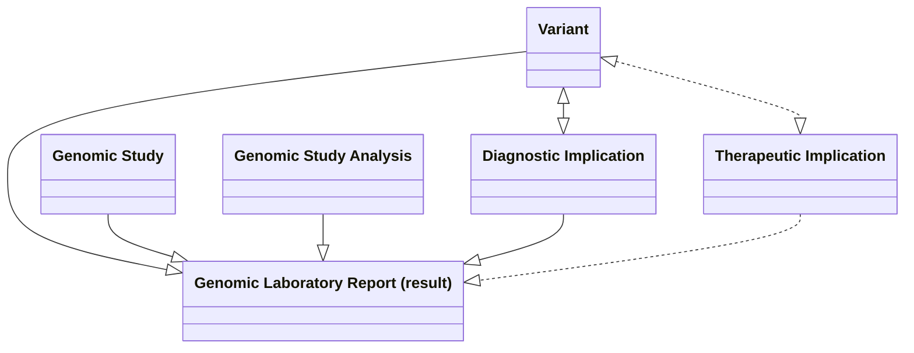

## References

- A. [HL7 Lab Results Interface (LRI), Release 1 from May 2017](https://confluence.hl7.org/download/attachments/25559919/2018%2004%2003%20-%20V2%20LRI%20-%20Ch.%205%20CG%20and%20Code%20System%20Tables.pdf?api=v2) (HL7 v2,5,1)
- B. HL7 International [Genomics Reporting Implementation Guide](https://build.fhir.org/ig/HL7/genomics-reporting/index.html) (HL7 FHIR)
  - HL7 USA [minimal Common Oncology Data Elements (mCODE) Implementation Guide - Genomics](https://build.fhir.org/ig/HL7/fhir-mCODE-ig/group-genomics.html)
- C. [openEHR Genomics Project](https://ckm.openehr.org/ckm/projects/1013.30.50)
- D. [NHS England FHIR Genomics Implementation Guide—Clinical Headings](https://simplifier.net/guide/fhir-genomics-implementation-guide/home/design/clinicalheadings)

## Domain Archetype

This is currently being elaborated and subject to change.

Archetype Viewer <a href="https://project-wildfyre.github.io/domain-archetype/?q=https://nw-gmsa.github.io/Questionnaire-GenomicTestReport.json" target="_blank">Questionnaire-GenomicTestReport</a>

<figure>


Laboratory Report - MindMap

</figure>
 

### Test Detail and Metadata Mapping

Metadata is data that applies to the patient's entire clinical pathway and so it extends beyond diagnostic tests.
Test detail tends to be common across all diagnostic tests in a patient's pathway, not just genomics.

| Name                                     | LOINC   | Value Set / Data Type                                                                                       | Cardinality | HL7 v2 ORU_RO1 Message  | HL7 FHIR DiagnosticReport | HL7 FHIR Resource (RESTful)                                              |
|------------------------------------------|---------|------------------------------------------------------------------------------------------------|-------------|-------------------------|---------------------------|--------------------------------------------------------------------------|
| Patient                                  |         |                                                                                                | 1..1        | [PID](hl7v2.html#pid)   | subject                   | [Patient](https://nw-gmsa.github.io/R4/StructureDefinition-Patient.html) |
| Case Identification or Visit/Stay Number | 56797-4 | [HospitalProviderSpellIdentifier](StructureDefinition-HospitalProviderSpellIdentifier.html)    | 0..1        | [PV1](hl7v2.html#pv1)-19 | encounter                 | [Encounter](StructureDefinition-Encounter.html)                          |
| Order Number                             |         | [Placer Order Number](https://nw-gmsa.github.io/R4/StructureDefinition-PlacerOrderNumber.html) | 1..1        | [ORC](hl7v2.html#orc)-2 | basedOn                   | [ServiceRequest](StructureDefinition-ServiceRequest.html)                |
| Report Number                            |         | [Report Number](https://nw-gmsa.github.io/R4/StructureDefinition-ReportNumber.html)            | 1..1        | [OBR](hl7v2.html#obr)-3 | identifier[ReportNumber]  |             |
| Genomic Test Code                        |         | [Genomic Test Code](ValueSet-GenomicTestCodes.html)                                            | 1..1        | [OBR](hl7v2.html#obr)-4 | code                      |                                                                          |
| Report date                              |         |                                                                                                | 1..1        | [OBR](hl7v2.html#obr)-7 | effectiveDateTime         |                                                                          |
| Results Interpreter                      |         | [England Practitioner Identifier](StructureDefinition-PractitionerIdentifier.html)             | 0..*        | [OBR](hl7v2.html#obr)-32 and OBR-33 | resultsInterpreter        | [Practitioner](StructureDefinition-Practitioner.html)                    |                                                                                            
| Performer (operator)                     |         | [England Practitioner Identifier](StructureDefinition-PractitionerIdentifier.html)             | 1..*        | [OBR](hl7v2.html#obr)-34 | performer[operator]       | [Practitioner](StructureDefinition-Practitioner.html)                    |
| Performer (organisation)                 |         | [Organisation Code](StructureDefinition-OrganisationCode.html)                                 | 1..*        |                         | performer[organisation]   | [Organizaton](StructureDefinition-Organizaton.html)                      |
| Specimen                                 | 80398-1 |                                                                                                | 0..1        | [SPM](hl7v2.html#spm)   | specimen                  | [Specimen](StructureDefinition-Specimen.html)                            |

### Results and Study Mapping

This is for elaboration and subject to change.

Results section is specific to genomics and is focused on the requirements of general clinicians, not genomic specialists. For this reason this section will tend to be an extract of the wider genomics reporting specifications.

A more detailed mapping of the results section of the laboratory report, see [Genomics Reporting Implementation Guide](https://build.fhir.org/ig/HL7/genomics-reporting/general.html)

| Name              | LOINC   | Value Set / Data Type | Example | Cardinality | HL7 v2 ORU_RO1 Message                   | HL7 v2 OBX-4 | HL7 FHIR Resource (RESTful)                                                                                                                                                     |
|-------------------|---------|----------|---------|-------------|------------------------------------------|--------------|---------------------------------------------------------------------------------------------------------------------------------------------------------------------------------|
| Narrative Report  | 51969-4 |          |         | 1..1        | [OBX (type=ED)](hl7v2.html#obx-type--ed) | 1            | DiagnosticReport.presentedForm [Attachment](StructureDefinition-NWAttachment.html) and Binary                                                                                   |
| Gene studied [ID] | 48018-6 |          | ACAD9   | 0..1        | [OBX](hl7v2.html#obx)                    | 1.a          | [Observation](StructureDefinition-Observation.html) Profile [Variant](https://build.fhir.org/ig/HL7/genomics-reporting/StructureDefinition-variant.html).component:gene-studied |

#### Genomic Study Mapping

This is for elaboration and subject to change.

See also [HL7 Genomic Reporting - Genomic Study](https://build.fhir.org/ig/HL7/genomics-reporting/StructureDefinition-genomic-study.html)

| Name                                        | LOINC             | Value Set / Data Type                                                                                                            | Example   | Cardinality | HL7 v2 OBX-4 | FHIR Profile                                                                                                                  |
|---------------------------------------------|-------------------|---------------------------------------------------------------------------------------------------------------------|-----------|-------------|------------|-------------------------------------------------------------------------------------------------------------------------------|
| Analysis method [Type]                      | Might be 81304-8  | [Genomic Study Type ValueSet](https://build.fhir.org/ig/HL7/genomics-reporting/ValueSet-genomic-study-type-vs.html) | SNP Array | 0..1        |            | [Genomic Study](https://build.fhir.org/ig/HL7/genomics-reporting/StructureDefinition-genomic-study.html).code  |
| Gene disease assessed / Clinical Indication | 51967-8           |                                                                                                                     |           | 1..1        | 1.a        | [Genomic Study](https://build.fhir.org/ig/HL7/genomics-reporting/StructureDefinition-genomic-study.html).reasonCode                                                                    |
| Genomic Test Outcome                        | TESTCOME (NWGMSA) | [Genomic Test Outcome Codes](ValueSet-GenomicTestOutcomeCodes.html)                                                 |           |             |            | [Genomic Study](https://build.fhir.org/ig/HL7/genomics-reporting/StructureDefinition-genomic-study.html).outcome                                                                       |                                                                                                                                                                                 |

#### Diagnostic Implication Mapping

This is for elaboration and subject to change.

| Name                                                   | LOINC   | Value Set / Data Type                                                         | Example        | Cardinality | HL7 v2 OBX-4 | FHIR Observation Profile                                                                                                                                    |
|--------------------------------------------------------|---------|-------------------------------------------------------------------------------|----------------|-------------|--------------|-------------------------------------------------------------------------------------------------------------------------------------------------------------|
| Genetic sequence variation clinical significance [Imp] | 53037-8 | [ACMG_Clinical significance of genetic variation](https://loinc.org/LL4034-6) | snp    | 0..1        | 2a           | [Diagnostic Implication](https://build.fhir.org/ig/HL7/genomics-reporting/StructureDefinition-diagnostic-implication.html).component[clinical-significance] |
| Probable Associated Phenotype                          | 81259-4 |                                                                               | Lynch syndrome | 0..1        | 2a           | [Diagnostic Implication](https://build.fhir.org/ig/HL7/genomics-reporting/StructureDefinition-diagnostic-implication.html).component[predicted-phenotype]   |

#### Variant Mapping

This is for elaboration and subject to change.

| Name                                       | LOINC   | Value Set / Data Type                                                                                                                                      | Example                     | Cardinality | HL7 v2 OBX-4 | FHIR Observation Profile                                                                                                                  |
|--------------------------------------------|---------|------------------------------------------------------------------------------------------------------------------------------------------------------------|-----------------------------|-------------|--------------|-------------------------------------------------------------------------------------------------------------------------------------------|
| Gene studied [ID]                          | 48018-6 |                                                                                                                                                            | ACAD9                       | 0..1        | 2a           | [Variant](https://build.fhir.org/ig/HL7/genomics-reporting/StructureDefinition-variant.html).component[gene-studied]                      |
| Genomic DNA change g.HGVS                  | 81290-9 |                                                                                                                                                            | NC_000003.11:g.128625063C>T | 0..1        | 2a           | [Variant](https://build.fhir.org/ig/HL7/genomics-reporting/StructureDefinition-variant.html).component[genomic-hgvs]                      |
| Transcript reference sequence [Identifier] | 51958-7 |                                                                                                                                                            | NM_014049.4                 | 0..1        | 2a           | [Variant](https://build.fhir.org/ig/HL7/genomics-reporting/StructureDefinition-variant.html).component[representative-transcript-ref-seq] |
| Genetic variant Assessment                 | 69548-6 | [Variant Assess](https://loinc.org/LL1971-2)                                                                                                               | Present                     | 0..1        | 2a           | [Variant](https://build.fhir.org/ig/HL7/genomics-reporting/StructureDefinition-variant.html).valueCodeableConcept                         |
| Variant analysis method [Type]             | 81304-8 | [Structural variant analysis method](https://loinc.org/LL4048-6)                                                                                           | SNP Array                   | 0..1        | 2a           | [Variant](https://build.fhir.org/ig/HL7/genomics-reporting/StructureDefinition-variant.html).method                                       |
| Genomic source class [Type]                | 48002-0 | [Genetic variant source](https://loinc.org/LL378-1)                                                                                                        | Somatic                     | 0..1        | 2a           | [Variant](https://build.fhir.org/ig/HL7/genomics-reporting/StructureDefinition-variant.html).component[genomic-source-class]              |
| DNA change type                            | 48019-4 | [LOINC DNA change type](https://loinc.org/48019-4) or [DNA Change Type](https://build.fhir.org/ig/HL7/genomics-reporting/ValueSet-dna-change-type-vs.html) | Substitution                | 0..1        | 2a           | [Variant](https://build.fhir.org/ig/HL7/genomics-reporting/StructureDefinition-variant.html).component[coding-change-type]                |
| Allelic state                              | 53034-5 | [Genetic variant allelic state](https://loinc.org/LL381-5)                                                                                                 | Heterozygous                | 0..1        | 2a           | [Variant](https://build.fhir.org/ig/HL7/genomics-reporting/StructureDefinition-variant.html).component[allelic-state]                     |
| Genomic ref allele [ID]                    | 69547-8 |                                                                                                                                                            | C                           | 0..1        | 2a           | [Variant](https://build.fhir.org/ig/HL7/genomics-reporting/StructureDefinition-variant.html).component[ref-allele]                        | 
| Allelic phase                              | 82120-7 | [Allelic phase](https://loinc.org/LL4025-4)                                                                                                                | Maternal                    | 0..1        | 2a           | See 94186-4 below?                                                                                                                        |
| Origin of germline genetic variant [Type]  | 94186-4 | [Origin of Genetic Variance](https://loinc.org/LL5489-1)                                                                                                   | Maternal                    | 0..1        | - n/a        | [Variant](https://build.fhir.org/ig/HL7/genomics-reporting/StructureDefinition-variant.html).component[variant-inheritance]               |

#### Genomic Study Analysis Mapping

This is for elaboration and subject to change.

TBC - This includes Gene studied [ID] (48018-6) and Gene mutations tested (36908-2). Maybe a requirement from oncology.
This appears to be part of [FHIR R6 GenomicStudy](https://build.fhir.org/genomicstudy.html)

| Name                        | LOINC   | Value Set / Data Type                               | Example | Cardinality | HL7 v2 OBX-4 | FHIR Observation Profile                                                                                                                                   |
|-----------------------------|---------|-----------------------------------------------------|---------|-------------|--------------|------------------------------------------------------------------------------------------------------------------------------------------------------------|
| regions                     |         |                                                     |         |             |              | [Genomic Study Analysis ](https://build.fhir.org/ig/HL7/genomics-reporting/StructureDefinition-genomic-study-analysis.html).extension[regions]             |
| Genomic source class [Type] | 48002-0 | [Genetic variant source](https://loinc.org/LL378-1) | Somatic | 0..1        |            | [Genomic Study Analysis](https://build.fhir.org/ig/HL7/genomics-reporting/StructureDefinition-genomic-study-analysis.html).extension[genomic-source-class] |
| specimen                    |         |                                                     |         |             |           | [Genomic Study Analysis](https://build.fhir.org/ig/HL7/genomics-reporting/StructureDefinition-genomic-study-analysis.html).extension[specimen]             |

## Examples

### Inherited MMR deficiency (Lynch syndrome) - R210

HL7 LRI (Ref A) Example 2 (5.9.1.2) - FOUND DISCRETE – TARGETED MUTATIONS ANALYSIS THAT STUDIES MANY MUTATIONS (106) 

- [Patient Paul LIVERPOOL](Patient-Patient-Liverpool.html)
- [Genomic Study- Inherited MMR deficiency (Lynch syndrome)](Procedure-f0036554-cd1a-463c-ac8a-d891ca409af9.html)
- [Diagnostic Implication - Lynch syndrome](Observation-6beb613f-d303-42af-b025-86e8e0872061.html)
- [Variant NTHL1](Observation-8385c2fd-313d-4fd5-b98e-d5ea4bae6f99.html)

### Cystic fibrosis Carrier R184

HL7 LRI (Ref A) Example 3 (5.9.1.3)  - SIMPLE VARIANT – MUTATION ANALYSIS WITH SEQUENCE PLUS DELETION-DUPLICATION STUDY

- [Patient Liam MANCHESTER](Patient-Patient-Manchester.html)
- [Genomic Study - Cystic fibrosis carrier testing](Procedure-7b362aa5-41a7-4168-94b4-f12dff0dfb2a.html)
- [Diagnostic Implication - Cystic Fibrosis Carrier](Observation-a954a98c-f427-4968-9022-8b760de66628.html)
- [Variant CFTR](Observation-bca547c1-78a5-41be-8cfc-03c05805ac85.html)
