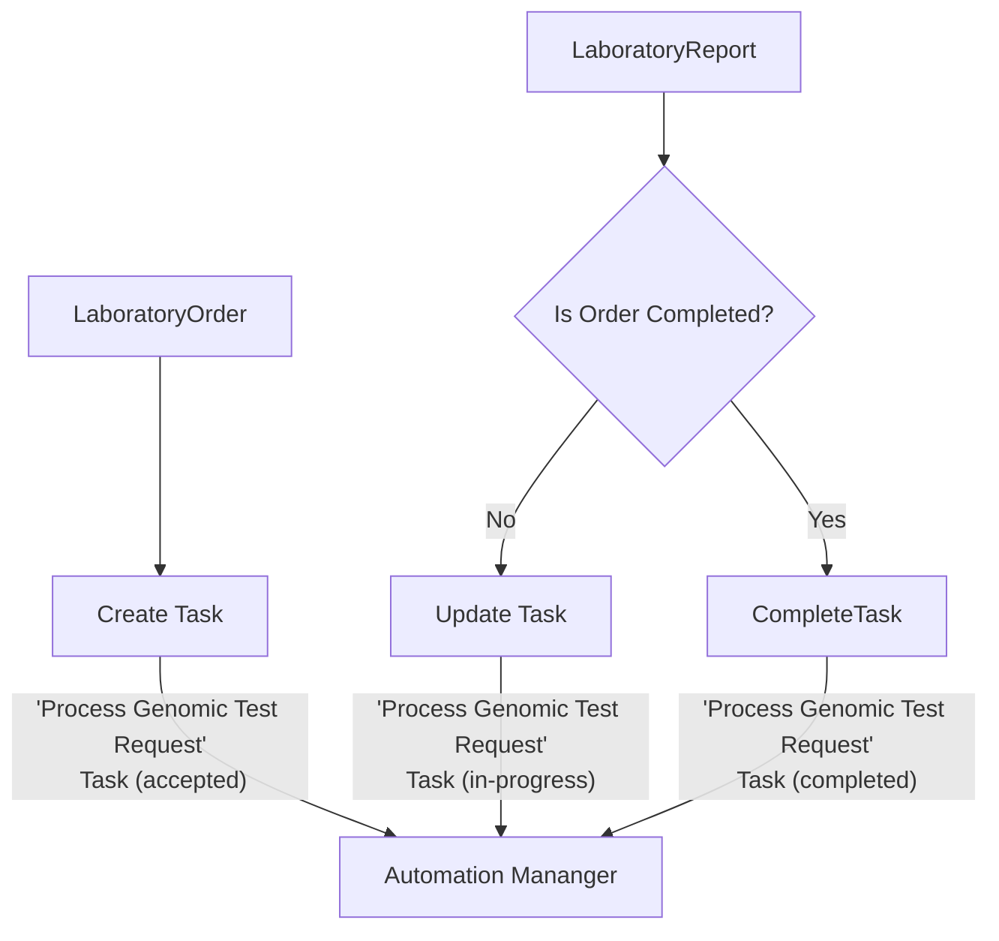
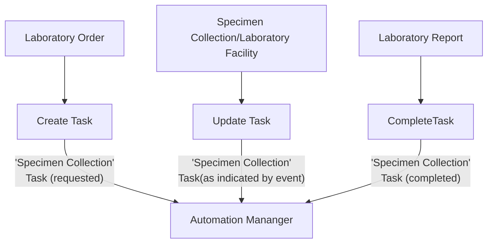

This is currently being elaborated and subject to change.

## References

- [NHS England FHIR Genomics Implementation Guide - Current State vs Future State](https://simplifier.net/guide/fhir-genomics-implementation-guide/Home/Design/Current-State-vs-Future-State)

## Laboratory Order Management

A single laboratory order may generate multiple reports. Throughout the process, the order placer needs to be informed of the order’s progress—particularly when the laboratory has fully completed it.

The overall status of the order is tracked using a `Task`, which is updated as work progresses.

- When the order is first received, a Task is created to represent it, and its status is set to `accepted`.
- As each report arrives, the Task is updated to reflect progress, moving to `in-progress`.
- The order is considered complete once all expected reports have been received, at which point the Task moves to `completed`.

### Caveats

The logic for determining when an order is complete may not always be accurate. For example, the laboratory may decide to perform additional or follow-up tests on the same specimen.

For this reason, it is advisable that the laboratory emit explicit events indicating that:

- the order is complete,
- new tests have been initiated, or
- existing tests have been modified.

[IHE Pathology and Laboratory Medicine (PaLM) Volume 2 - LAB-4](https://www.ihe.net/uploadedFiles/Documents/PaLM/IHE_PaLM_TF_Vol2a.pdf) offers a potential approach to handling this.

## Specimen Collection

Testing cannot begin until a specimen has been collected. Activities such as biopsies or sample collection occur outside the core diagnostic workflow. Monitoring the progress of specimen collection is important for supporting timely diagnostic processing.

### Caveats

Specimen-related information may be limited in both laboratory orders and reports. In some older HL7 implementations, the `SPM` segment may not be included at all.

To address these gaps, the following approaches can be used:

- [IHE Pathology and Laboratory Medicine (PaLM) Volume 2 - LAB-4](https://www.ihe.net/uploadedFiles/Documents/PaLM/IHE_PaLM_TF_Vol2a.pdf), which can be issued whenever specimen details are updated.
- use [IHE Specimen Event Tracking (SET)](SET.html), which allows the laboratory facility to send specimen-related event messages to the central automation management system and from the specimen collection facility—typically an Electronic Patient Record (EPR) system.
