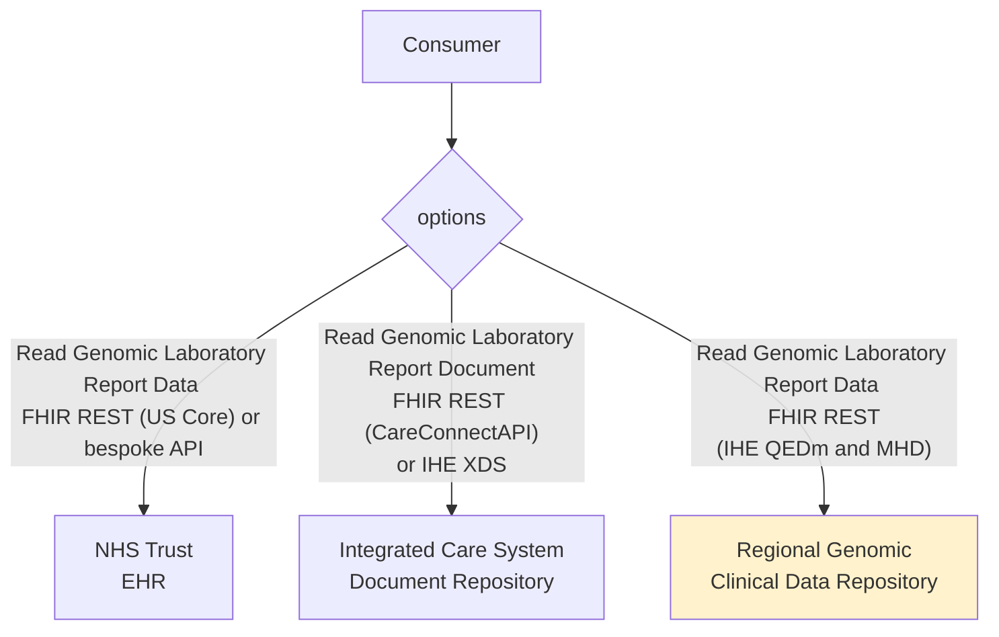
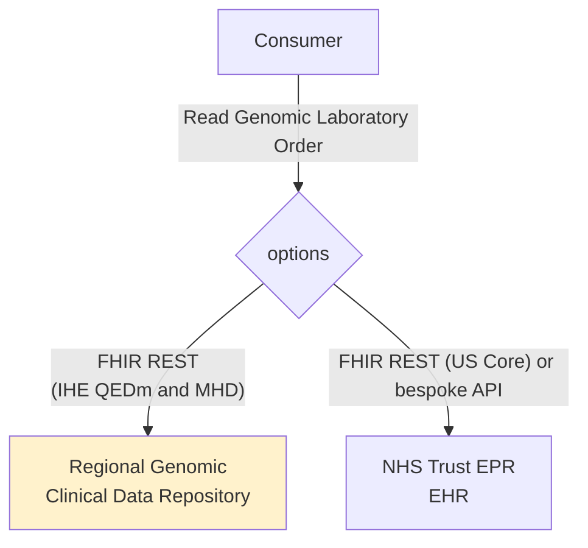
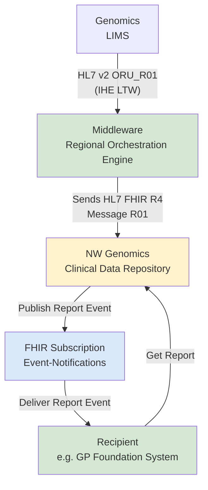

This is currently being elaborated and subject to change.

## Reference Standards

1. Genomic Archive and Communication System (GACS) 
   - https://healthit.gov/wp-content/uploads/2025/03/sync_for_genes_report_november_2017.pdf
   - https://www.researchgate.net/publication/361146233_Building_a_Genome_Archiving_and_Communication_System_Integrated_into_a_Health_Information_Systems
2. Health Information Exchange (HIE)
   - [IHE HIE White Paper](https://profiles.ihe.net/ITI/HIE-Whitepaper/)
   - [HL7 Intermediataries White Paper](https://confluence.hl7.org/spaces/FHIR/pages/144967060/Intermediaries+White+Paper)
3. [EU Health Data API](https://euridice.org/eu-health-data-api/)
   - [IHE Patient Demographics Query for Mobile (PDQm)](https://profiles.ihe.net/ITI/PDQm/index.html) HL7 FHIR
   - [IHE Mobile access to Health Documents (MHD)](https://profiles.ihe.net/ITI/MHD/index.html) HL7 FHIR   
   - [HL7 International Patient Access (IPA)](https://hl7.org/fhir/uv/ipa/)/[IHE Query for Existing Data Mobile (QEDm)](https://profiles.ihe.net/PCC/QEDm/index.html) HL7 FHIR

## Actors and Transactions

| Actor                  | Definition                                                                                                                                                                          |
|------------------------|-------------------------------------------------------------------------------------------------------------------------------------------------------------------------------------|
| Document Consumer      | A system (e.g., an EHR or healthcare app) that requests documents (such as patient records, lab results, or images). It initiates queries and retrieves the actual documents.       |
| Document Source        | The system that creates or owns a document (e.g., a hospital EHR, lab system, or imaging system). Responsible for sending the document and its metadata.                            |
| Document Recipient     | The system that receives, stores, and indexes the submitted document. It consists of: **Document Registry** and **Document Repository**                                             |                                                                                          |
| Document Responder     | The system that responds to the consumer’s requests. It contains two main parts: **Document Registry** and **Document Repository**                                                  |
| Document Registry      | Stores metadata (indexes) about available documents (e.g., type, patient ID, creation date, author), not the actual documents. It helps the consumer find what documents exist.     |
| Document Repository    | Stores the actual documents (clinical content). Once a document is identified, this is where it’s retrieved from.                                                                   | 
| Clinical Data Consumer | A system or application (e.g., mobile health app, EHR system, patient portal) that needs to access existing clinical data.                                                          |
| Clinical Data Source   | The system that stores and manages the clinical data (e.g., EHR database, hospital information system, lab system). It responds to queries by providing the requested patient data. |  

In the North West region the HIE systems are:

- Document Registry
    - Greater Manchester Care Record
    - Share2Care
- Document Repository
    - Greater Manchester Care Record
    - Share2Care
    - NW GMSA Clinical Data Repository
- Clinical Data Source
    - Greater Manchester Care Record
    - NW GMSA Clinical Data Repository

## Read Genomic Laboratory Report

The APIs for accessing genomic laboratory reports from EHR using FHIR REST are outside the scope of this Implementation Guide and are detailed in supplier-specific implementation guides, such as:

- [EPIC on FHIR](https://fhir.epic.com/)
- [Meditech FHIR](https://fhir.meditech.com/)
- [FHIR R4 APIs for Oracle Health Millennium Platform](https://docs.oracle.com/en/industries/health/millennium-platform-apis/mfrap/r4_overview.html)

The Regional Clinical Data Repository (CDR) will adopt a similar FHIR RESTful approach to that used by Electronic Health Records (EHRs), and will also conform to [IHE Query for Existing Data for Mobile (QEDm)](https://build.fhir.org/ig/IHE/QEDm/branches/master/index.html) and [IHE Mobile access to Health Documents (MHD)](https://profiles.ihe.net/ITI/MHD/index.html)

## Read Laboratory Order

### Genomic Report Notification and Read Report (Future?)

In the future, an alternative messaging approach using [FHIR Subscription](https://build.fhir.org/ig/HL7/fhir-subscription-backport-ig/index.html) and Event Notifications is expected to be supported.
The outline of this approach is shown below and is related to a similar approach used by [NHS England Pathology FHIR specification](https://digital.nhs.uk/data-and-information/information-standards/governance/latest-activity/standards-and-collections/dapb4101-pathology-and-laboratory-medicine-reporting-information-standard/implementation/pathology-fhir-specification#architecture)

### Publish a Document

<figure>


Publish a Document

</figure>
 

#### Interactions (Publishing Options)

The Document Source sends documents to the Document Recipient using one of several possible methods:

- Provide and Register Document Set-b [ITI-41]
  - Classic IHE XDS transaction.
  - Sends both the document(s) and their metadata in a structured set.
- Provide Document Bundle [ITI-65]
  - FHIR-based transaction.
  - Sends a document (e.g., CDA, PDF) wrapped in a FHIR Bundle along with metadata.
- Simplified Publish [ITI-105]
  - A simplified publication mechanism for certain use cases, requiring fewer steps.
- Generate Metadata [ITI-106]
  - Used when the document source wants the recipient to generate metadata automatically (instead of providing it explicitly).

<b>Interaction:</b> <a href="hl7v2.html#mdm_t02-original-document-notification-and-content" _target="_blank">NW GMSA HL7 v2 MDM_T02</a> can also be used for this purpose.

### Search and Retrieve document

<figure>


Search and Retrieve document

</figure>
 

<b>Interaction:</b> <a href="MHD.html" _target="_blank">NW GMSA MHD</a> 

#### Interactions

- Search (Querying for Documents)
  - The Document Consumer sends queries to the Document Registry.
  - Supported interactions:
    - Registry Stored Query [ITI-18] → Standard stored query mechanism to search by patient ID, document type, date, etc.
    - Find Document References [ITI-67] → A FHIR-based query to find references to available documents.

✅ Goal: Find references to documents (not the actual documents yet).

- Retrieve (Getting the Documents)
  - After finding references, the Document Consumer retrieves the documents from the Document Repository.
  - Supported interactions:
    - Retrieve Document Set [ITI-43] → Used to retrieve one or more documents from a repository.
    - Retrieve Document [ITI-68] → FHIR-based retrieval of a specific document.

✅ Goal: Get the actual document content (e.g., PDF, CDA, images).   

#### Strengths:

- Good for sharing legal clinical documents (signed, immutable records).
- Provides a registry for organized search.
- Strong governance and audit support.

#### Limitations:

- Data inside documents may be hard to query directly (need to download and parse).
- Best for document-level interoperability, not fine-grained data queries.

### Query Clinical Data 

<figure>


Query Clinical Data

</figure>
 

<b>Interaction:</b> <a href="QEDm.html" _target="_blank">NW GMSA QEDm</a> 

- This is the IHE transaction for mobile clinical data access.
- It is FHIR-based and allows the Clinical Data Consumer to query and retrieve structured clinical data directly from the Clinical Data Source.
- Examples of data that can be retrieved:
  - Patient demographics
  - Allergies
  - Medications
  - Problems/diagnoses
  - Lab results
  - Clinical notes

#### Strengths:

- Fine-grained access: you can retrieve just a lab result, allergy list, or active medications.
- More real-time and lightweight, well-suited for mobile and modern apps.
- Easier integration with FHIR APIs.

#### Limitations:

- No central registry — consumers must know which sources to query.
- Less emphasis on document integrity (since it’s data fragments, not signed documents).
- Governance may be more complex across multiple data sources.

## Side-by-Side Comparison

| Feature	      | Document Sharing (XDS, ITI transactions)	                    | Clinical Data Query (PCC-44)                                |
|---------------|--------------------------------------------------------------|-------------------------------------------------------------|
| Data Type     | 	Whole documents (CDA/FHIR Documents, PDF, images)	          | Discrete data (FHIR resources)                              |
| Query Target	 | Document Registry (then repository)	                         | Direct Data Source                                          |
| Retrieval     | ITI-43, ITI-68 (document content)                            | 	PCC-44 (FHIR resources)                                    |
| Use Case	     | Legal record exchange, discharge summaries, imaging reports	 | Mobile apps, clinical decision support, patient-facing apps |
| Strength	     | Strong governance, legal compliance, document integrity      | 	Flexible, real-time, fine-grained data access              |
| Limitation    | 	Less flexible for data analytics                            | 	No document-level legal record                             |
