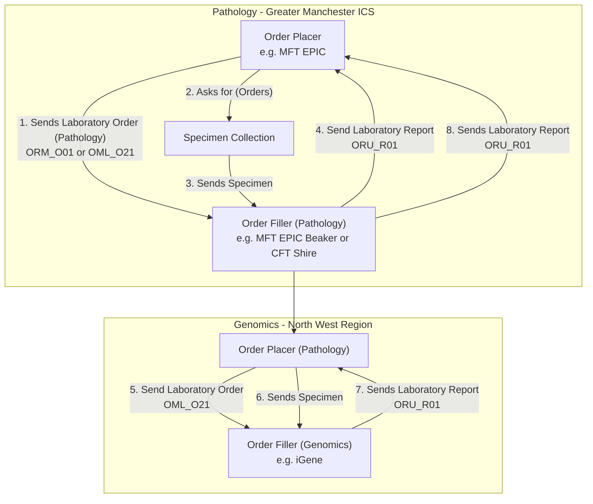
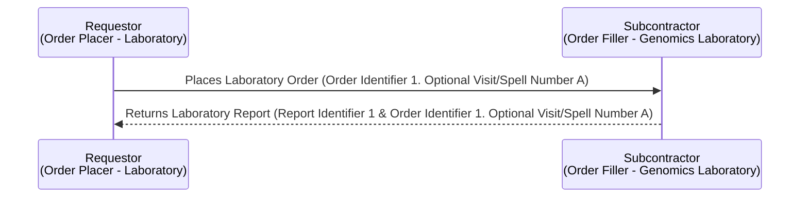
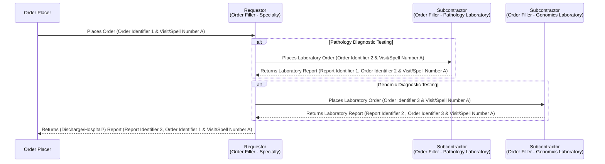
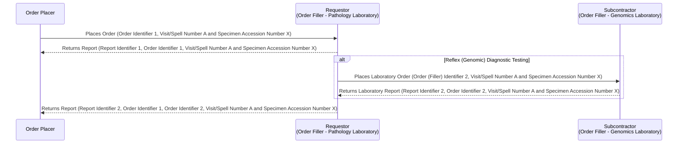
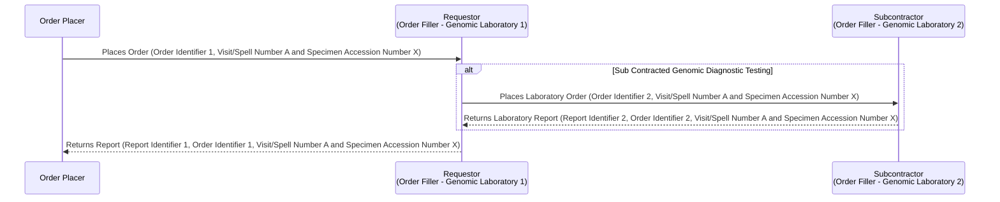

This is currently being elaborated and subject to change.

## References

1. [IHE Inter Laboratory Workflow](https://wiki.ihe.net/index.php/Inter_Laboratory_Workflow)
2. [IHE Laboratory Technical Framework Supplement Inter-Laboratory Workflow (ILW)](https://www.ihe.net/uploadedFiles/Documents/Laboratory/IHE_LAB_Suppl_ILW.pdf)

## Actors and Transactions

| Actor                                               | Definition                                                                                                                                                                                             |
|-----------------------------------------------------|--------------------------------------------------------------------------------------------------------------------------------------------------------------------------------------------------------|
| [Requestor](ActorDefinition-Requestor.html)         | A hospital laboratory that subcontracts a part of an Order or of an Order Group to another laboratory, e.g. Pathology or HODS. Is known in IHE TLW as [Order Placer](ActorDefinition-OrderPlacer.html) |
| [Subcontractor](ActorDefinition-Subcontractor.html) | Receives Sub-orders, acknowledges specimen arrival and sends back results fulfilling these Sub-orders, e.g. Genomics. Is known in IHE TLW as [Order Filler](ActorDefinition-OrderFiller.html)                                                           |

## Overview

See Ref 1 for details.

 

IHE ILW Summary
 
 

### Modernisation

The current IHE ILW specification relies on HL7 v2.x, HL7 v3, and IHE XDS. Several modernization paths are available, most of which focus on adopting FHIR, updating relevant IHE profiles, and shifting from Clinical Documents (HL7 CDA and FHIR Documents) to IHE QEDm for data exchange.

 

IHE ILW Modernistion with FHIR
 
 

## Scenarios

### NHS England Genomic Order Management Service FHIR API

- [NHS England - Genomic Order Management Service FHIR API](https://digital.nhs.uk/developer/api-catalogue/genomic-order-management-service-fhir) a [FHIR Workflow](https://hl7.org/fhir/R4/workflow.html) based service for managing orders and results at a national level.

<figure>


Work Order Management 

</figure>
 

#### Main Process Flow

- Order Submission
    - The Order Placer submits a Laboratory Order O21 (LAB-1) to the Automation Manager.
    - The Automation Manager decides whether to route or split the order as needed depending on the requested tests.
- Conditional Routing (opt blocks)
    - [North West GMSA Order]
        - The Automation Manager submits a Genomic Order O21 (LAB-1/LAB-4) to Order Filler (North West GMSA).
        - The Order Filler sends back Laboratory Report R01 to the Automation Manager.
        - The Automation Manager forwards this Laboratory Report R01 to the Order Placer.
    - [Other GMSA Order]
        - The Automation Manager submits a Genomic Order O21 (LAB-1/LAB-4) using the Genomic Order Management Service API to Order Filler (other GMSA).
        - The Order Filler returns Laboratory Report R01 via the same API.
        - The Automation Manager sends this Laboratory Report R01 to the Order Placer.
- Completion
    - When all tests in the order are complete, the Automation Manager sends a task complete notification (which can be an email) to the Order Placer.

### NHS North West Children Cancer 

See [Blood Tests](SET.html#blood-sample-collection) which includes inter-organisation workflows around laboratory testing. 

 

Genomic Order Notifications - Use Case 4
 
 

#### As is Process

(From North West Children Cancer. This is centred around laboratory tests, genomic tests will have similar notification systems)

- Blood test requested by Primary Treatment Centre (PTC)
- Blood sample taken by Community Nurse or Paediatric Oncology Shared Care Unit (POSCU) and the specimen details are documented
- Blood Laboratory Order is created and a laboratory order request is sent to the laboratory
- Blood test performed by laboratory
- Laboratory writes up a blood results report (laboratory report)
- Laboratory report sent to Community Nurse or POSCU
- Laboratory report then sent to PTC
- Community Nurse or POSCU calls PTC by phone to notify that the results have been sent and to confirm that they have been received
- If results cannot be understood, PTC will call Community Nurse or POSCU to inform them. This is usually due to a defective message
    - Community Nurse or POSCU sends results in a different format (via telephone or re-writes the results out)
- PTC may edit a child's prescription on regimen in light of blood results and may need to recall a patient into hospital for additional tests
- If prescription is amended then PTC must notify POSCU

### Use Case: Genomic Test Order following on from Pathology Test Order

<b>Specimen Event Tracking:</b> See LAB-40 HL7 v2.9 SET <a href="https://wiki.ihe.net/index.php/Specimen_Event_Tracking" _target="_blank">IHE Specimen Event Tracking (SET)</a> and  <a href="https://hl7-definition.caristix.com/v2/HL7v2.7/TriggerEvents/OSM_R26" _target="_blank">Hl7 v2.7 OSM_R26 Unsolicited Specimen Shipment Manifest Message</a>

 

Genomic LTW Business Process - Use Case 3
 
 

In this use case the original order is raised by the `Order Placer` and sent to a Pathology LIMS (`Pathology Order Filler`). The Pathology LIMS follows the processes outlined in [Use Case 1: Genomic Test Order](#use-case-genomic-test-order) and [Use Case 2: Genomic Test Report](#use-case-genomic-test-report) for pathology testing.  
As part of this testing, the clinical process requires a genomics test to be performed.
This genomics process is largely the same except for:
- The order is sent as one interaction as the sample does not need to be collected.
- The order should contain the pathology report detailing the results of the pathology tests.

<figure>


Multiple Diagnostic Tests - LAB-1 and LAB-3

</figure>
 

#### Main Process Flow

- Initial Laboratory Order
    - Step 1: The Order Placer submits a Laboratory Order O21 (LAB-1) to Order Filler (Pathology).
    - Step 2: Order Filler (Pathology) sends back a Laboratory Report R01 (LAB-3).
    - Note: As required by local clinical guidelines, this step can also include imaging orders.
- Optional Path 1 – Genomic Order created by original order placer
    - Condition: [Genomic Order created by original order placer].
    - Note: The same specimen can be reused for multiple tests.
    - Step 3: Order Placer submits a Genomic Order O21 (LAB-2) to Order Filler (Genomics).
    - Step 4: Specimen is sent from Order Placer to Genomics.
    - Step 5: Order Filler (Genomics) sends a Genomic Report R01 (LAB-3) back to the Order Placer.
- Optional Path 2 – Genomic Order created by Pathology
    - Condition: [Order Filler (Pathology) creates Genomic Order].
    - Note: The same specimen can be reused for multiple tests.
    - Step 6: Order Filler (Pathology) submits a Genomic Order O21 (LAB-2) to Order Filler (Genomics).
    - Step 7: Specimen is sent from Pathology to Genomics.
    - Step 8: Order Filler (Genomics) sends a Genomic Report R01 (LAB-3) to Order Filler (Pathology).
    - Step 9: Pathology sends the Genomic Report R01 (LAB-3) to the Order Placer.

#### Diagnostic Cancer Pathways

This use case can often occur around cancer:

 

Cancer Diagnostics
 
 

##### Colorectal Cancer—Diagnostic Pathways Example

The details of this are beyond the scope of this guide, for more details see [Getting It Right First Time (GIRFT) Best Practice Timed Diagnostic Cancer pathways ](https://gettingitrightfirsttime.co.uk/wp-content/uploads/2024/03/BestPracticeTimedDiagnosticCancerPathwayssummary-guide-March-24-V3.pdf)

For information on `Genomic Tests on the bowel cancer cells`, see [macmillan.org.uk](https://www.macmillan.org.uk/cancer-information-and-support/bowel-cancer/tests-on-the-bowel-cancer-cells) and [NICE DG27 Molecular testing strategies for Lynch syndrome in people with colorectal cancer](https://www.nice.org.uk/guidance/dg27)

 

Colorectal Cancer Diagnostics and Patient Referrals
 
 

## Options 

Variations on the basic TLW scenario. 

Order Order Placer MUST include Ordering Facility (ODS Code) if the Order Filler is outside the organisation (i.e. ICS Pathology Lab or Regional Genomics Lab).
Order Filler MUST respond with a Report Identifier and the Order Identifier (if supplied in the Order) in the laboratory report.

### Orchestrated Order 

e.g. Haematology and oncology services

The specialty is responsible for sending a consolidated report to the Order Placer.
For both the Pathology and Genomics Orders, the original Order Identifier SHOULD be included in the order (ServiceRequest.basedOn)

### Reflex Order

Is this around cancer? Is similar to above but both Lab and Genomics use the specimen for testing, so the genomic order is raised by the Pathology Lab.

Who has the responsibility for sending the genomic report to the Order Placer?

For the Reflex Order, the original Order Identifier SHOULD be included in the order (ServiceRequest.basedOn)

### Sub Contact 

Genomic Lab sub contracts to another Genomics Lab for testing.

For the Sub Contracted Order, the original Order Identifier SHOULD be included in the order (ServiceRequest.basedOn)

