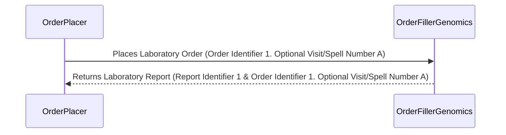
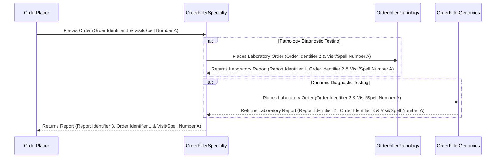
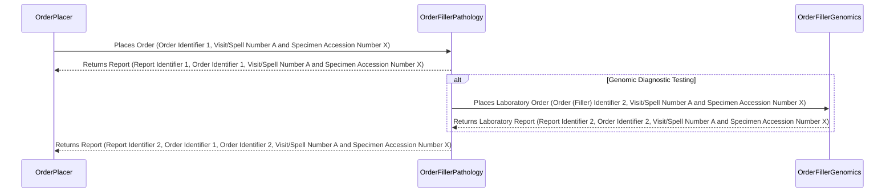
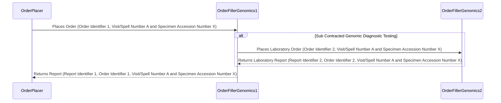

This is currently being elaborated and subject to change.

## References

1. [IHE Inter Laboratory Workflow](https://wiki.ihe.net/index.php/Inter_Laboratory_Workflow)
2. [IHE Laboratory Technical Framework Supplement Inter-Laboratory Workflow (ILW)](https://www.ihe.net/uploadedFiles/Documents/Laboratory/IHE_LAB_Suppl_ILW.pdf)

## Actors and Transactions

## Overview

See Ref 1 for details.

 

IHE ILW Summary
 
 

### Modernisation

The current IHE ILW specification relies on HL7 v2.x, HL7 v3, and IHE XDS. Several modernization paths are available, most of which focus on adopting FHIR, updating relevant IHE profiles, and shifting from Clinical Documents (HL7 CDA and FHIR Documents) to IHE QEDm for data exchange.

 

IHE ILW Modernistion with FHIR
 
 

## Scenarios

### NHS England Genomic Order Management Service FHIR API

- [NHS England - Genomic Order Management Service FHIR API](https://digital.nhs.uk/developer/api-catalogue/genomic-order-management-service-fhir) a [FHIR Workflow](https://hl7.org/fhir/R4/workflow.html) based service for managing orders and results at a national level.

### NHS North West Children Cancer 

See [Blood Tests](SET.html#blood-sample-collection) which includes inter-organisation workflows around laboratory testing. 

## Options 

Variations on the basic TLW scenario. 

Order Filler MUST respond with a Report Identifier and the original Order Identifier (if supplied) in the laboratory report.

### Diagnostic Testing Orchestrated by Service 

e.g. HODS.

The specialty is responsible for sending a consolidated report to the Order Placer.

### Reflex Order

Is this around cancer? Is similar to above but both Lab and Genomics use the specimen for testing, so the genomic order is raised by the Pathology Lab.

Who has the responsibility for sending the genomic report to the Order Placer?

### Sub Contact 

Genomic Lab sub contracts to another Genomics Lab for testing.

