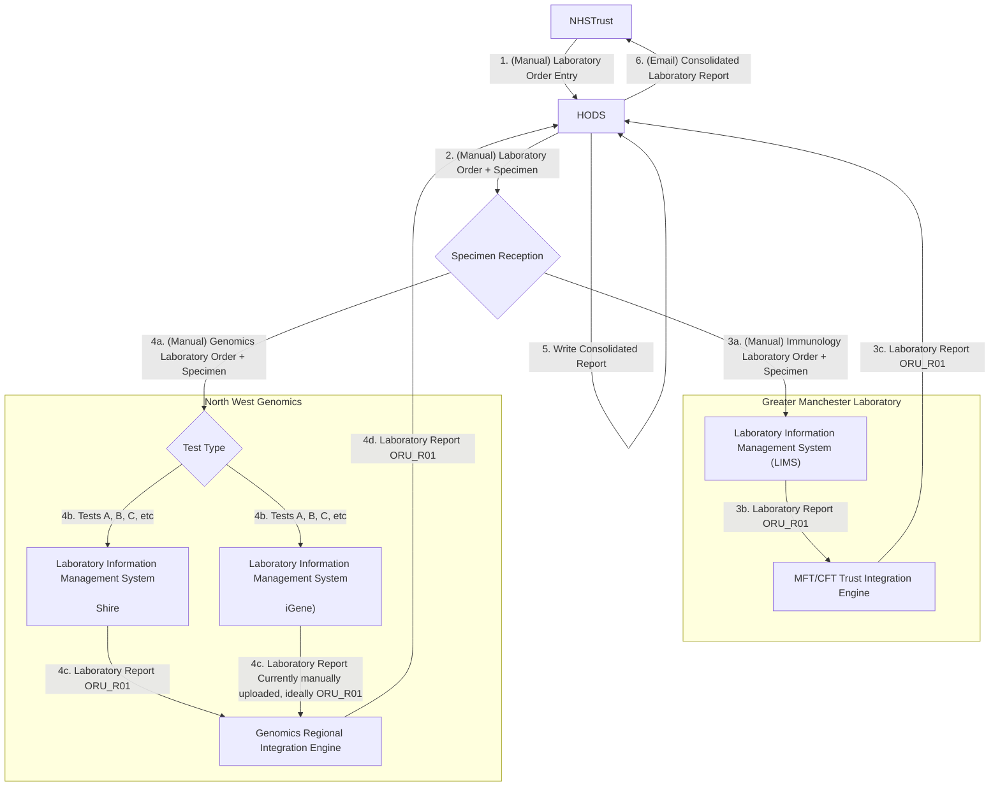

This is currently being elaborated and subject to change.

## References

1. [IHE Inter Laboratory Workflow](https://wiki.ihe.net/index.php/Inter_Laboratory_Workflow)
2. [IHE Laboratory Technical Framework Supplement Inter-Laboratory Workflow (ILW)](https://www.ihe.net/uploadedFiles/Documents/Laboratory/IHE_LAB_Suppl_ILW.pdf)

## Actors and Transactions

## Overview

See Ref 1 for details.

 

IHE ILW Summary
 
 

### Modernisation

The current IHE ILW specification relies on HL7 v2.x, HL7 v3, and IHE XDS. Several modernization paths are available, most of which focus on adopting FHIR, updating relevant IHE profiles, and shifting from Clinical Documents (HL7 CDA and FHIR Documents) to IHE QEDm for data exchange.

 

IHE ILW Modernistion with FHIR
 
 

## Scenarios

### Haematological Malignancy Diagnostic Services

#### Greater Manchester

After move of HODS from The Christie to Manchester Foundation Trust.

- Trusts will place their orders directly in HODS (1). HODS prints a request form, this is sent with the samples to Central specimen reception at MFT (2a).
- Specimen reception then route the samples to the appropriate labs for testing, e.g. Genomics (4a), Immunology (3a), Christie via transport, etc.
- The orders are manually booked into LIMS (Beaker (3a), iGene (4a + 4b), Shire (4a + 4b), etc). Which Genomic LIMS is used is determined by Genomic Test Type.
- Results are sent electronically from LIMS (3b and 4c) to HODS (with exception of iGene PDFs, these are manually uploaded)
- Reporting consultant writes the final combined report within HODS itself when all results are in (5)
- When report is marked Closed , requesting clinicians are alerted by email (6) to log into HODS and view/export the PDF of the final report

#### Cheshire and Mersey

For elaboration purposes only. This is a more detailed breakdown the the Genomic Tests.

 

HODS Genomic Tests - Mersey and Cheshire GLH
 
 

### NHS England Genomic Order Management Service FHIR API

- [NHS England - Genomic Order Management Service FHIR API](https://digital.nhs.uk/developer/api-catalogue/genomic-order-management-service-fhir) a [FHIR Workflow](https://hl7.org/fhir/R4/workflow.html) based service for managing orders and results at a national level.

### NHS North West Childrens Cancer 

See [Blood Tests](SET.html#blood-sample-collection) which includes inter-organisation workflows around laboratory testing. 
