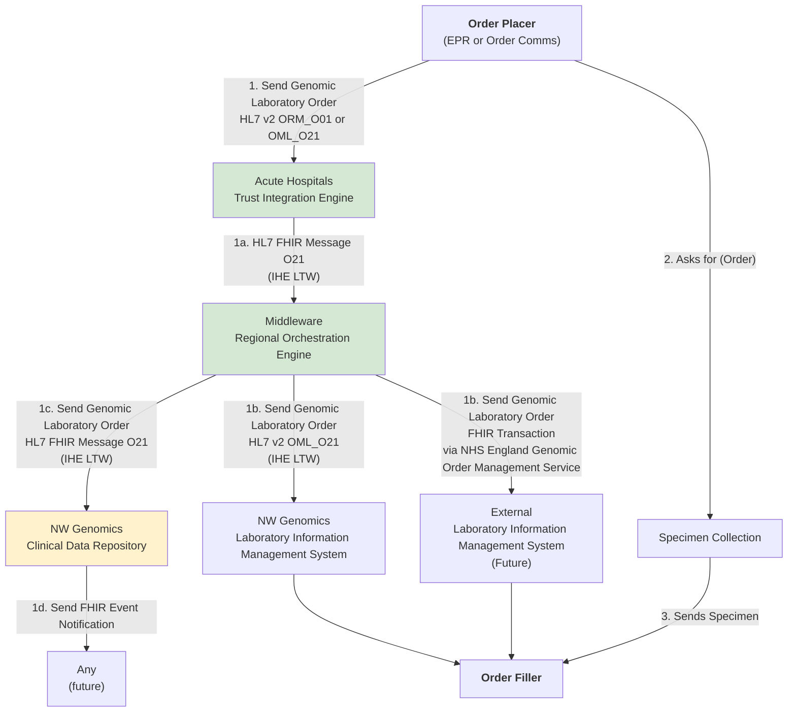
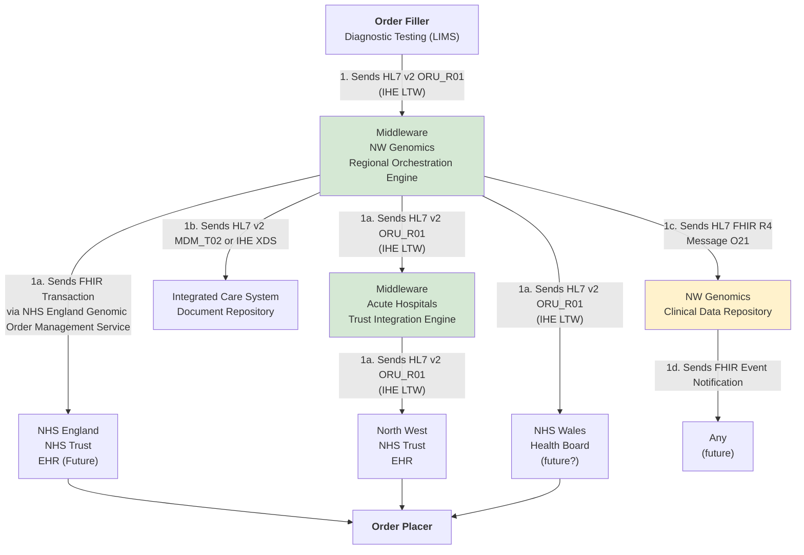
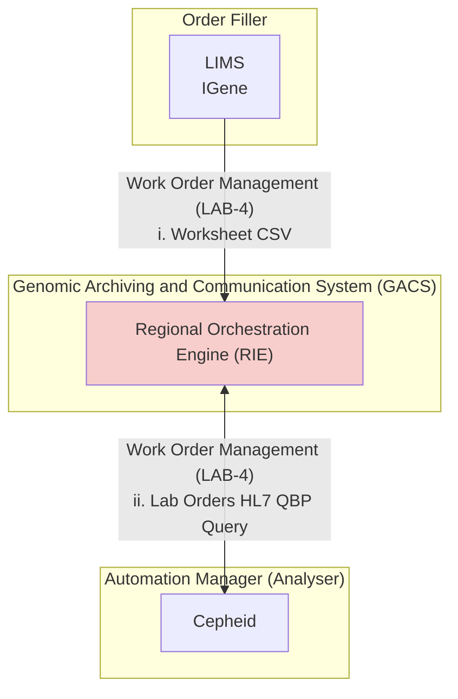
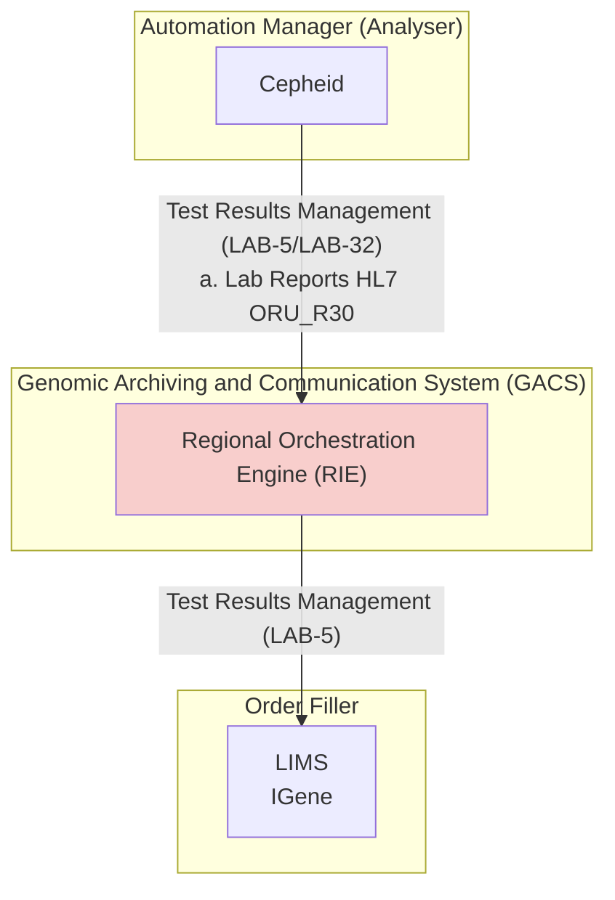

## References 

1. [IHE Pathology and Laboratory Medicine (PaLM) Technical Framework - Volume 1](https://www.ihe.net/uploadedFiles/Documents/PaLM/IHE_PaLM_TF_Vol1.pdf) HL7 v2

## Actors and Transactions

| Actor                                                           | Definition                                                                                  |
|-----------------------------------------------------------------|---------------------------------------------------------------------------------------------|
| [Order Placer](ActorDefinition-OrderPlacer.html)                | Commonly known as the Electronic Patient Record (EPR) System or Order Communications System |
| [Order Filler](ActorDefinition-OrderFiller.html)                | Genomic Laboratory Hub (GLH), Laboratory Information System (LIMS)                          |
| [Automation Manager](ActorDefinition-AutomationManager.html)    | Performed by Laboratory Information System (LIMS)                                           |
| [Order Result Tracker](ActorDefinition-OrderResultTracker.html) | This is often provided by Electronic Patient Record (EPR) Systems                           |
| Laboratory Report (Clinical Document)                           | See [Clinical Document](ActorDefinition-ClinicalDocument.html)                              | 
| [Intermediary](ActorDefinition-Intermediary.html)                               | E.g. Regional or Trust Integration Engine                                                   |
| Automation Manager | Often software associated with analysers and Laboratory Analytical Workflow (IHE LAW)       |

See also Ref A `Section 3 Laboratory Testing Workflow (LTW) Profile` for detailed description of actors.

<figure>


IHE LTW Actor Diagram

</figure>
 

Initially only the IHE `LAB-1` and `LAB-3` is in focus.

Later stages will include the use of [Genomic Order Management Service](https://digital.nhs.uk/developer/api-catalogue/genomic-order-management-service-fhir).

<b>Interaction:</b> LAB-1 <a href="LAB-1.html" _target="_blank">Genomic Test Order O21</a> HL7 FHIR and <a href="hl7v2.html#oml_o21-laboratory-order" _target="_blank">Laboratory Order OML_021</a> HL7 v2
 
<b>Interaction:</b> LAB-3 <a href="LAB-3.html" _target="_blank">Genomic Test Report R01</a> HL7 FHIR and <a href="hl7v2.html#oru_r01-unsolicited-transmission-of-an-observation-message" _target="_blank">Unsolicited Results ORU_R01</a> HL7 v2 

## Overview

 

Genomic LTW Business Process
 
 

> The sample may not need collecting by the ordering clinician for 2 reasons 
> - it has already been sent to the GLH and extracted DNA is already stored there 
> - the sample is somewhere else in the country. In this instance the ordering clinician will need to arrange the sample transfer to the GLH.

The processes above are described in more detail in:

- [Use Case 1: Genomic Test Order](#use-case-genomic-test-order) for the order
- [Use Case 2: Genomic Test Report](#use-case-genomic-test-report) for the report

From a high level perspective the process is 

<figure>


Genomics Simplified Sequence Diagram

</figure>
 

Where the `Order Placer` sends the **Laboratory Order** to the `Order Filler`, the lab performs the test and then sends the **Laboratory Report** back to the `Order Placer`. However, variations can exist such as the order is updated or the order is entered directly on the `Order Filler`system (these are currently out of scope).

## Laboratory Order (LAB-1)

### Use Case: Genomic Test Order

An order is created by the clinical practice and placed to the laboratory.

<figure>


Genomics Test Order Activity

</figure>
 

#### Select Genomic Test Order Form

Within the system creating the genomics order, the practitioner will select a form for the test required. Below are several examples from [North West Genomic Laboratory Hub - Test Request Forms](https://mft.nhs.uk/nwglh/documents/test-request-forms/).
How this is implemented will vary between different NHS organisations and systems they use.

<table style="width:100%">
  <tr>
    <td>
       
      
NW GLH Genomic Testing Request Form – Rare Disease
   
    </td>
    <td>
       
      
Request for Genetic Testing for Haemoglobinopathies
   
    </td>
  </tr>
</table>

#### Complete Genomic Test Order Form

These forms may (/will?) will have a computable definition called an [template (FHIR Questionnaire)](https://hl7.org/fhir/R4/questionnaire.html) which will list the technical content requirements for the form. At present only one archetype has been defined:

- [NW GMSA Genomics Test Order Panel](Questionnaire-GenomicTestOrder.html)

This archetype definition can also support [HL7 Structured Data Capture](https://build.fhir.org/ig/HL7/sdc/index.html) should the Order Placer system support these features.

#### Submit Genomic Test Order Form

The completed form is submitted to the Regional Orchestration Engine using:

<b>Interaction:</b> <a href="LAB-1.html" _target="_blank">Genomic Test Order O21</a> 

<figure>


Genomics Test Order Sequence Diagram - LAB-1

</figure>
 

For submission, this form will be converted by the [Order Placer](ActorDefinition-OrderPlacer.html) to a communication format called [HL7 FHIR](https://hl7.org/fhir/R4/index.html) (and for compatability reasons [HL7 v2](https://en.wikipedia.org/wiki/Health_Level_7#HL7_Version_2).
If the [Order Placer](ActorDefinition-OrderPlacer.html) has a FHIR enabled Electronic Patient Record (e.g. EPIC, Cerner, Meditech, etc), they may use [HL7 SDC - Form Data Extraction](https://build.fhir.org/ig/HL7/sdc/extraction.html) to assist with this process.

 

Order Test Form - Data Extraction Overview
 
 

<b>Domain Archetype:</b> <a href="Questionnaire-GenomicTestOrder.html" _target="_blank">Genomic Test Order (Template)</a> 

The FHIR exchange style used [FHIR Message](https://hl7.org/fhir/R4/messaging.html) following [laboratory-order](MessageDefinition-laboratory-order.html) message definition. This definition is based on HL7 v2 `OML_O21 Laboratory Order` which simplifies conversion to/from pipe+hat (v2) and json (FHIR) formats.

> At present, the NW GLH Laboratory Information Management System (LIMS) will not support HL7 FHIR. The Regional Integration Exchange (RIE) will perform conversion between v2 and FHIR formats.

This message is an [aggregate (DDD)](https://martinfowler.com/bliki/DDD_Aggregate.html)/[archetype](https://en.wikipedia.org/wiki/Archetype_(information_science)) and so is a collection of FHIR Resources (similar to v2 segements) which is described in [Genomic Test Order](Questionnaire-GenomicTestOrder.html).

#### Communicating Ask at Order Entry questions and prior results

See also [HL7 Europe Laboratory Report - ServiceRequest](https://hl7.eu/fhir/laboratory/StructureDefinition-ServiceRequest-eu-lab.html#communicating-ask-at-order-entry-questions-and-prior-results)
This message can be extended by [template (FHIR Questionnaire)](https://hl7.org/fhir/R4/questionnaire.html) which allows the definition of additional questions to be defined for the `laboratory order`.

The detail of this form/template defines:

 

Order Text Form Example (extract)
 
 

| Question                             | CodeSystem | Code      | FHIR Profile                                                    | HL7 v2 Segment | FHIR Questionniare  item.type | FHIR Observation  value[x] | v2 OBX-2                                                                      |
|--------------------------------------|------------|-----------|-----------------------------------------------------------------|----------------|--------------------------------|--------------------------------|-------------------------------------------------------------------------------|
| Does This Test Relate to a Pregnancy | SNOMED     | 77386006  | [Observation](StructureDefinition-Observation.html)             | OBX            | boolean                        | valueBoolean                   | CE ([code 0136](https://terminology.hl7.org/5.1.0/CodeSystem-v2-tables.html)) |
| Sample                               | LOINC      | 68992-7   | [Observation-Panel](StructureDefinition-Observation-Panel.html) | OBR            |                                |                                |                                                                               |
| High Infection Risk Sample           | SNOMED     | 281269004 | [Observation](StructureDefinition-Observation.html)             | OBX            | boolean                        | valueBoolean                   | CE ([code 0136](https://terminology.hl7.org/5.1.0/CodeSystem-v2-tables.html)) |

> It is not expected the NW GLH Laboratory Information Management System (LIMS) will support UK SNOMED CT, and the RIE will handle the conversion either internally using [FHIR ConceptMap](https://hl7.org/fhir/R4/conceptmap.html) or a terminology service with the following capabilities [IHE Sharing Valuesets, Codes, and Maps (SVCM)](https://profiles.ihe.net/ITI/SVCM/index.html)

#### Collect Sample and Update Genomic Test Order

After submitting the original order, the sample will be collected and sent to the Order Filler. The Order Filler will update the Test Order to include details such as a specimen collection date, order filler number, etc.

#### Relationship to NHS England Pathology

This guide builds on the use cases described in the [NHS England Pathology FHIR Implementation Guide](https://simplifier.net/guide/pathology-fhir-implementation-guide/Home/Design/Background), extending them to support a wider range of stakeholders and introducing standards for the Laboratory Order LAB-1.

Key differences include:

- **Workflow foundation:** The [IHE Laboratory and Testing Worflow LTW](https://www.ihe.net/uploadedFiles/Documents/PaLM/IHE_PaLM_TF_Vol1.pdf) is used as the reference model for describing laboratory testing processes.
- **Order Placer role:** The GP Electronic Patient Record (EPR) System and the Order Communications System together form the Order Placer role, which may also be fulfilled by other EPR systems.
- **Intermediary between Order Placer and Order Filler:** This intermediary performs message translation and code conversion.
- **Order Result Tracker role:** For results, the GP EPR System acts as the Order Result Tracker, though other systems (e.g. Secondary Care EPR) can provide this function.
- **Intermediary between Order Filler and Order Result Tracker:** This intermediary also handles message translation and code conversion.
- **Canonical model:** A standardised model ([Canonical model](https://en.wikipedia.org/wiki/Canonical_model)), expressed in HL7 FHIR, that can be implemented using HL7 v2, FHIR, and IHE XDS. It aligns with the latest HL7 UK Core and NHS England Data Model and Dictionary. While primarily focused on genomics, it incorporates elements from pathology and radiology for compatibility, and mandates the use of NHS England National Procedure Codes.

 

Relationship to NHS England Pathology
 
 

## Laboratory Report (LAB-3)

### Use Case: Genomic Test Report

A report is created by the clinical practice and sent to the order result tracker.

#### Genomic Test Report Description

<figure>


Genomics Test Report Activity

</figure>
 

#### Send/Share Genomic Test Report

 

 

Genomic Report Example
 
 

<b>Domain Archetype:</b> <a href="StructureDefinition-Composition-GenomicReport.html" _target="_blank">Genomic Test Report (Composition)</a> 

<figure>


Genomics Test Report Sequence Diagram - LAB-3

</figure>
 

#### Main Process Flow

- Optional Preliminary Report Stage
  - Perform Diagnostic Test → Write Preliminary Report (Order Filler).
  - Send (Preliminary) Genomic Test Report IHE LAB-3 from the Order Filler to the Intermediary (RIE).
  - RIE sends HL7 v2 message Laboratory Report ORU_R01 to the Order Placer.
  - The same HL7 v2 message is also sent from the Intermediary to the Order Placer.

- Final Report Stage
  - Complete Report (Order Filler).
  - Send (Final) Genomic Test Report IHE LAB-3 from the Order Filler to the Intermediary (RIE).
  - RIE sends HL7 v2 message Laboratory Report ORU_R01 to the Order Placer.

- Completion Notification
  - When all tests in the order are complete, a Task Complete Notification is sent to the Order Placer.
    - This notification can be sent via email or another messaging system.

### Order and Report Use Case Summary

 

Genomic Order and Report Summary
 
 

Genomic Test Order and Report use cases form part of a broader diagnostic testing workflow, which is guided by:

- [NICE](https://www.nice.org.uk/) standards
- **Getting It Right First Time (GIRFT)** best practice pathways (e.g. [Getting It Right First Time (GIRFT) Best Practice Timed Diagnostic Cancer pathways ](https://gettingitrightfirsttime.co.uk/wp-content/uploads/2024/03/BestPracticeTimedDiagnosticCancerPathwayssummary-guide-March-24-V3.pdf)
- Local Diagnostic Pathway Guidance.

These pathways are technically implmented and generally align with the [IHE Laboratory and Testing Worflow LTW](https://www.ihe.net/uploadedFiles/Documents/PaLM/IHE_PaLM_TF_Vol1.pdf) (for Imaging workflows see [IHE Radiology (RAD)](https://www.ihe.net/uploadedFiles/Documents/Radiology/IHE_RAD_TF_Vol1.pdf))

Within EHR systems, test orders are usually created through an **Order Entry Form** (also referred to in health informatics as a *Template*). Reports are typically displayed in the EPR as a *Composition* (health informatics terminology).

Between the **Order Placer** (e.g., consultant and EPR) and the **Order Filler** (e.g., laboratory and LIMS), various intermediary systems are used. These are often called Trust Integration Engines (TIEs). The most widely used messaging standard is HL7 v2.

To modernise these workflows, the North West GMSA is also introducing **FHIR**. Alongside this, a regional canonical data model—compatible with HL7 v2, FHIR, and IHE XDS—is being developed. This model aims to reduce the need for multiple message transformations by establishing a common (regional) NHS core data standard.

### Relationship to NHS England Genomic Order Management Service FHIR API

This guide builds on the use cases outlined in [NHS England Genomic Order Management Service FHIR API - Background](https://simplifier.net/guide/genomic-order-management-service-fhir-api/Home/Design/Background), expanding them to support a broader range of participants and introducing standards for the `Laboratory Order LAB-1`.
Key differences include:

- **Workflow basis:** The [IHE Laboratory and Testing Worflow LTW](https://www.ihe.net/uploadedFiles/Documents/PaLM/IHE_PaLM_TF_Vol1.pdf) serves as the primary reference for describing laboratory testing processes.
- **Message translation and code conversion:** The Regional Orchestration Engine (RIE) handles translations and code mappings to and from the Genomic Order Management Service FHIR API.
- **Routing of orders and reports:** The RIE routes orders and reports for other GMSAs through the Genomic Order Management Service FHIR API.
- **Regional workflow consistency:** Existing regional workflows remain largely unchanged, with both HL7 v2 and FHIR standardised across the region.
- **Report compatibility:** Reports are aligned with neighbouring Welsh NHS systems, using DHCW HL7 v2 ORU as the core model for both HL7 v2 and FHIR in the North West.

 

Relationship to NHS England Genomic Order Management Service
 
 

## Work Order Management (LAB-4)

In Progress

## Test Results Management (LAB-5)

In Progress

## Security Considerations

TODO - is OAuth2 based using client credentials flow.

This may include [IHE Internet User Authentication [IUA]](https://profiles.ihe.net/ITI/IUA/index.html) and [IHE Basic Audit Log Patterns[BALP]](https://profiles.ihe.net/ITI/BALP/index.html) which includes use of:

- OAuth2 Standard for **Authorisation**
  - including use of JWT access tokens and including future support for [SMART-on-FHIR Scopes](https://build.fhir.org/ig/HL7/smart-app-launch/scopes-and-launch-context.html))
- FHIR AuditEvent for **Logging Access**
- TLS for **Transport Security**

## Cross-Profile Considerations

It is recommended that the actors receive patient demographic and encounter updates only within the
context of a work order. Whenever patient data changes, due to:

- Update patient information (A31 or A08)
- Patient transfer (A02)
- Transfer cancelled (A12)
- Patients merge (A40)

Note: Event trigger definitions based on [NHS England HL7 v2 ADT Message Specification](https://drive.google.com/drive/folders/1FRkyZvWpZB1nCKbvQbo-eW_q9VtlR3Ws) which is NHS England's supplement to IHE Technical Framework Volume2: [Patient Identity Management [ITI-30]](https://profiles.ihe.net/ITI/TF/Volume2/ITI-30.html) and  [Patient Encounter Management [ITI-31]](https://profiles.ihe.net/ITI/TF/Volume2/ITI-31.html).

It is common for this requirement to be answered by a combination of:

- [Patient Administration (PAM)](PAM.html)
- [IHE Patient Administration Management (PAM)](https://profiles.ihe.net/ITI/TF/Volume1/ch-14.html)//HL7 v2 ADT Patient Encounter Management (A02, A08 and A12)
  - (Denmark) HL7 FHIR version [DK MedCom HospitalNotification](https://medcomfhir.dk/ig/hospitalnotification/)

