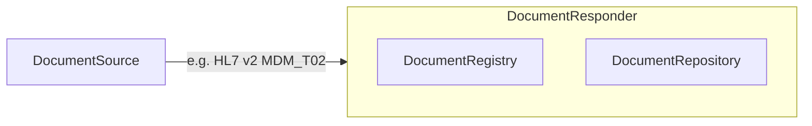
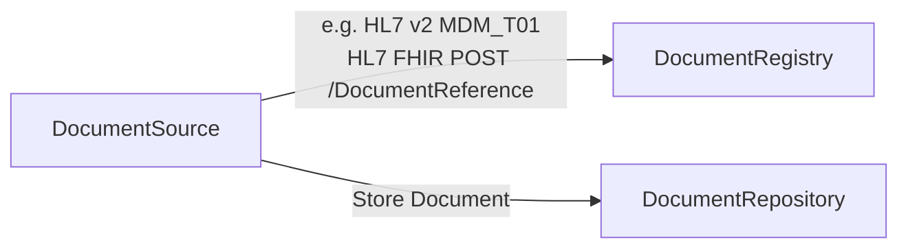
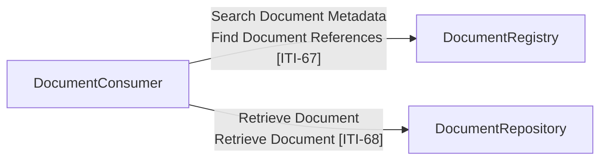
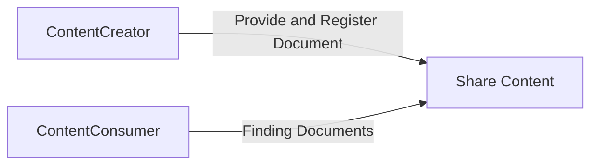

## References

1. [IHE Pathology and Laboratory Medicine (PaLM) Technical Framework - Volume 1](https://www.ihe.net/uploadedFiles/Documents/PaLM/IHE_PaLM_TF_Vol1.pdf) XD-LAB
2. [IHE Mobile Health Document Sharing (MHDS)](https://profiles.ihe.net/ITI/MHDS/index.html)
3. [IHE Cross Enterprise Document Sharing (XDS.b)](https://profiles.ihe.net/ITI/TF/Volume1/ch-10.html)
4. [IHE Mobile access to Health Documents (MHD)](https://profiles.ihe.net/ITI/MHD/index.html)
5. [NHS England National Record Locator (NRL)](https://digital.nhs.uk/services/national-record-locator) for [National Imaging Registry](https://digital.nhs.uk/services/national-imaging-registry) this is related to IHE MHDS

## Actors and Transactions

| Actor             | Definition                                                                                  |
|-------------------|---------------------------------------------------------------------------------------------|
| Document Consumer || 
| Document Source   || 
| Document Registry ||
| Document Repository ||
| Content Creator    ||
| Content Consumer ||

## Scenarios

### Provide and Register Document - Sharing Documents via a central Document Registry + Repository

Often used with Electronic Document Management Systems (EDMS) and IHE XDS systems where the interaction is known as Provide and Register Document Set-b [ITI-41].

This interaction is available for use in NW Genomics [MDM_T02 Original document notification and content](hl7v2.html#mdm_t02-original-document-notification-and-content)

### Register Document - Sharing Documents via a central Document Registry + distributed Repositories

This is the design pattern used by IHE MHDS and NHS England National Record Locator.

### Finding Documents  

This is the design pattern used by IHE MHDS and NHS England National Record Locator.

This FHIR/IHE API is available for use in NW Genomics [Mobile Access to Health Documents [MHD]](MHD.html)

### Structured Clinical Document (Clinical Document Architecture)

XD-LAB uses HL7 Clinical Document Architecture (CDA), it is believed NHS England and HL7 EU/EHDS will adoption FHIR Document as the replacement format of clinical documents.
Example: [EU Laboratory Report](https://build.fhir.org/ig/hl7-eu/laboratory/)

The exchange interactions (`Share Content`) in the diagram below, are the same as above.

### Data Model

#### FHIR Document Reference (XDS Document Entry)

The data models in HL7 MDM (FHIR), FHIR and IHE XDS are effectively the same, this can be found in [NW Genomics FHIR DocumentReference](StructureDefinition-DocumentReference.html). NRL currently implements a subset which may be improved by National Imaging Registry (which is the source of the NW Genomcis model).   

#### Genomic Report 

Will be defined by [NHS England FHIR Genomics](https://simplifier.net/guide/fhir-genomics-implementation-guide/Home/Design/Clinicalheadings?version=0.5.3) 
