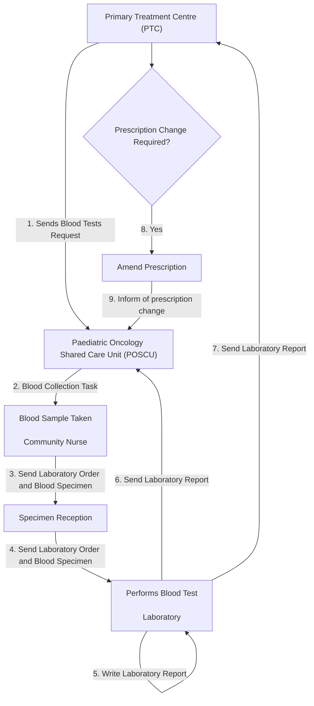
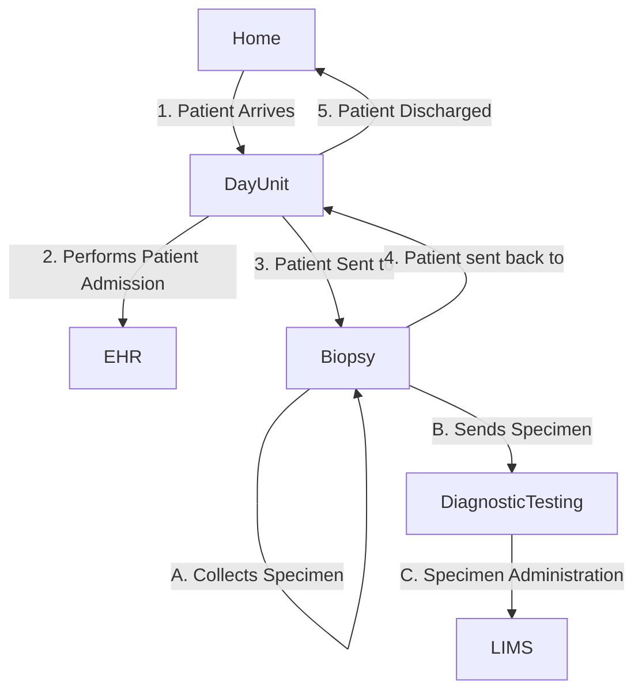

## References 

1. [IHE Specimen Event Tracking](https://wiki.ihe.net/index.php/Specimen_Event_Tracking)
2. [NHS MFT Transport of Samples](https://mft.nhs.uk/the-trust/other-departments/laboratory-medicine/cytology/diagnostic-cytopathology/requesting-of-investigations/transport-of-samples/)

## Actors and Transactions

## Overview

See Ref 1 for details.

 

IHE SET Main Events
 
 

## Scenarios

### Blood Sample Collection

For information only, this is an extract of work done by North West Childresn Cancer and NHS England.

## As Is Process:

- (1) Blood test requested by Primary Treatment Centre (PTC)
- (2) Blood sample taken by Community Nurse or Paediatric Oncology Shared Care Unit (POSCU) and the specimen details are documented
- (3) Blood Laboratory Order is created and an laboratory order request is sent to the laboratory
- Blood test performed by laboratory
- (5) Laboratory writes up blood results report (laboratory report)
- (6) Laboratory report sent to Community Nurse or POSCU
- (7) Laboratory report then sent to PTC
- Community Nurse or POSCU calls PTC by phone to notify that the results have been sent and to confirm that they have been received
- If results cannot be understood, PTC will call Community Nurse or POSCU to inform them. This is usually due to a defective message
- Community Nurse or POSCU sends results in a different format (via telephone or re writes the results out)
- (8) PTC may edit child's prescription on regimen in light of blood results and may need to recall patient  into hospital for additional tests
- (9) If prescription is amended then PTC must notify POSCU

### Biopsy Procedure

For information purposes only, this documention of a biopsy procedure in Nottingham University Hospital.

[Collect Specimen - Biopsy Procedure for obtaining a specimen, part of a diagnostic pathway. Day case admission.](ExampleScenario-BiopsyProcedure.html)
