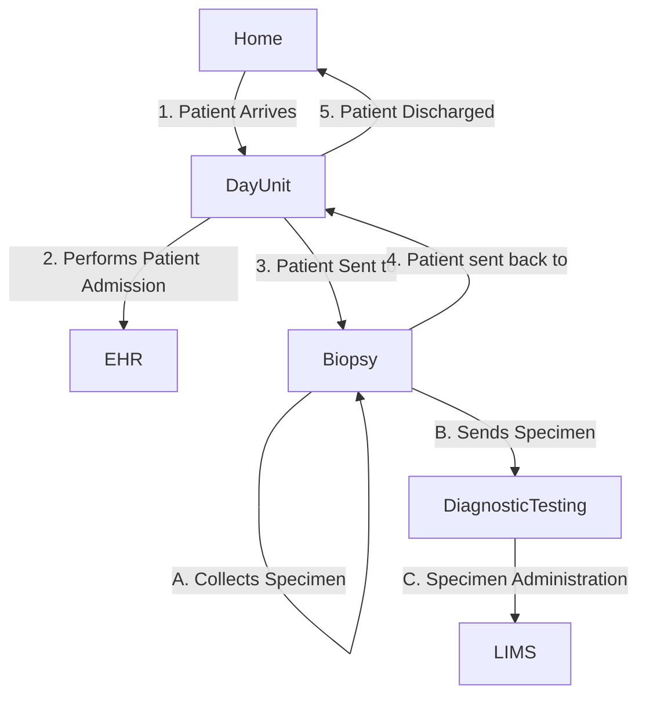

## References 

1. [IHE Specimen Event Tracking](https://wiki.ihe.net/index.php/Specimen_Event_Tracking)

## Actors and Transactions

## Overview

See Ref 1 for details.

 

IHE SET Main Events
 
 

## Scenarios

[Collect Specimen - Biopsy Procedure for obtaining a specimen, part of a diagnostic pathway. Day case admission.](ExampleScenario-BiopsyProcedure.html)
