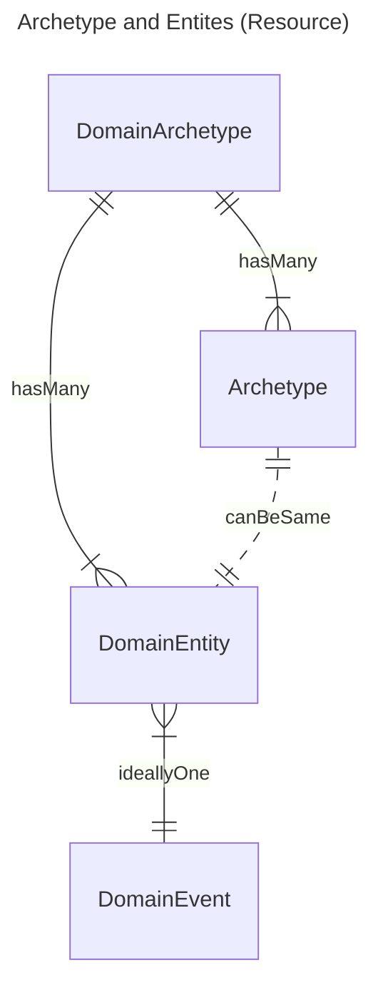

## Overview 

<figure>


Diagnostic Workflow - MindMap

</figure>
 

This implementation guide is primarily focused on **Diagnostic Workflow** and how it fits in with the wider health data model is shown in the diagram above. 
- **Patient Care** and **Patient Administration** are generally found in NHS providers **Electronic Patient Record** systems
- **Care Directory Services** is centrally defined by NHS England and has supporting API's provided by NHS England (e.g. ODS).

In software design these are often called [domains](https://en.wikipedia.org/wiki/Domain-driven_design).
**Genomic Diagnostic Workflow** sits in between several domains and in software architecture this is called a [bounded context](https://martinfowler.com/bliki/BoundedContext.html). 

### Domain Archetype

This section of the guide focuses on (`health informatics`/`data architecture`/`information science`) [Archetype](https://en.wikipedia.org/wiki/Archetype_(information_science)), this is a related concept to (`domain driven design`) `entity` models.

To resolve this difference, this guide has adopted the following relationship:

A `domain archetype` can consist of many `archtypes` and `domain entities`, an archetype and entity can be the same.
`Domain Event` is a key interaction with `Domain Driven Design`, ideally this should contain a single `Domain Event` as multiple events can become an [anti-pattern](https://en.wikipedia.org/wiki/Anti-pattern).

| Domain Archetype            | Archetype                                          | Domain Entity     | Domain Event         |
|-----------------------------|----------------------------------------------------|-------------------|----------------------|
| Laboratory Report           | HL7 Lab Results Interface (extends HL7 v2 ORU_R01) | HL7 v2 Segment    | HL7 v2 Event Message |
| Laboratory Order and Report | Genomic Reporting - HL7 FHIR Profile               | HL7 FHIR Resource | FHIR Workflow        |
|                             | Genomic Module - openEHR Archetype                 |                   |                      |

In genomics all the definitions of Archetype are related and so compatible with each other.

## Diagnostic Report

 

Diagnostic Testing Bounded Contexts
 
 

### Genomic Ordering and Reporting (Right Side)

<figure>


Archetypes High Level Model

</figure>
 

This domain focuses on genomic and molecular diagnostics, the data modeling here is **Archetypes** or templates.

- [Genomic Test Order](Questionnaire-GenomicTestOrder.html)
- [Genomic Test Report](Questionnaire-GenomicTestReport.html) – Summarizes genomic testing results.
  - Variant – Represents a specific genetic variant or mutation.
  - Diagnostic Implication – Links variants to clinical significance (e.g., pathogenicity, treatment implications).
  - The relationships show that a Genomic Report contains Variants, which in turn have Diagnostic Implications. 
  - This domain also connects to the Diagnostic Report in the core

