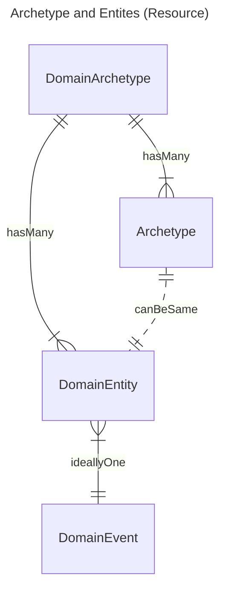

## Overview 

<figure>


Diagnostic Workflow - MindMap

</figure>
 

This implementation guide primarily focuses on the **Diagnostic Workflow** and how it integrates within the broader **health data model**, as illustrated in the diagram above.
- **Patient Care** and **Patient Administration** are typically found in NHS providers **Electronic Patient Record** systems
- **Care Directory Services** on the other hand, are centrally defined by NHS England, with supporting APIs also provided by NHS England (for example, the ODS API).

In software design, these areas are often referred to as [domains](https://en.wikipedia.org/wiki/Domain-driven_design). The **Genomic Diagnostic Workflow** operates across several of these domains — in software architecture terms, this is known as a [bounded context](https://martinfowler.com/bliki/BoundedContext.html). 

### Domain Archetype

This section of the guide explores the concept of a Domain [Archetype](https://en.wikipedia.org/wiki/Archetype_(information_science)) — a notion that connects ideas from health informatics, data architecture, and information science with domain-driven design entity models.

To align these perspectives, this guide defines the following relationship:

The **Domain Archetype** concept originates from [Data Mesh](https://en.wikipedia.org/wiki/Data_mesh) principles and serves as a bridge between data architecture and software architecture.

A **Domain Archetype** may encompass multiple **Archetypes** and **Domain Entities**.
An **Archetype** and a **Domain Entity** can represent the same concept.
A **Domain Event** reflects key interactions in Domain-Driven Design; ideally, each archetype or entity should correspond to a single **Domain Event**, since handling multiple events can lead to architectural [anti-patterns](https://en.wikipedia.org/wiki/Anti-pattern) - We should use event-driven message feeds rather than relying on batch data transfers (messages) or the physical exchange of [compositions](https://en.wikipedia.org/wiki/Clinical_Document_Architecture).

| Domain Archetype            | Archetype                                          | Domain Entity     | Domain Event         |
|-----------------------------|----------------------------------------------------|-------------------|----------------------|
| Laboratory Report           | HL7 Lab Results Interface (extends HL7 v2 ORU_R01) | HL7 v2 Segment    | HL7 v2 Event Message |
| Laboratory Order and Report | Genomic Reporting - HL7 FHIR Profile               | HL7 FHIR Resource | FHIR Workflow        |
|                             | Genomic Module - openEHR Archetype                 |                   |                      |

In genomics, all these **archetype** definitions are interrelated and **designed to be mutually compatible**.

## Diagnostic Report

 

Diagnostic Testing Bounded Contexts
 
 

### Genomic Observation

- [Variant](Questionnaire-GenomicTestReport.html#variant)
- [Diagnostic Implication](Questionnaire-GenomicTestReport.html#diagnostic-implication)

### Genomic Procedure

- [Genomic Study](Questionnaire-GenomicTestReport.html#genomic-study)

### Genomic Ordering and Reporting (Right Side)

<figure>


Archetypes High Level Model

</figure>
 

This domain focuses on genomic and molecular diagnostics, the data modeling here is **Archetypes** or templates.

- [Genomic Test Order](Questionnaire-GenomicTestOrder.html)
- [Genomic Test Report](Questionnaire-GenomicTestReport.html) – Summarizes genomic testing results.
  - Variant – Represents a specific genetic variant or mutation.
  - Diagnostic Implication – Links variants to clinical significance (e.g., pathogenicity, treatment implications).
  - The relationships show that a Genomic Report contains Variants, which in turn have Diagnostic Implications. 
  - This domain also connects to the Diagnostic Report in the core

