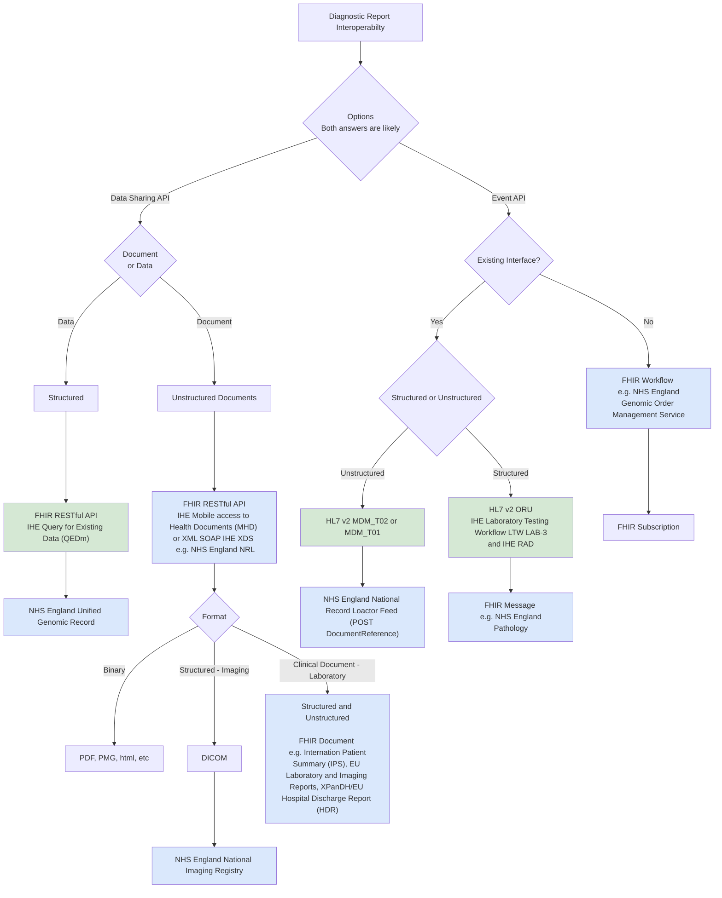

## Introduction

The architecture generally follows [Domain Driven Design [DDD]](https://en.wikipedia.org/wiki/Domain-driven_design), [Domain Driven Design](https://martinfowler.com/bliki/DomainDrivenDesign.html) and [Data Mesh](https://en.wikipedia.org/wiki/Data_mesh)

The general architecture is shown below:

 

Data Mesh
 
 

Data Sharing is based on FHIR RESTful API's, and asynchronous messaging used to deliver the orders and reports in mostly HL7 v2 and IHE Laboratory Testing Workflow (LTW) based .

The diagram below shows multiple interoperability pathways for exchanging diagnostic reports—either as structured data or documents—between systems.
It maps out which standards (FHIR, HL7 v2, IHE, XDS/MHD), APIs, and NHS England national services (UGR, NIR, NRL, Genomic OMS, etc.) are involved depending on:

- Which API is used
   - Event API
   - Data Sharing API
- Whether an existing interface already exists
- Whether the exchange is structured data or unstructured documents

NHS England services are coded in blue, while currently implemented services are coded in green.

## Enterprise Integration

The [Intermediary](ActorDefinition-Intermediary.html), North West GMSA Regional Integration Engine (RIE) is an [Enterprise Service Bus](https://en.wikipedia.org/wiki/Enterprise_service_bus) most commonly known in the NHS as a Trust Integration Engine (TIE).

This implement as series of [Enterprise Integration Patterns](https://www.enterpriseintegrationpatterns.com/patterns/messaging/) based around messaging, the diagrams below follow conventions used for these patterns.

The ESB has a [Canonical Data Model](https://www.enterpriseintegrationpatterns.com/patterns/messaging/CanonicalDataModel.html) which is expressed in this Implementation Guide using HL7 FHIR. This model is common to all the exchange formats used in the ESB:

- JSON [HL7 FHIR](https://hl7.org/fhir/)
- pipe+hat [HL7 v2](https://en.wikipedia.org/wiki/Health_Level_7)
- potential use case for sharing reports: XML [IHE XDS.b](https://profiles.ihe.net/ITI/TF/Volume1/ch-10.html)

This canonical model is a mandatory extension to [HL7 UK Core](https://simplifier.net/guide/ukcoreversionhistory) and includes requirements from 
- [NHS England HL7 v2 ADT Message Specification](https://drive.google.com/drive/folders/1FRkyZvWpZB1nCKbvQbo-eW_q9VtlR3Ws)
- [Digital Health and Care Wales - HL7 ORU_R01 2.5.1 Implementation Guide](https://nw-gmsa.github.io/R4/DHCW-HL7-v2-5-1-ORUR01-Specification.pdf)
- [Royal College of Radiologist](https://www.rcr.ac.uk/media/wwtp2mif/rcr-publications_radiology-reporting-networks-understanding-the-technical-options_march-2022.pdf)
- [IHE Europe Metadata for exchange medical documents and images](https://www.ihe-europe.net/sites/default/files/2017-11/IHE_ITI_XDS_Metadata_Guidelines_v1.0.pdf) see UK content.
- [NHS Data Model and Dictionary](https://www.datadictionary.nhs.uk/)

> This canonical model is not specific to Genomics. It is focused on standard message construction patterns in particular [CorrelationIdentifier](https://www.enterpriseintegrationpatterns.com/patterns/messaging/CorrelationIdentifier.html) such as Order Numbers and Episode/Stay Identifiers and use of Clinical Coding Systems such as UK SNOMED CT. 
> 
> Genomic Specific modelling, which this model supports, can be found on [NHS England FHIR Genomics Implementation Guide](https://simplifier.net/guide/fhir-genomics-implementation-guide)

To support genomics workflow, this guide is aligned to enterprise workflow processes described in [IHE Laboratory Testing Workflow](https://wiki.ihe.net/index.php/Laboratory_Testing_Workflow), terminology from this guide especially around Actors is used throughout this Implementation Guide.

Three types of messages are used within this workflow process:

| Message Type                                                                                                  | HL7 Name              | IHE Name                                                                 | Description                                                                       |
|:--------------------------------------------------------------------------------------------------------------|-----------------------|--------------------------------------------------------------------------|-----------------------------------------------------------------------------------|
| [**C**ommand Message](https://www.enterpriseintegrationpatterns.com/patterns/messaging/CommandMessage.html)   | Laboratory Order O21  | [LAB-1](LAB-1.html) | To request a laboratory order                                                     |
| [**D**ocument Message](https://www.enterpriseintegrationpatterns.com/patterns/messaging/DocumentMessage.html) | Laboratory Report R01 | [LAB-3](LAB-3.html)                                                      | Used to transfer the report back to the order placer and othre interested parties | 
|                                                                                                               | Original Document T02 | [HL7 MDM_T02](hl7v2.html#mdm_t02-original-document-notification-and-content) | Used to send a copy of the report to a HIE                                        | 

## Laboratory Order 

<figure>


Laboratory Order - Overview

</figure>
 

### Messaging with a copy sent to a FHIR Repository

 

Messaging + FHIR Repository
 
 

- Update Genomic Data Repository ([Wire Tap](https://www.enterpriseintegrationpatterns.com/patterns/messaging/WireTap.html))
  - First point of entry for HL7 FHIR O21 messages [Command Message](https://www.enterpriseintegrationpatterns.com/patterns/messaging/CommandMessage.html).
  - Updates internal genomic data repository using FHIR RESTful interactions. ([Messaging Gateway](https://www.enterpriseintegrationpatterns.com/patterns/messaging/MessagingGateway.html))
- Router ([Message Router](https://www.enterpriseintegrationpatterns.com/patterns/messaging/MessageRouter.html))
  - Routes messages based on order metadata.
- Transform to HL7 v2 Message ([Message Translator](https://www.enterpriseintegrationpatterns.com/patterns/messaging/MessageTranslator.html) and v2 [Canoncial Model](https://www.enterpriseintegrationpatterns.com/patterns/messaging/CanonicalDataModel.html))
  - Converts HL7 FHIR O21 messages into HL7 v2.5.1 OML_O21 format.
  - These transformed messages are sent to NW GMSA LIMS iGene.
- Genomic Order Management Adaptor Service FHIR API ([Messaging Gateway](https://www.enterpriseintegrationpatterns.com/patterns/messaging/MessagingGateway.html))
  - Targets NHS England Genomic Order Management Service FHIR API which is the interface to external GMSA.
  - This uses a FHIR RESTful API, similar to the Clinical Data Repository Adaptor, and like this service, the business logic (how to update the repository) is held within Regional Integrations Engine and this is not exposed externally. 

## Laboratory Report

<figure>


Laboratory Report - Overview

</figure>
 

 

Laboratory Report - Detailed
 
 

- Source System
  - NW GMSA LIMS (iGene) ([Document Message](https://www.enterpriseintegrationpatterns.com/patterns/messaging/DocumentMessage.html))
    - Produces genomic test results in HL7 v2.3 ORU_R01 messages.
    - These are sent into the Enterprise Service Bus (ESB).
- Transformation and Enrichment (inside ESB)
  - Transform to HL7 FHIR Message ([Message Translator](https://www.enterpriseintegrationpatterns.com/patterns/messaging/MessageTranslator.html) and FHIR [Canoncial Model](https://www.enterpriseintegrationpatterns.com/patterns/messaging/CanonicalDataModel.html))
    - Converts HL7 v2.3 message into a modern HL7 FHIR R01 message.
  - Update Genomic Data Repository & Enrich Content ([Content Enricher](https://www.enterpriseintegrationpatterns.com/patterns/messaging/DataEnricher.html))
    - Stores and enhances the message with additional data elements.
    - Provides a consistent, enriched dataset for downstream use.
- Routing
  - Router
    - Determines where the message should be delivered (e.g., hospital systems, care records, repositories).
    - Reports are sent to the NHS Trust which ordered the test ([Message Router](https://www.enterpriseintegrationpatterns.com/patterns/messaging/MessageRouter.html))
    - Reports are sent to NHS ICS Health Information Exchange (HIE) for sharing the reports within the ICS, this is based on the GP Surgery for the patient which is obtained via a PDS lookup. ([Dynamic Router](https://www.enterpriseintegrationpatterns.com/patterns/messaging/DynamicRouter.html))
  - Transform to HL7 v2 Message ([Message Translator](https://www.enterpriseintegrationpatterns.com/patterns/messaging/MessageTranslator.html) and v2 [Canoncial Model](https://www.enterpriseintegrationpatterns.com/patterns/messaging/CanonicalDataModel.html))
    - Converts enriched content back into a structured HL7 v2.x format for downstream systems that still rely on v2.
    - This ensures backward compatibility with existing hospital systems.
- Output
  - Reports are sent as:
    - HL7 v2.5.1 ORU_R01 or MDM_T02 messages (for systems using HL7 v2).
    - HL7 over HTTP with OAuth2 (for secure API-based delivery).
- Repository Service
  - A dedicated Repository Service captures and stores all enriched FHIR data. ([Messaging Gateway](https://www.enterpriseintegrationpatterns.com/patterns/messaging/MessagingGateway.html))
    - FHIR Repository Adapter converts incoming HL7 FHIR messages into a format suitable for storage.
    - Data is stored in the Clinic Data Repository (IRIS FHIR Repository).
    - Access is available via HL7 FHIR RESTful API.

### Laboratory Report Routing - NHS Trust (ORU_R01)

This routing is based on the ODS Code of the ordering facility.
Note: Routing logic for rest of England and Wales if for illustration purposes, neither are implemented.

<figure>


Laboratory Report Routing - NHS Trust (ORU_R01)

</figure>
 

### Laboratory Report Message Routing - NHS ICS (MDM_T02)

This routing is based on the GP Practice (ODS Code) of the Patient, failing that postcode is used to infer ICS.

<figure>


Laboratory Report Routing - Laboratory Report Message Routing - NHS ICS (MDM_T02)

</figure>
 

## Security

### http Authorisation

As we are using http RESTful for communication between the Trust Integration Engines, this security and authorisation can be solved in a number of ways such as:

- TLA-MA
- openid

These are practical for point-to-point connections, but as the solution grows it can become complicated, so it is preferred we move to enterprise level security such as OAuth2 Client Credentials Grant.

- [IHE Internet User Authorization (IUA)](IUA.html)
- [NHS England - Application-restricted APIs](https://digital.nhs.uk/developer/guides-and-documentation/security-and-authorisation#application-restricted-apis)

See [Authorisation](authorisation.html) for more details.

## Message Validation and Asynchronous Replies

 

Laboratory Order Messaging
 
 

- **Accept Message** The Order Placer (NHS trust) sends a FHIR Message (NW GMSA) [Genomic Test Order O21](Questionnaire-GenomicTestOrder.html) to the RIE via the [$process-message](OperationDefinition-ProcessMessage.html) endpoint
    - If the RIE doesn’t understand the message for technical reasons, it will respond immediately with an error message.
    - **Validation** The RIE performs FHIR Validation on the order against the requirements listed in this Implementation Guide. The validation contains no errors, it is accepted; any errors will cause the message to be rejected. The RIE responds to the order placer asynchronously via a message queue, this is accessed by the order placer via a **Polling Consumer**
- **Distribution List** If the message is accepted, it is passed to a router, at present this router passes the message onto the next process. This router is for future use with the national broker.
- **Transform to HL7 v2** The RIE will convert the FHIR Message to a [HL7 v 2.4 ORM O01](hl7v2.html#oml_o21-laboratory-order) and send this to iGene.

