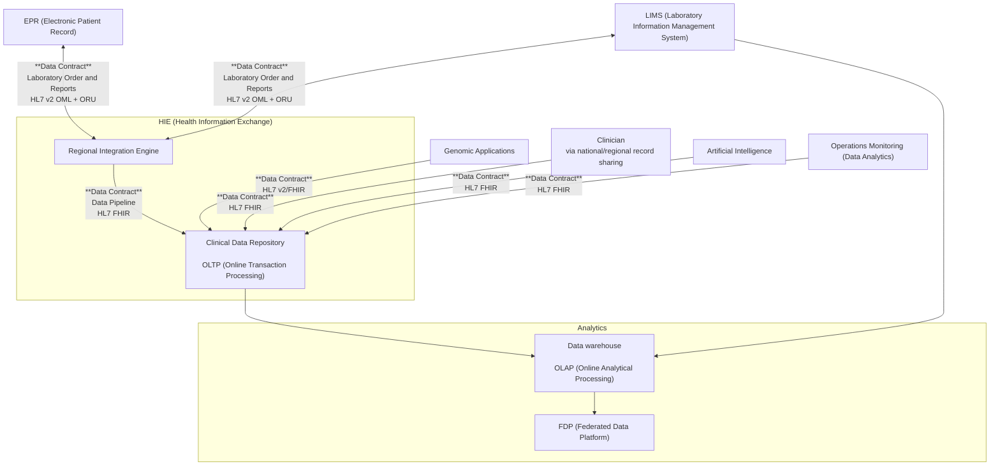

Data Contracts apply to all interactions used in this implementation guide. They are primarily expressed using HL7 FHIR, when HL7 v2 and IHE XDS mappings will be provided.

The scope of these data contracts is shown in the diagram above. It specifically excludes expressing data contracts for:
- EPR (Electronic Patient Record) systems (e.g. [openEHR Genomics](https://ckm.openehr.org/ckm/projects/1013.30.50) )
- Genomic Applications (e.g. [Global Alliance for Genomics and Health](https://www.ga4gh.org/)) 
- LIMS 
- OLAP (Online Analytical Processing) and FDP (Federated Data Platform)

