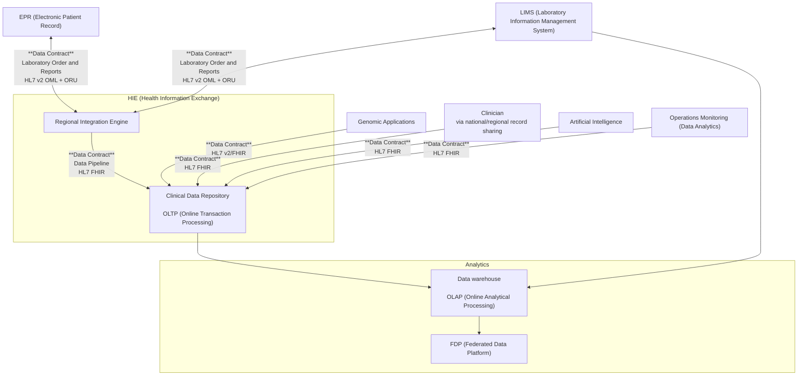

Data contracts govern all interactions defined in this implementation guide. They are primarily specified using HL7 FHIR; where applicable, mappings to HL7 v2 and IHE XDS will also be provided.

The diagram above illustrates the scope of the data contracts covered by this guide. Specifically, it **excludes** the definition of data contracts for the following systems and domains:

- EPR (Electronic Patient Record) systems (e.g. [openEHR Genomics](https://ckm.openehr.org/ckm/projects/1013.30.50) )
- Genomic Applications (e.g. [Global Alliance for Genomics and Health](https://www.ga4gh.org/)) 
- LIMS 
- OLAP (Online Analytical Processing) and FDP (Federated Data Platform)

This guide **includes** the definition of data contracts for:

- **Business-to-Business (B2B):** Use of HL7 FHIR to read data from the Clinical Data Repository.
- **Data Pipeline:** Internal use of HL7 FHIR for data exchange between the Regional Integration Engine and the Clinical Data Repository.
- **Business-to-Business (B2B):** Use of HL7 v2 and HL7 FHIR for interactions between LIMS and EPR systems.
- **Data Pipeline:** Use of HL7 v2, HL7 FHIR and IHE XDS for data exchange between the CDR and Regional Document Sharing systems such as IHE XDS, GMCR and National Record Locator. Note: data contract downgrades will be present in these pipelines.

## Data Contract Change Process

1. Data constraints or issues identified by data consumers. 
2. Requirement or issues is recorded on [NH Genomics IG issues](https://github.com/nw-gmsa/nw-gmsa.github.com/issues)
3. Business, suppliers and integration partners (the `NW Genomics Data Team`) review and comment on viability.
4. Data contract is updated/created in this guide (as PR?)
5. Change is reviewed and approved by the `NW Genomics Data Team`.
6. Change is released.
