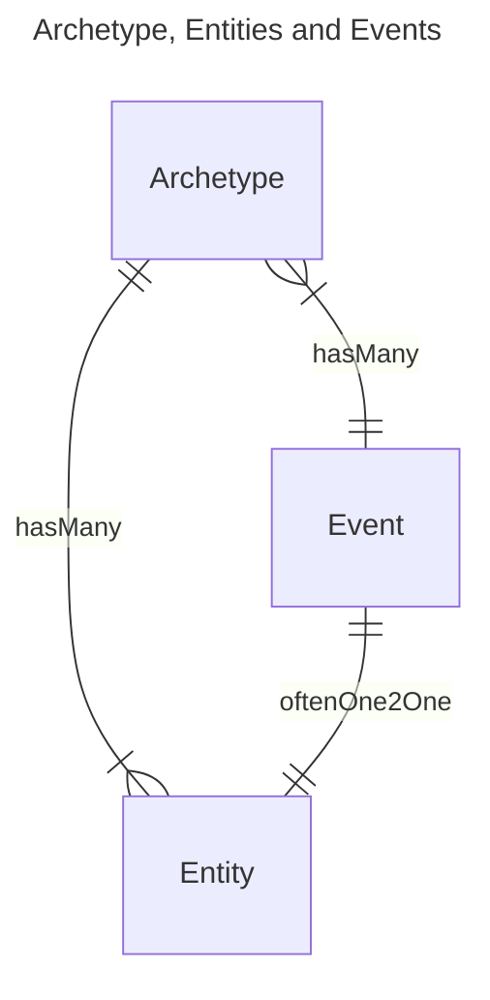
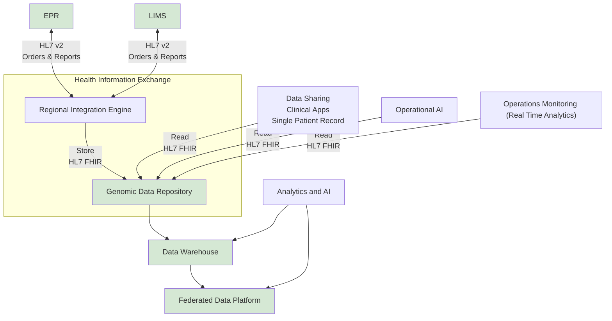
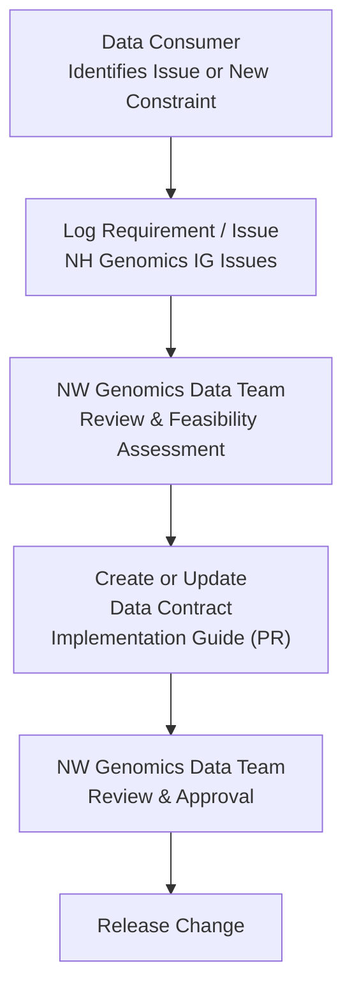

## Overview 

<figure>


Diagnostic Workflow - MindMap

</figure>
 

This implementation guide primarily focuses on the **Diagnostic Workflow** and how it integrates within the broader **health data model**, as illustrated in the diagram above.
- **Patient Care** and **Patient Administration** are typically found in NHS providers **Electronic Patient Record** systems
- **Care Directory Service** on the other hand, are centrally defined by NHS England, with supporting APIs also provided by NHS England (for example, the ODS API).

In software design, these areas are often referred to as [domains](https://en.wikipedia.org/wiki/Domain-driven_design). The **Genomic Diagnostic Workflow** operates across several of these domains — in software architecture terms, this is known as a [bounded context](https://martinfowler.com/bliki/BoundedContext.html). 

### Archetypes, Entities, and Events

This guide uses the following concepts:  
- 
- Health Informatics [Archetype](https://en.wikipedia.org/wiki/Archetype_(information_science)), this is model associated with messaging.
- [Entities](https://en.wikipedia.org/wiki/Entity%E2%80%93relationship_model) such as HL7 v2 segments and FHIR resources.
- [Events](https://en.wikipedia.org/wiki/Event_(computing)) such as HL7 v2 ADT and SET event feeds.

To align these perspectives, this guide defines the following relationship:

The **Archetype** follows the **Domain Archetype** concept from [Data Mesh](https://en.wikipedia.org/wiki/Data_mesh) principles and serves as a bridge between data architecture and software engineering.

- **Domain Archetype** may encompass multiple **Entities** and **Events**.
- **Entities** and a **Events** can have the same content and may be used interchangeably.

| Domain Archetype  | Archetype Examples                                 | Entity Examples   | Event Examples |
|-------------------|----------------------------------------------------|-------------------|----------------|
| Laboratory Order  | HL7 v2 OML_O21                                     | HL7 v2 Segment    |                |
| Laboratory Report | HL7 Lab Results Interface (extends HL7 v2 ORU_R01) | HL7 v2 Segment    |                |
|                   | Genomic Reporting - HL7 FHIR Profile               | HL7 FHIR Resource | FHIR Workflow  |
|                   | openEHR Genomic Module Archetypes                  |                   |                |
| Health Document   | IHE XDS Submission Set                             |                   | HL7 v2 MDM_T01 |

This domain focuses on genomic and molecular diagnostics, and the main **Archetypes** are: 

- [Genomic Test Order](Questionnaire-GenomicTestOrder.html)
- [Genomic Test Report](Questionnaire-GenomicTestReport.html) – Summarizes genomic testing results.
  - Variant – Represents a specific genetic variant or mutation.
  - Diagnostic Implication – Links variants to clinical significance (e.g., pathogenicity, treatment implications).

This guide although primarily using HL7 FHIR and V2 for interactions between health providers, it does not promote the use of these technical standards for data persistence in ERR, LIMS and analytics systems. Suppliers are free to use standards which may be more appropiate such as 
<a href="https://openehr.org/" target="_blank">openEHR</a> for EHR systems or <a href="https://www.ga4gh.org/" target="_blank"> Global Alliance for Genomics and Health (GA4GH)</a> for research/system databases.   

## Data Contracts

Data contracts govern all interactions defined in this implementation guide, and are used for all entities, messages (archetype) and events. They are primarily specified using HL7 FHIR; where applicable, mappings to HL7 v2 and IHE XDS will also be provided.

The diagram above illustrates the scope of the data contracts covered by this guide. Specifically, it **excludes** the definition of data contracts for the following systems and domains:

- EPR (Electronic Patient Record) systems (e.g. [openEHR Genomics](https://ckm.openehr.org/ckm/projects/1013.30.50) )
- Genomic Applications (e.g. [Global Alliance for Genomics and Health](https://www.ga4gh.org/))
- LIMS
- OLAP (Online Analytical Processing) and FDP (Federated Data Platform)

This guide **includes** the definition of data contracts for:

- **Business-to-Business (B2B):** Use of HL7 FHIR to read data from the Clinical Data Repository.
- **Data Pipeline:** Internal use of HL7 FHIR for data exchange between the Regional Integration Engine and the Clinical Data Repository.
- **Business-to-Business (B2B):** Use of HL7 v2 and HL7 FHIR for interactions between LIMS and EPR systems.
- **Data Pipeline:** Use of HL7 v2, HL7 FHIR and IHE XDS for data exchange between the CDR and Regional Document Sharing systems such as IHE XDS, GMCR and National Record Locator. Note: data contract downgrades will be present in these pipelines.

## Main Data Contracts

| Data Contract     | Type              | HL7 FHIR                                                        | HL7 v2 Segment                                           | IHE XDS        | HL7 v2 Message                                                                   | FHIR Message/Transaction                                             | 
|-------------------|-------------------|-----------------------------------------------------------------|----------------------------------------------------------|----------------|----------------------------------------------------------------------------------|----------------------------------------------------------------------|
| Laboratory Order  | Message/Archetype |                                                                 |                                                          |                | [OML_O21](hl7v2.html#oml_o21-laboratory-order)                                   |                                                                      |
| Laboratory Report | Message/Archetype |                                                                 |                                                          |                | [ORU_R01](hl7v2.html#oru_r01-unsolicited-transmission-of-an-observation-message) |                                                                      |  
| Patient           | Entity & Event    | [Patient](StructureDefinition-Patient.html)                     | [PID](hl7v2.html#pid)                                    |                |                                                                                  |                                                                      |
| Organisation      | Entity            | [Organization](StructureDefinition-Organization.html)           |                                                          |                |                                                                                  |                                                                      |
| Service Request   | Entity            | [ServiceRequest](StructureDefinition-ServiceRequest.html)       | [ORC](hl7v2.html#orc)                                    |                |                                                                                  |                                                                      | 
| Diagnostic Report | Entity            | [DiagnosticReport](StructureDefinition-DiagnosticReport.html)   | [OBR](hl7v2.html#obr)                                    |                |                                                                                  |                                                                      |
| Document Metadata | Entity & Event    | [DocumentReference](StructureDefinition-DocumentReference.html) | [TXA](hl7v2.html#txa) and [OBX](hl7v2.html#obx-type--ed) | Document Entry | [MDM_T02](hl7v2.html#mdm_t02-original-document-notification-and-content)                                                                      | See [IHE MHD ITI-105](https://profiles.ihe.net/ITI/MHD/ITI-105.html) |

## Data Contract Change Process

1. Data consumers identify data constraints or issues.
2. Requirements or issues are logged in the [NH Genomics IG issues](https://github.com/nw-gmsa/nw-gmsa.github.com/issues)
3. Business stakeholders, suppliers, and integration partners (collectively, the `NW Genomics Data Team`) review the item and assess its feasibility.
4. The data contract is created or updated within this implementation guide (for example, via a pull request).
5. The proposed change is reviewed and approved by the `NW Genomics Data Team`.
6. Once approved, the change is released.

