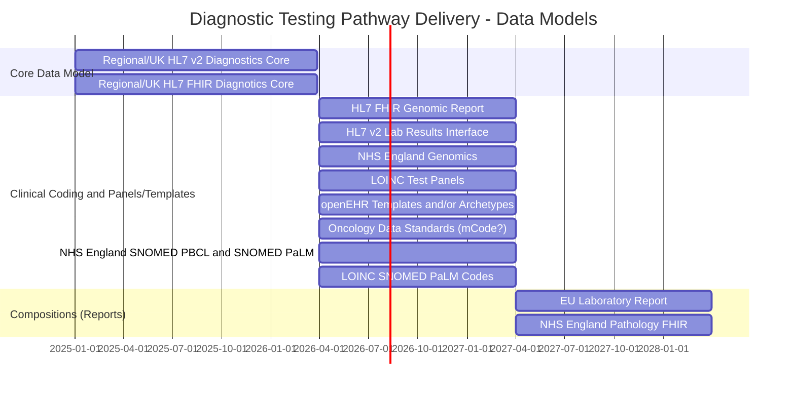
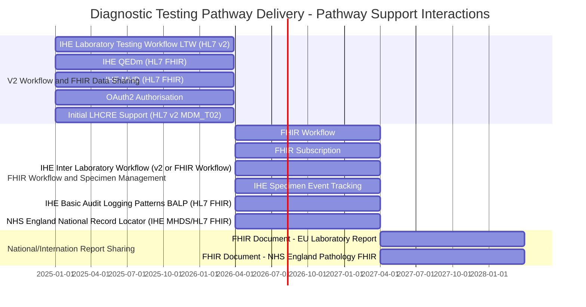

This is a very rough outline of the pathway delivery.

```mermaid
gantt
    title Diagnostic Testing Pathway Delivery - Data Models
    dateFormat YYYY-MM
    section Core Data Model
        Regional/UK HL7 v2 Diagnostics Core         :a1, 2025-01-01, 450d
        Regional/UK HL7 FHIR Diagnotics Core    :a1, 2025-01-01, 450d
    section Clinical Coding and Panels/Templates
        HL7 FHIR Genomic Report: 2026-04-01, 365d
        HL7 v2 Lab Results Interface: 2026-04-01, 365d
        NHS England Genomics: 2026-04-01, 365d
        LOINC Test Panels :2026-04-01, 365d
        openEHR Templates and/or Archetypes :2026-04-01, 365d
        Oncology Data Standards (mCode?) :2026-04-01, 365d
        NHS England SNOMED PBCL and SNOMED PaLM:2026-04-01, 365d
        LOINC SNOMED PaLM Codes:2026-04-01, 365d
    section Compositions (Reports)
        EU Laboratory Report: 2027-04-01, 365d
        NHS England Pathology FHIR: 2027-04-01, 365d
```

```mermaid
gantt
    title Diagnostic Testing Pathway Delivery - Pathway Support Interactions
    dateFormat YYYY-MM
    section V2 Workflow and FHIR Data Sharing
        IHE Laboratory Testing Workflow LTW (HL7 v2)        :a1, 2025-01-01, 450d
        IHE QEDm (HL7 FHIR)    :a1, 2025-01-01, 450d
        IHE MHD (HL7 FHIR)    :a1, 2025-01-01, 450d
        OAuth2 Authorisation   :a1, 2025-01-01, 450d
        Initial LHCRE Support (HL7 v2 MDM_T02) :a1, 2025-01-01, 450d
    section FHIR Workflow and Specimen Management
        FHIR Workflow  : 2026-04-01, 365d
        FHIR Subscription  : 2026-04-01, 365d
        IHE Inter Laboratory Workflow (v2 or FHIR Workflow)        : 2026-04-01, 365d
        IHE Specimen Event Tracking : 2026-04-01, 365d
        IHE Basic Audit Logging Patterns BALP (HL7 FHIR): 2026-04-01, 365d
        NHS England National Record Locator (IHE MHDS/HL7 FHIR): 2026-04-01, 365d
    section National/Internation Report Sharing
        FHIR Document - EU Laboratory Report: 2027-04-01, 365d
        FHIR Document - NHS England Pathology FHIR: 2027-04-01, 365d
```
