## Message Based Workflow

### Traditional Point-To-Point Messaging Transformation

The diagram below illustrates [point to point](https://www.enterpriseintegrationpatterns.com/patterns/messaging/PointToPointChannel.html) messaging between an `Order Placer` and an `Order Filler`. The `Order Filler` is typically a Laboratory Information Management System (LIMS), while the `Order Placer` is usually a clinical system such as an Electronic Patient Record (EPR).

Not all interactions will necessarily be electronic. For example, reports may be sent by email, and orders may be submitted via email or physically accompany the specimen.

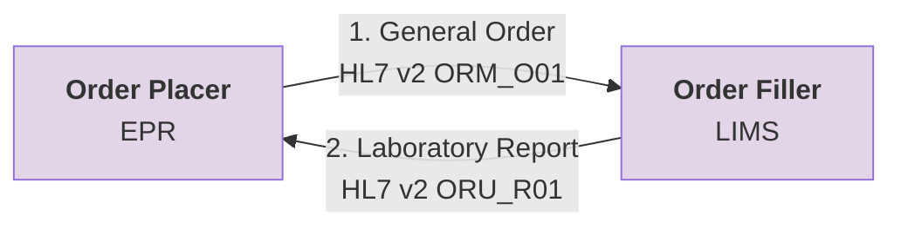

In many NHS Trusts, a Trust Integration Engine (TIE) is used to facilitate this point-to-point messaging.

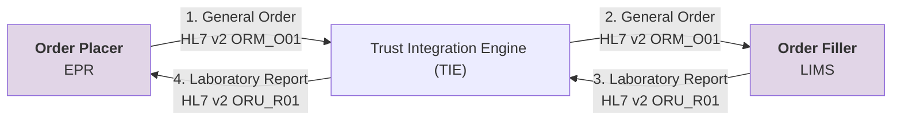

TIEs typically handle transformations between the different HL7 v2 variants used by Order Placers (e.g. EPRs) and Order Fillers (e.g. LIMS).

### Regional Orchestration Engine (RIE) – Initial Interoperability For Existing Messaging Flows

To support ordering and reporting at a regional level, [IHE Laboratory Testing Workflow (LTW)](LTW.html) will be adopted using HL7 v2.5.1 message formats. This includes moving from ORM_O01 to OML_O21 to support the SPM (Specimen) segment.

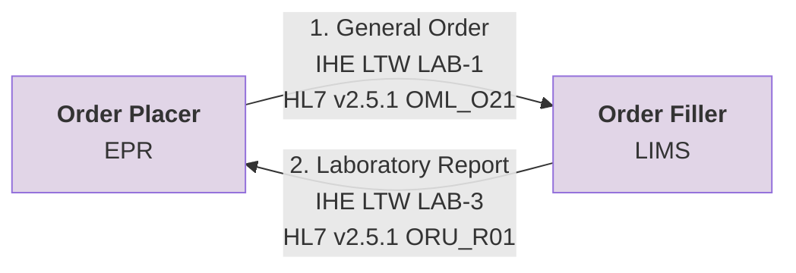

Existing interfaces to NW Genomics LIMS will be migrated to use the Regional Orchestration Engine (RIE). The RIE performs similar functions to NHS Trust TIEs, and in the interim phase will perform pass through routing of messages only.
Note the use of the IHE LTW profile and the HL7 v2.5.1 message format is only expected to be implemented between the NHS Trust TIE and Regional RIE..

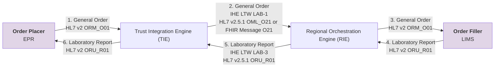

### Regional Orchestration Engine (RIE) - Regional Interoperability

The regional genomic service supports more than 20 NHS Trusts, each potentially operating different clinical systems. Within NHS North West Genomics itself, multiple LIMS and supporting clinical systems are in use. Under a traditional point-to-point integration model, this rapidly leads to a highly complex and fragile integration landscape.

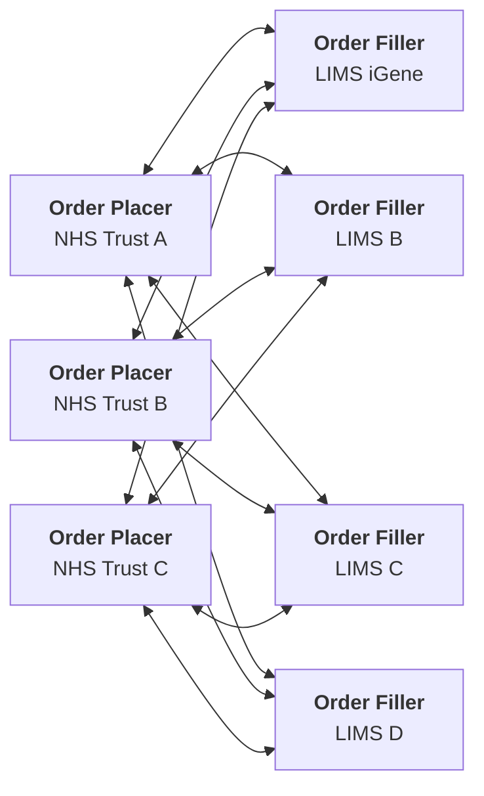

To address this challenge, the RIE acts as a **central routing and interoperability hub**. All orders and reports are exchanged between NHS Trust ordering systems and North West Genomics LIMS platforms via the RIE.

Rather than maintaining multiple bespoke integrations, each participant integrates once with the RIE. Trust Integration Engines remain responsible for transforming messages between local EPR systems and the regional standard used by the RIE.

A key element of this approach is the introduction of `standardised message formats and interactions` between Trust TIEs and the RIE. These standards are based on a single, shared data model known as the `Data Contract`.

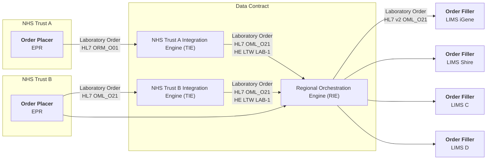

Equivalent patterns apply to laboratory reports.

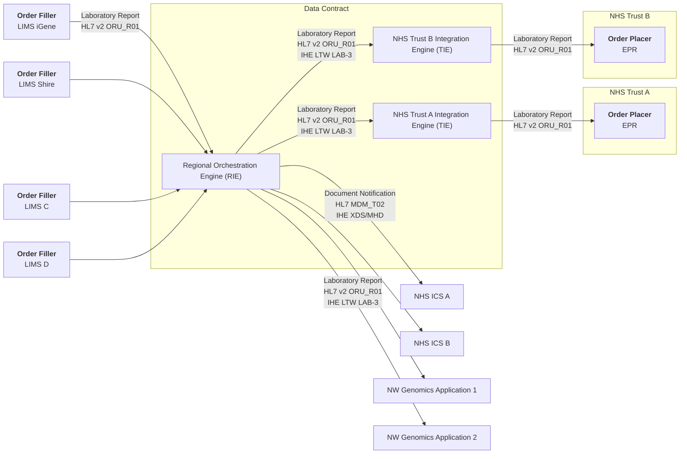

#### RIE vs Trust Integration Engine

The primary distinction between a Regional Orchestration Engine and a Trust Integration Engine is scope:

- **Trust Integration Engines** focus on internal interoperability within a single organisation.
- The **Regional Orchestration Engine** operates at a regional level, providing centralised routing and orchestration across multiple organisations.

This hub-and-spoke model significantly reduces integration complexity, improves maintainability, and supports consistent data quality across the region.
The main distinction between a Regional Orchestration Engine (RIE) and a Trust Integration Engine is that the RIE functions as a central routing hub. Each participant connects only to the RIE rather than individually integrating with multiple other systems. This significantly reduces integration complexity. Trust TIEs will still be responsible for transforming messages between their internal EPR systems and the RIE.

#### Identifier and Codes (Terminology) Standardisation

Because the RIE operates at a regional level, certain HL7 v2 message components must be standardised or updated. These changes ensure global uniqueness for identifiers such as:

- Patient identifiers: NHS Number (England and Wales), CHI Number (Scotland), HSCN Number (Northern Ireland), and local NHS Trust medical record numbers
- Order identifiers: placer and filler order numbers
- Report identifiers
- Visit identifiers: spell or episode numbers
- Specimen identifiers: including accession and pathology specimen identifiers

Standard clinical terminologies are used to ensure semantic interoperability:

- SNOMED CT for clinical concepts
- LOINC (and SNOMED CT) for laboratory observations and orderable items

These requirements are outlined in the [Data Contract](data-intro.html). HL7 v2 message exchanges are aligned with HL7 v2.5.1 and the following IHE profiles (**API Contracts**):

- [IHE Laboratory Testing Workflow (LTW)](TLW.html) profile
- [IHE Inter Laboratory Workflow (ILW)](ILW.mw) profile (Future)
- [IHE Specimen Event Tracking (SET)](SET.html) profile (Future)

#### Practical Implementation

From a practical perspective, the RIE is introduced into the existing point-to-point messaging flow. It is at this boundary—between the TIE and the RIE—that the use of the [Data Contracts](data-intro.html)
, including HL7 v2.5.1 and adoption of IHE LTW, is mandated.

Data Contracts are not mandated between the RIE and LIMS, nor between the TIE and EPR. For practical reasons, these systems may require changes in the future to align with the central Data Contracts.

NHS Trust TIEs do not interface directly with the LIMS within NHS North West Genomics and, going forward, will not interface directly with LIMS from other regional genomic systems and NHS England Genomic Order Management Service. All such interactions will be managed by the RIE.

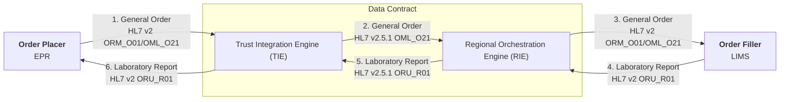

## Data and Document Sharing

### Regional Data and Document Sharing - Genomic Data Repository (GDR)

Traditional messaging focuses solely on communication between two systems—the order placer and the order filler—and does not support wider sharing of genomic data across multiple organisations such as NHS Trusts, GP practices, or other clinical teams.

To address this, a central Genomic Data Repository (GDR) will be established. This repository will provide a read-only [FHIR RESTful (read only API)](https://hl7.org/fhir/R4/http.html) and will be populated via data flows through the RIE (See [Health Information Exhange (HIE)](#health-information-exchange-hie)) and will focus primarily on sharing data produced by NHS North West Genomics.

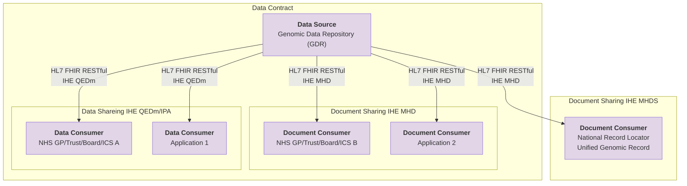

The [Data Contract](datta-intro.html) and data structures used in the FHIR interfaces follow the same conventions as those used in the HL7 v2 message exchanges.

The CDR is expected to adopt emerging IHE Europe standards for clinical data and document sharing. These currently include (**API Contract**):

- [IHE Mobile access to Health Documents (MHD) ITI-66 and ITI-67](MHD.html) HL7 FHIR
- [IHE Query for Existing Data for Mobile (QEDm) PCC-44](QEDm.html) HL7 FHIR
- [IHE Patient Demographics Query for Mobile (PDQm) ITI-78](PDQm.html) HL7 FHIR
- [IHE Internet User Authorization (IUA)](IUA.md) OAuth2
- [IHE Basic Audit Log Patterns (BALP)](https://profiles.ihe.net/ITI/BALP/index.html) HL7 FHIR

## Conversational (Event) Based Workflow

### FHIR Workflow

The introduction of data and document sharing using HL7 FHIR RESTful APIs enables a transition from a traditional message-based workflow to an event-based workflow (see [FHIR Workflow](https://hl7.org/fhir/R4/workflow.html)).

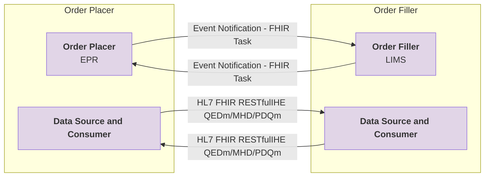
In this model, orders and reports are no longer exchanged directly between the Order Placer and the Order Filler. Instead, both systems communicate through FHIR Tasks, using event notifications to coordinate activities and state changes.

This represents a shift from a message-oriented workflow (see [EIP Messaging Patterns](https://www.enterpriseintegrationpatterns.com/patterns/messaging/)) to a conversation-based workflow (see [EIP Conversation Patterns](https://www.enterpriseintegrationpatterns.com/patterns/conversation/index.html)). Rather than relying on single, transactional messages, the workflow is managed as an ongoing conversation between participants.

Although this approach involves multiple exchanges between the Order Placer and the Order Filler, it more accurately reflects real-world clinical workflows, where work progresses through a series of coordinated steps, acknowledgements, and state transitions rather than a single request–response interaction.

It is anticipated that event notifications will be implemented using [FHIR Subscriptions](https://build.fhir.org/ig/HL7/fhir-subscription-backport-ig/), which support a publish–subscribe (pub/sub) pattern, or alternatively through the [NHS England Multicast Notification Service API](https://digital.nhs.uk/developer/api-catalogue/multicast-notification-service).

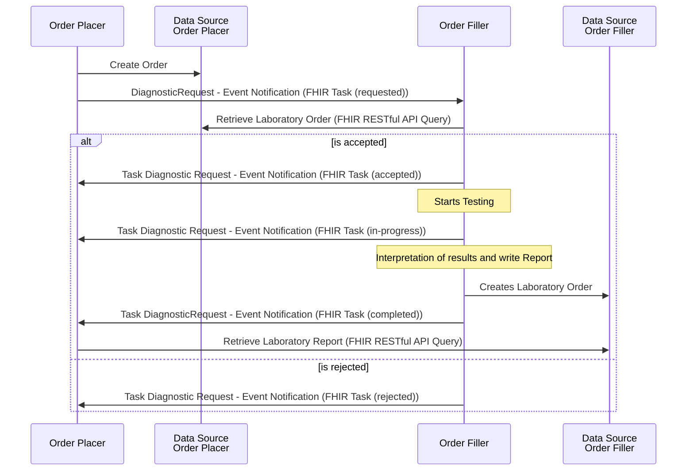

This diagram illustrates an event-based, conversation-driven laboratory ordering workflow using HL7 FHIR Tasks.

The Order Placer creates a diagnostic order and notifies the Order Filler via a FHIR Task. The Order Filler retrieves the order using FHIR RESTful queries, accepts or rejects the request, and communicates status updates (accepted, in-progress, completed, or rejected) back to the Order Placer through task-based event notifications. Laboratory testing, result interpretation, and report creation occur asynchronously, with reports retrieved by the Order Placer via FHIR RESTful APIs upon task completion.

### Health Information Exchange (HIE)

A conversational (event-based) workflow, also referred to as a conversation-based workflow, represents a modern approach to clinical messaging. This paradigm assumes that both the Order Placer and the Order Filler can share data using HL7 FHIR RESTful APIs.

In practice, this capability may not always be available. For example, Laboratory Information Management Systems (LIMS) within NHS North West Genomics may not support FHIR RESTful APIs. In such cases, the Genomic Data Repository (GDR) is used to share genomic laboratory reports and other genomic data. Similarly, if Electronic Patient Record (EPR) systems do not support FHIR RESTful APIs, the GDR is used to facilitate the sharing of laboratory orders.

Together, the Regional Orchestration Engine (RIE) and the Genomic Data Repository (GDR) collectively constitute the Health Information Exchange (HIE).

<figure>


Health Information Exchange (HIE)

</figure>
 
