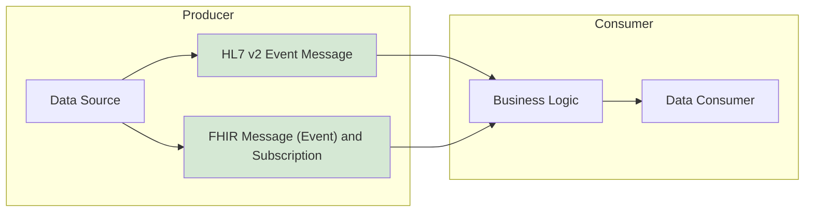
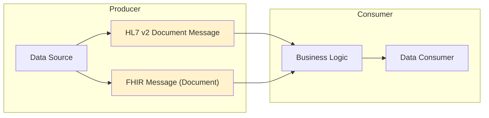
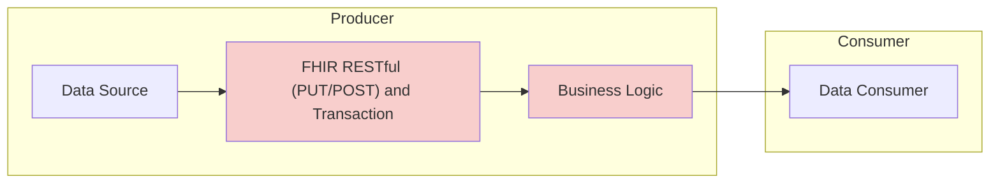
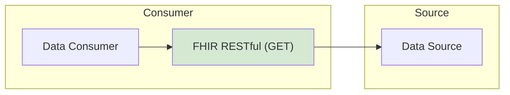
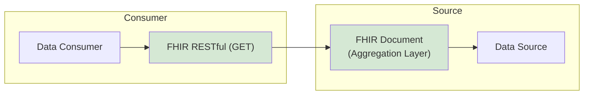

## Genomic Data Exchange Overview

The North West Genomics data exchange architecture enables secure and
standardised communication between NHS Trust clinical systems and
regional genomic laboratory services.

The architecture consists of three primary components:

1. **Regional Integration Engine (RIE)**  
   Routes and standardises messaging between organisations.

2. **Genomic Data Repository (GDR)**  
   A central read-only repository for genomic data and reports. Also known as a **Data Platform**

3. **API Gateway (APIM)**  
   Provides external data access to the GDR and also provides [API Security](api-security.html).

Together these components form the **Health Information Exchange (HIE)**
for the North West Genomic Medicine Service Alliance.

Key goals:

- Reduce point-to-point integrations
- Standardise HL7 and FHIR interactions
- Enable cross-organisation genomic data sharing
- Support modern event-driven workflows

## Traditional Integration Model

Historically, each NHS Trust integrated directly with laboratory systems.
This resulted in multiple bespoke integrations.

Problems:

- High maintenance cost
- Complex transformation logic
- Challenging onboarding of new systems
- Limited use clinical terminology

## RIE Integration Model

The Regional Integration Engine introduces a **hub-and-spoke model**.

Each participant integrates once with the RIE.

Benefits:

- Reduced integration complexity
- Centralised routing and ordchestration
- Standardised message formats and data standards

## Architectural Principles

The exchange architecture is based on several core principles.

### Hub-and-Spoke Integration

All participating organisations integrate with a Regional Integration Engine (RIE) rather than building direct integrations with each other.

This approach:
- reduces integration complexity
- centralises routing and transformation
- simplifies onboarding of new systems

### Standards-Based Interoperability

The exchange uses widely adopted healthcare interoperability standards including:

- HL7 v2 messaging
- HL7 FHIR APIs
- SNOMED CT terminology
- IHE interoperability profiles

### Event-Driven Workflow

Modern workflows are supported through:

- FHIR Tasks
- event notifications
- workflow status updates

This enables clinical systems to respond dynamically to laboratory workflow events.

### Separation of Messaging and Data Access

Two complementary exchange patterns are used:

| Pattern                 | Purpose |
|-------------------------|---------|
| Messaging |	Operational workflow communication |
| APIs                    | Access to structured genomic data |
{:.grid}

 

## HL7 v2 and FHIR Exchange

Exhange has two high-level styles:

- Messaging which sends data between applications/organisations. This breaks down into two sub-styles:
  - Event Messaging which sends asynchronous event notifications between applications
  - Document Messaging which sends structured clinical data between applications
- Data Sharing which shares data between applications/organisations

The general trend is to use FHIR RESTful (GET) for data sharing. 

HL7 v2 is the most common exchange format for healthcare data. It has two basic interaction styles:

- [V2 Event Message](https://www.enterpriseintegrationpatterns.com/patterns/messaging/EventMessage.html) for reliable, asynchronous event notification between applications e.g. ADT and MDM_T01 events
- [V2 Document Message](https://www.enterpriseintegrationpatterns.com/patterns/messaging/DocumentMessage.html) to reliably transfer a data structure (orders and reports) between applications, e.g.ORM_O01, OML_O21, ORU_R01 and MDM_T02

HL7 FHIR has several interaction styles which can replace HL7 v2.

- [FHIR Message (Document)](https://hl7.org/fhir/R4/messaging.html) which for orders and report messaging, is a direct replacement of HL7 v2.
- [FHIR RESTful (GET)](https://hl7.org/fhir/R4/http.html) which provides a read only API to the source data. This is one of the most common interaction style using FHIR.
- [FHIR Message (Event) and Subscription](https://build.fhir.org/ig/HL7/fhir-subscription-backport-ig/) is a modernised version of HL7 v2 which focuses on event notifications only similar to HL7 v2 ADT and MDM_T01 events (but not orders and reports).
- [FHIR RESTful (PUT/POST)](https://hl7.org/fhir/R4/http.html) which provides a read and write API to the desintiation data. Note this moves the consumer business logic to the consumer and so can be considered an anti-pattern for enterprise level exchanges.
- [FHIR Document](https://hl7.org/fhir/R4/documents.html) Clinical documents are the FHIR version of HL7 v3 Clinical Document Architecture (CDA).

### Event Message – HL7 v2 Event Message and FHIR Message (Event) and Subscription

#### Advantages

- High level of support in secondary care
- Scales well in large enterprise environments and has proven to be reliable for health administration events.
- Business logic is in the consumer
- Can be extended to support publish/subscribe messaging via FHIR Subscription

#### Disadvantages

- Not supported in primary care
- Use of FHIR is currently low, as HL7 v2 events use is high.

#### Examples 

- NHS England ADT Messsaging Specification.

### Document Message - HL7 v2 Document Message and FHIR Message (Document)

#### Advantages

- High level of support in secondary and primary care
- Business logic is in the consumer

#### Disadvantages

- Only supports data sharing via point-to-point messaging
- Does not scale well in large enterprise environments
- Clinical data standards tend to be weak

#### Examples 

- NHS England Transfer of Care 
- NHS England National Event Management System
- HL7 v2 ORU_R01
- NHS England Pathology
- NHS England Electronic Prescription Service
- NHS England Booking and Referral System (referrals)

### FHIR RESTful (PUT/POST) and Transaction

#### Advantages

- Modern API restful API to populate a database/EHR
- Suitable for internal data engineering

#### Disadvantages

- Business logic is in the consumer
- Consumer data rules are with the producer
- Does not scale in large enterprise environments

### Data and Document Sharing - FHIR RESTful (GET)

#### Advantages

- Modern API restful API to access EHR data
- Scales well in large enterprise environments
- Is the default exchange format for FHIR
- Can be reused for data engineering purposes (e.g. analytics and AI)

#### Disadvantages

- Does not support event notifications (see above).

#### Examples

- NHS England COVID-19 API's 
- Yorkshire and Humberside Care Record
- North West Genomics FHIR Repository
- NHS England National Record Locator Service (NRL) and National Imaging Registry (NIR)
- NHS England Booking and Referral System (appointments)
- HL7 + IHE Europe [EU Health Data API](https://euridice.org/eu-health-data-api/)

### Document Sharing Format - Clinical Documents (FHIR Document)

#### Advantages

- Supports data sharing in environments where direct exchange of clinical data is not possible.
- Support international document sharing and is *probably* the UK home nations' preferred format.
- Replaces PDF formats.
- Can be used by consumers as structured or unstructured data.
- Can be implemented as an Aggregation Layer on top of FHIR RESTful (GET).

#### Disadvantages

- Can be an anti-pattern when used on the wrong enviroment.
- Analytics and AI is more complex than FHIR RESTful (GET).

#### Examples

- [International Patient Summary](https://euridice.org/specifications-eu-patient-summary/)
- HL7 Europe [Laboratory Report](https://euridice.org/specifications-eu-laboratory-report-specification/)

