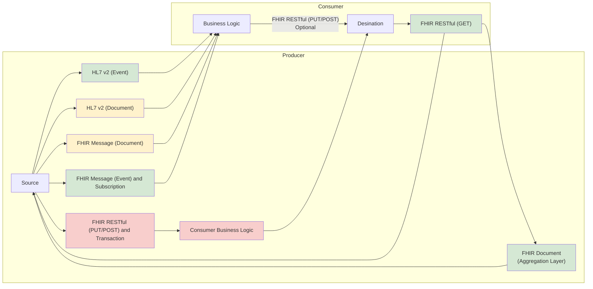

HL7 v2 is the most common exchange format for healthcare data. It has two basic interaction styles:

- [Event Message](https://www.enterpriseintegrationpatterns.com/patterns/messaging/EventMessage.html) for reliable, asynchronous event notification between applications e.g. ADT and MDM_T01 events
- [Document Message](https://www.enterpriseintegrationpatterns.com/patterns/messaging/DocumentMessage.html) to reliably transfer a data structure (orders and reports) between applications, e.g.ORM_O01, OML_O21, ORU_R01 and MDM_T02

HL7 FHIR has several interaction styles which can replace HL7 v2.

- [FHIR Message (Document)](https://hl7.org/fhir/R4/messaging.html) which for orders and report messaging, is a direct replacement of HL7 v2.
- [FHIR RESTful (GET)](https://hl7.org/fhir/R4/http.html) which provides a read only API to the source data. This is one of the most common interaction style using FHIR.
- [FHIR Message (Event) and Subscription](https://build.fhir.org/ig/HL7/fhir-subscription-backport-ig/) is a modernised version of HL7 v2 which focuses on event notifications only similar to HL7 v2 ADT and MDM_T01 events (but not orders and reports).
- [FHIR RESTful (PUT/POST)](https://hl7.org/fhir/R4/http.html) which provides a read and write API to the desintiation data. Note this moves the consumer business logic to the consumer and so can be considered an anti-pattern for enterprise level exchanges.

Like HL7 v3 CDA, FHIR also supports a clinical document model called [FHIR Document](https://hl7.org/fhir/R4/documents.html)
