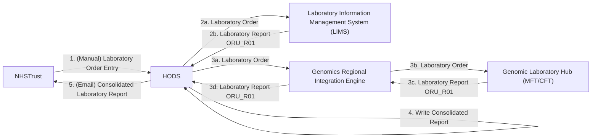
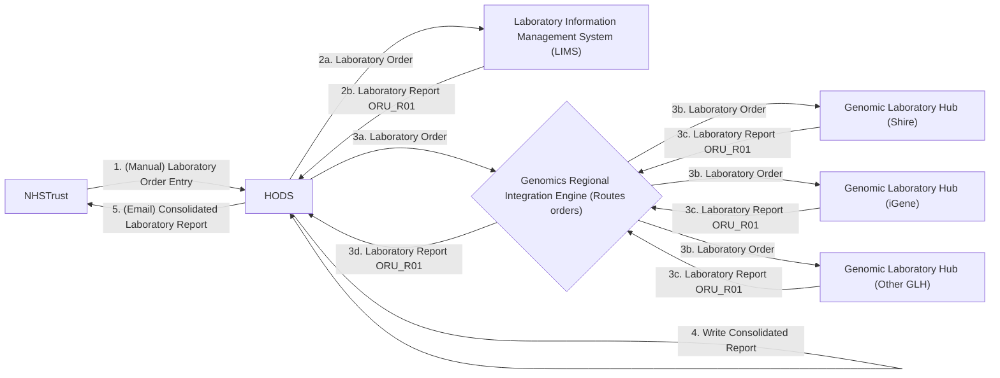

### Current 

After move of HODS from The Christie to Manchester Foundation Trust.

```mermaid
graph LR
    NHSTrust --> |"1. (Manual) Laboratory Order Entry"| HODS
    HODS --> |2a. Laboratory Order| LIMS["Laboratory Information Management System (LIMS)"]
    HODS --> |3a. Laboratory Order| RIE["Genomics Regional Integration Engine"] 
    RIE --> |3b. Laboratory Order| GLH["Genomic Laboratory Hub (MFT/CFT)"]
    LIMS --> |2b. Laboratory Report ORU_R01| HODS
    GLH --> |3c. Laboratory Report ORU_R01| RIE 
    RIE --> |3d. Laboratory Report ORU_R01| HODS
    HODS --> |4. Write Consolidated Report| HODS
    HODS --> |"5. (Email) Consolidated Laboratory Report"| NHSTrust
```

### Future

For elaboration purposes only.

```mermaid
graph LR
    NHSTrust --> |"1. (Manual) Laboratory Order Entry"| HODS
    HODS --> |2a. Laboratory Order| LIMS["Laboratory Information Management System (LIMS)"]
    HODS --> |3a. Laboratory Order| RIE{"Genomics Regional Integration Engine (Routes orders)"} 
    RIE --> |3b. Laboratory Order| GLH1["Genomic Laboratory Hub (Shire)"]
    RIE --> |3b. Laboratory Order| GLH2["Genomic Laboratory Hub (iGene)"]
    RIE --> |3b. Laboratory Order| GLH3["Genomic Laboratory Hub (Other GLH)"]
    LIMS --> |2b. Laboratory Report ORU_R01| HODS
    GLH1 --> |3c. Laboratory Report ORU_R01| RIE 
    GLH2 --> |3c. Laboratory Report ORU_R01| RIE 
    GLH3 --> |3c. Laboratory Report ORU_R01| RIE 
    RIE --> |3d. Laboratory Report ORU_R01| HODS
    HODS --> |4. Write Consolidated Report| HODS
    HODS --> |"5. (Email) Consolidated Laboratory Report"| NHSTrust
```