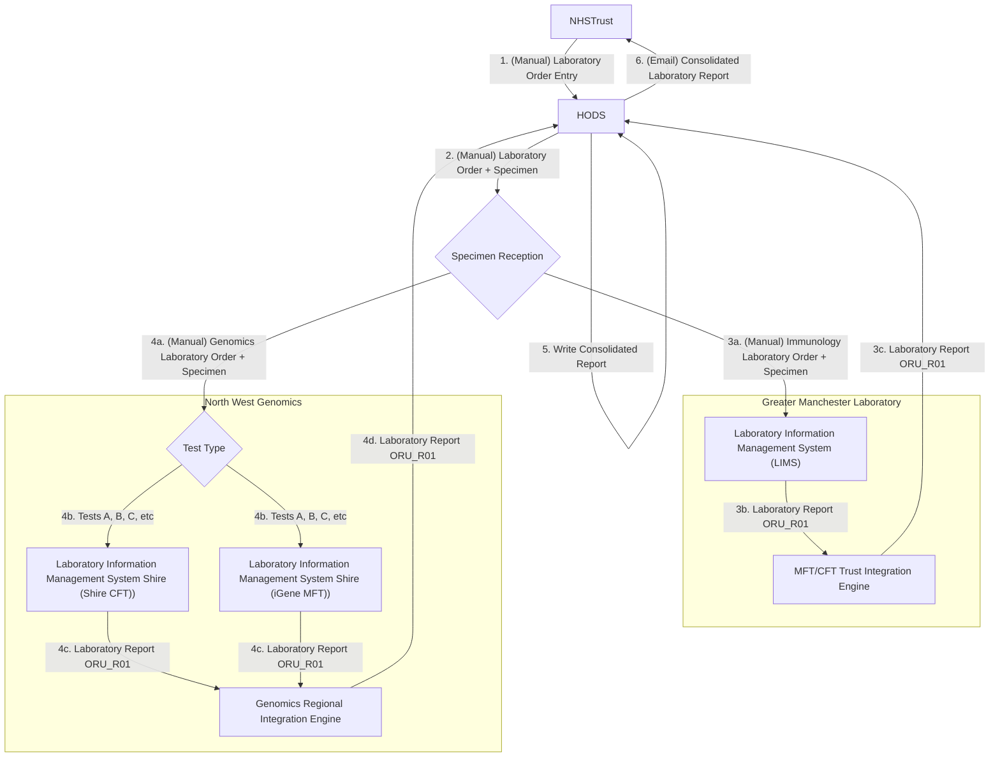

### Greater Manchester 

After move of HODS from The Christie to Manchester Foundation Trust.

- Trusts will place their orders directly in HODS (1). HODS prints a request form, this is sent with the samples to Central specimen reception at MFT (2a).
- Specimen reception then route the samples to the appropriate labs for testing, e.g. Genomics (4a), Immunology (3a), Christie via transport, etc.
- The orders are manually booked into LIMS (Beaker (3a), iGene (4a + 4b), Shire (4a + 4b), etc). Which Genomic LIMS is used is determined by Genomic Test Type.
- Results are sent electronically from LIMS (3b and 4c) to HODS (with exception of iGene PDFs, these are manually uploaded)
- Reporting consultant writes the final combined report within HODS itself when all results are in (5)
- When report is marked Closed , requesting clinicians are alerted by email (6) to log into HODS and view/export the PDF of the final report

### Cheshire and Mersey

For elaboration purposes only. This is a more detailed breakdown the the Genomic Tests.

 

HODS Genomic Tests - Mersey and Cheshire GLH
 
 

