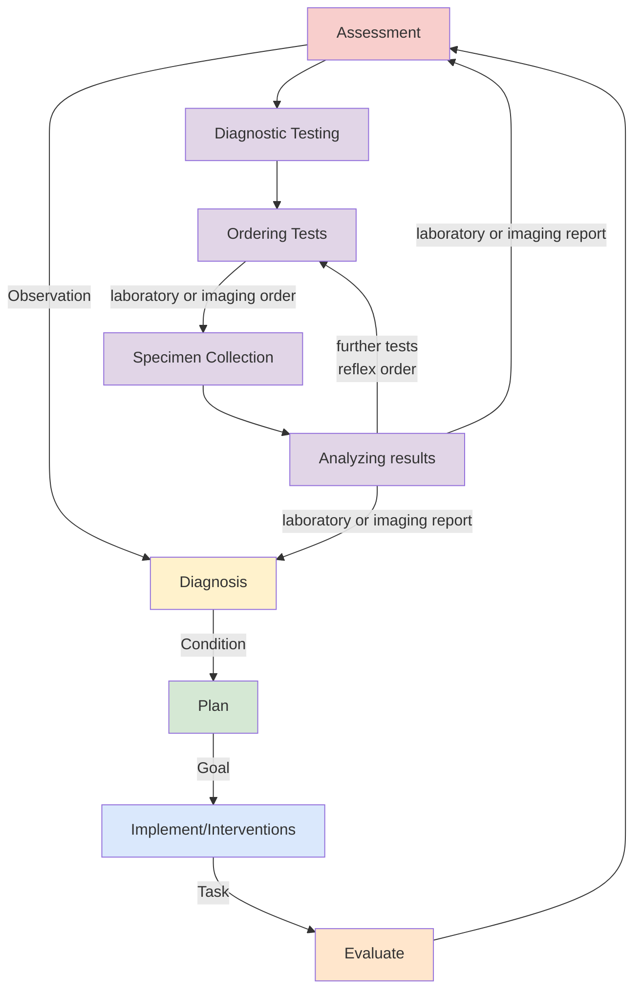
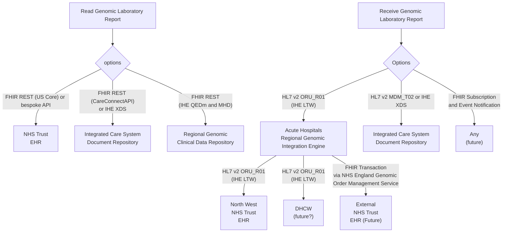
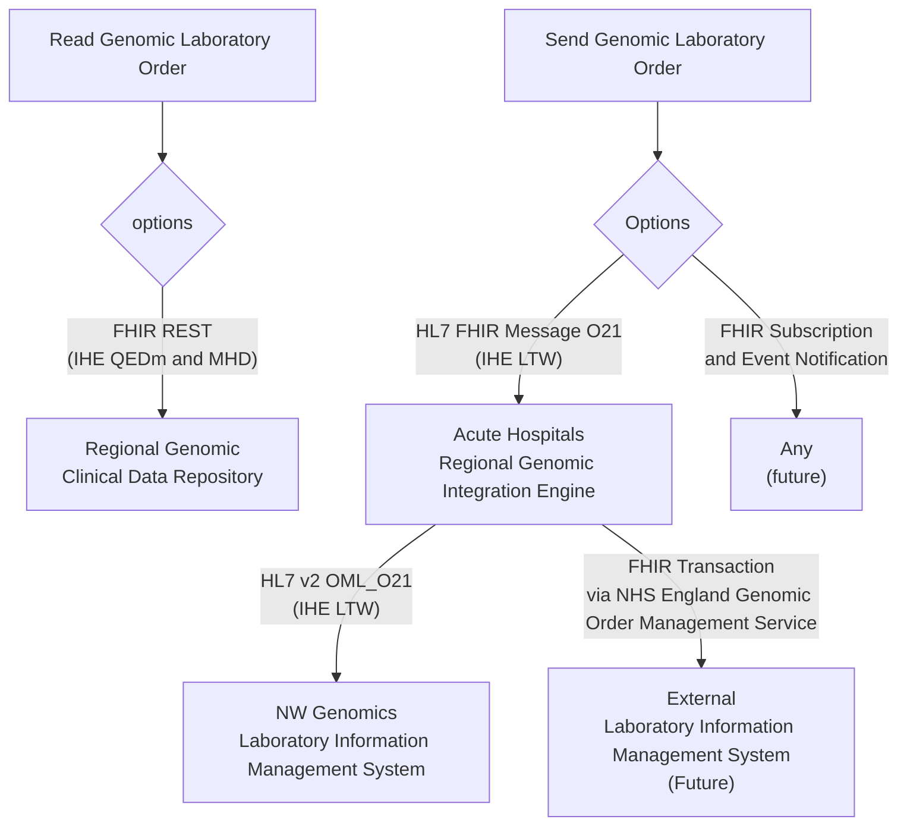

## Introduction

This guide is to support Genomic Testing Workflow at a regional level and is designed to be compatible with:

- [NHS England - FHIR Genomics Implementation Guide](https://simplifier.net/guide/fhir-genomics-implementation-guide/Home) which defines the conformance requirements for Genomics in England
- [NHS England - Genomic Order Management Service FHIR API](https://digital.nhs.uk/developer/api-catalogue/genomic-order-management-service-fhir) a [FHIR Workflow](https://hl7.org/fhir/R4/workflow.html) based service for managing orders and results at a national level.

The general workflow is based on IHE LTW profiles and HL7 v2 OML and ORU. 

### Clinical Process

Genomic Testing Workflow is part of Diagnostic Testing, which is also part of the general clinical process. 

### Diagnostic Testing Workflow

Genomic diagnostic testing follows the same standardized process defined by the [IHE Laboratory Testing Workflow](https://wiki.ihe.net/index.php/Laboratory_Testing_Workflow) used in traditional laboratory testing.
This workflow has been enhanced to support the sharing of laboratory reports (documents) through Integrated Care Systems (ICS). In addition, a new mechanism for sharing laboratory reports has been introduced to establish a regional genomic data repository.

 

Diagnostic Testing Workflow
 
 

Together, the ICS document sharing and regional data repositories represent new methods of exchanging genomic data, building upon the traditional HL7 v2 messaging approach.

#### Read Genomic Laboratory Report

The APIs for accessing genomic laboratory reports from EHR using FHIR REST are outside the scope of this Implementation Guide and are detailed in supplier-specific implementation guides, such as:

- [EPIC on FHIR](https://fhir.epic.com/)
- [Meditech FHIR](https://fhir.meditech.com/)
- [FHIR R4 APIs for Oracle Health Millennium Platform](https://docs.oracle.com/en/industries/health/millennium-platform-apis/mfrap/r4_overview.html)

The Regional Clinical Data Repository (CDR) will adopt a similar FHIR RESTful approach to that used by Electronic Health Records (EHRs), and will also conform to [IHE Query for Existing Data for Mobile (QEDm)](https://build.fhir.org/ig/IHE/QEDm/branches/master/index.html) and [IHE Mobile access to Health Documents (MHD)](https://profiles.ihe.net/ITI/MHD/index.html)   

#### Receive Genomic Laboratory Report

To enable viewing of Genomic Laboratory Reports within an NHS Trust EHR or an ICS Document Repository, the report must first be received through HL7 v2 ORU or MDM messaging.

In the future, an alternative messaging approach using [FHIR Subscription](https://build.fhir.org/ig/HL7/fhir-subscription-backport-ig/index.html) and Event Notifications is expected to be supported. Details of this approach will be provided in a later version of this Implementation Guide.

#### Read and Send Laboratory Order

## How to Read this IG

<table >
  <thead>
    <tr>
      <th></th>
      <th>Menu Item</th>
      <th>Description</th>
      <th>Audience</th>
    </tr>
  </thead>
  <tbody>
    <tr>
      <td style="background-color: #E1D5E7">&nbsp;&nbsp;</td>
      <td>Analysis and Design (Volume 1)</td>
      <td>Description of the processes and corresponding technical frameworks</td>
      <td>General</td>
    </tr>
    <tr>
      <td style="background-color: #F8CECC">&nbsp;&nbsp;</td>
      <td>Interfaces (Volume 2)</td>
      <td>Description of the processes and corresponding technical frameworks (HL7 v2 and FHIR Interactions)</td>
      <td>Detailed Technical (Integration Developer)</td>
    </tr>
    <tr>
      <td style="background-color: #DAE8FC">&nbsp;&nbsp;</td>
      <td>Domain Archetype (Volume 3)</td>
      <td>NHS North West Forms, Templates, Reports and Compositions</td>
      <td>Detailed Technical (Data Modelling)</td>
    </tr>
    <tr>
      <td style="background-color: #DAE8FC">&nbsp;&nbsp;</td>
      <td>Artefacts (Volume 4)</td>
      <td>NHS North West Common Data Models</td>
      <td>Detailed Technical</td>
    </tr>
    <tr>
      <td style="background-color: #DAE8FC">&nbsp;&nbsp;</td>
      <td>Development</td>
      <td>Testing, Suppport and Architecture</td>
      <td>Detailed Technical (Developer)</td>
    </tr>
  </tbody>
</table>

## Technical Overview

This Implementation Guide is implemented in the Regional Integration Engine (RIE)

<figure>


Regional Integration Engine Scope

</figure>
 

This guide follows [IHE Laboratory Testing Workflow](https://wiki.ihe.net/index.php/Laboratory_Testing_Workflow), which describes how to use HL7 v2 orders and reports at an enterprise level. It will contain several modifications in order to support HL7 [FHIR Messasging](https://hl7.org/fhir/R4/messaging.html), these messages will be closely related to HL7 v2 Messages to help with adoption.
For documentation purposes, HL7 v2 version used will be 2.5.1 (this also matches NHS England FHIR Genomics, HL7 International v2 standards around structured Genomic reporting and Digital Health and Care Wales standards around ORU_R01)

It also brings in both data and workflow requirements from a variety of other guides.

 

North West GMSA IG
 
 

### GLH Regional Integration Engine (GLH RIE)

This implementation guide will be supported by a **Genomics Regional Integration Engine (RIE)** which will:

- [Message Routing](https://www.enterpriseintegrationpatterns.com/patterns/messaging/MessageRouter.html) to deliver orders and reports to the regional GLH (and in the future national GLH's).
- [Message Translation](https://www.enterpriseintegrationpatterns.com/patterns/messaging/MessageTranslator.html) to 
  - LAB-1 converts HL7 FHIR based orders to HL7 v2 Messages (for Order Placer (local GLH))
  - LAB-3 converts HL7 v2 based results (from Order Placer (local GLH)) to HL7 FHIR Messages
- [Message Bridge](https://www.enterpriseintegrationpatterns.com/patterns/messaging/MessagingBridge.html) between regional Trust Integration Engines (TIE)/GLH Laboratory Information System (LIMS) and the national Genomic Order Management Service (LAB-4 and LAB-5)
- May contain a Structured Reporting [Message Translation](https://www.enterpriseintegrationpatterns.com/patterns/messaging/MessageTranslator.html) to convert HL7 v2 ORU_R01 structured reports to a [HL7 Europe Laboratory Report](https://build.fhir.org/ig/hl7-eu/laboratory/) to replace the use of PDF reports.

### Testing 

This implementation guide will also enable use of FHIR Testing tools such as [Command Line FHIR Validation](https://confluence.hl7.org/display/FHIR/Using+the+FHIR+Validator) and [Online FHIR Validation](https://validator.fhir.org/)

## SNOMED CT

UK edition of SNOMED (83821000000107)

## Dependencies



## Credits

| Role(s)              | Contributor(s)                               | 
|----------------------|----------------------------------------------|
|                      | North West Genomic Medicine Service Alliance |
|                      | Alder Hey Children's Hospital Trust          |
|                      | Manchester University NHS Foundation Trust   |
|                      | Liverpool Womens NHS Foundation Trust        |
|                      | The Christie NHS Foundation Trust            |
|                      | NHS England                                  |
| Enterprise Architect | **Kevin Mayfield** (Aire Logic/Mayfield IS)  |      

