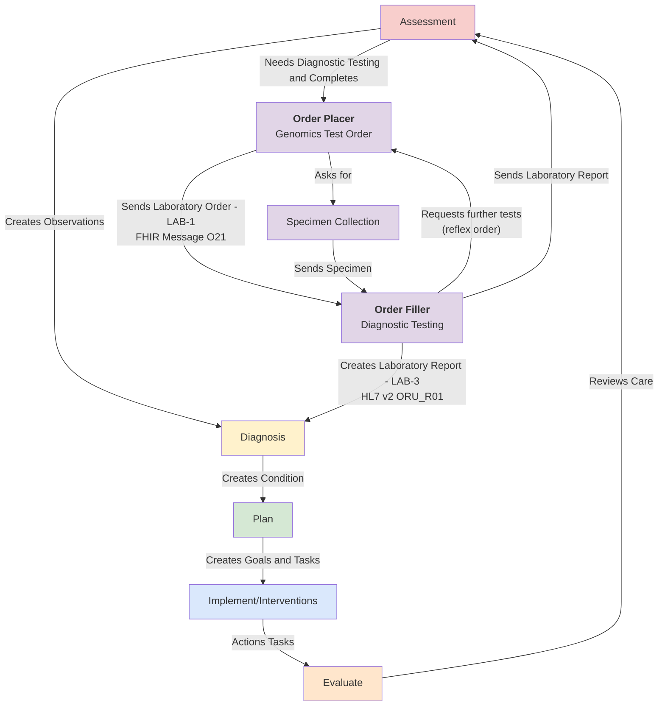
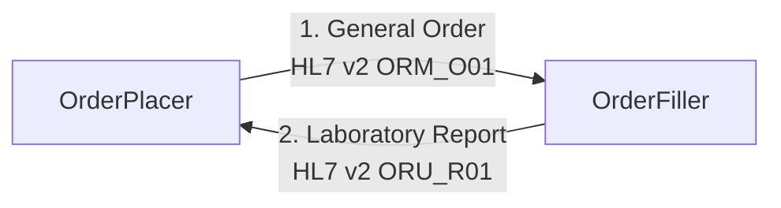
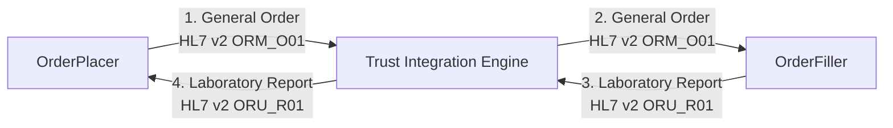
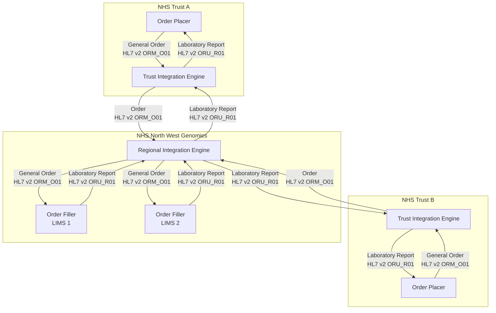
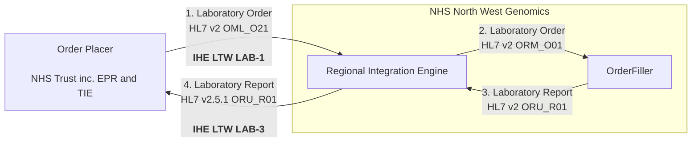

## Overview

Diagnostic testing plays a central role in supporting clinical processes by providing objective information that guides decision-making throughout a patient’s care journey. Its use spans from initial assessment to long-term management and evaluation of outcomes.

Genomic diagnostic testing supports clinical decision making by analysing a patient’s DNA or RNA to identify genetic variations that influence disease risk, diagnosis, treatment, and prognosis. By providing highly specific, personalised information, it enhances the precision and effectiveness of clinical care.

NHS North West Genomics is a new NHS service that brings together clinical diagnostic genomic testing services across the North West of England. While regionally delivered, the service supports genomic testing requests from across the UK.
The service is hosted by Manchester University NHS Foundation Trust.

As part of this transition, existing electronic ordering and reporting systems will be supported by a Regional Integration Engine (RIE) and a Genomic Clinical Data Repository. These components enable interoperability between local clinical systems and regional genomic laboratory services.

## Messaging

### Point To Point Messaging

The diagram below illustrates [point to point](https://www.enterpriseintegrationpatterns.com/patterns/messaging/PointToPointChannel.html) messaging between an `Order Placer` and an `Order Filler`. The `Order Filler` is typically a Laboratory Information Management System (LIMS), while the `Order Placer` is usually a clinical system such as an Electronic Patient Record (EPR).

Not all interactions will necessarily be electronic. For example, reports may be sent by email, and orders may be submitted via email or physically accompany the specimen.

In many NHS Trusts, a Trust Integration Engine (TIE) is used to facilitate this point-to-point messaging.

TIEs typically handle transformations between the different HL7 v2 variants used by Order Placers (e.g. EPRs) and Order Fillers (e.g. LIMS).

### Message Routing

The regional service may support more than 20 NHS Trusts, each using different clinical systems. Within NHS North West Genomics itself, multiple LIMS and supporting clinical systems are in use.

While this architecture is complex, it builds on existing interfaces. The RIE’s primary role is message distribution and routing rather than altering the underlying interaction patterns.

The Regional Integration Engine introduces message routing across the region. From a Trust perspective, interactions remain largely unchanged: reports are returned to the originating Order Placer. For example, if Alder Hey places an order, the laboratory report is returned to Alder Hey.

### Data Contracts (Domain Entities)

This model requires coordination between NHS Trusts and regional standardisation of HL7 (v2 and FHIR). Key changes include:

- **Medical Record Number (MRN):** MRNs may overlap across Trusts, so they are augmented with the ODS code of the originating NHS organisation.
- **Patient Identifiers: NHS Number, CHI Number, and HSNI** become the primary patient identifiers. NHS Numbers must be verified against national demographic services.
- **Clinical Coding: SNOMED CT and LOINC** are used for OBX segments and observations. Local codes may still be included where required.
- **Specimen Messaging:** Specimen information must be included in orders, requiring the use of HL7 v2.5.1 OML_O21 rather than ORM_O01. This supports distributed genomic testing, where multiple tests may be performed on a single specimen across several laboratories.

This data contract uses as <a href="DHCW-HL7-v2-5-1-ORUR01-Specification.pdf" _target="_blank">Digital Health and Care Wales - HL7 ORU_R01 2.5.1 Implementation Guide</a>,
<a href="https://drive.google.com/drive/folders/1FRkyZvWpZB1nCKbvQbo-eW_q9VtlR3Ws" _target="_blank">NHS England HL7 v2 ADT Message Specification</a>, and for document metadata
<a href="https://www.ihe-europe.net/sites/default/files/2017-11/IHE_ITI_XDS_Metadata_Guidelines_v1.0.pdf" _target="_blank">IHE Europe Document Metadata</a> and <a href="https://www.digihealthcare.scot/app/uploads/2024/05/CDI-Standard-V4.5-FINAL.pdf" _target="_blank">Digital Health and Care Scotland - (EH4001) CLINICAL DOCUMENT INDEXING STANDARDS</a> as core UK HL7/IHE standards.

Key data contracts are: 

| FHIR Resource                                                   | HL7 v2 Segment                                                   | IHE XDS         |
|-----------------------------------------------------------------|------------------------------------------------------------------|-----------------|
| [Patient](StructureDefinition-Patient.html)                     | [PID](hl7v2.html#pid)                                            |                 | 
| [DiagnosticReport](StructureDefinition-DiagnosticReport.html)   | [OBR](hl7v2.html#obr)                                            |                 | 
| [DocumentReference](StructureDefinition-DocumentReference.html) | [OBX type=ED](hl7v2.html#obx-type--ed) and [TXA](hl7v2.html#txa) | [DocumentEntry](StructureDefinition-DocumentReference.html) |
| [Encounter](StructureDefinition-Encounter.html)                 | [PV1](hl7v2.html#pv1)                                            |                 |
| [Observation](StructureDefinition-Observation.html)             | [OBX](hl7v2.html#obx)                                            |                 |
| [ServiceRequest](StructureDefinition-ServiceRequest.html)       | [ORC](hl7v2.html#orc)                                            |                 |
| [Specimen](StructureDefinition-Specimen.html)                   | [SPM](hl7v2.html#spm)                                            |                 |

The RIE will not perform transformation of HL7 messages. Responsibility for message transformation remains with each NHS Trust’s TIE and all parties are expected to use the same Data Contracts.

Data contracts are expected to apply to all message and payload formats i.e., HL7 v2, FHIR, DICOM and IHE XDS if used at a regional elvel will all following the same Data Contract. 

#### Domain Archetypes

The Data Contracts are used to form Domain Archetypes which provide a high level model for both orders and reports. 

| Domain Archetype                                            |
|-------------------------------------------------------------|
| [Genomic Test Order](Questionnaire-GenomicTestOrder.html)   |
| [Genomic Test Report](Questionnaire-GenomicTestReport.html) |

The domain archetypes also provide details around SNOMED CT and LOINC codes.

### Event Contracts

Finally, HL7 itself does not define workflow expectations between Order Placers and Order Fillers. These are specified in 

- [IHE Laboratory Testing Workflow (LTW)](TLW.html) profile
- [IHE Inter Laboratory Workflow (ILW)](ILW.mw) profile (Future)
- [IHE Specimen Event Tracking (SET)](SET.html) profile (Future)

## Genomic Data and Document Sharing

One of the main issues with messaging is that it focuses on interactions betwee two parties, the order placer and the order filler. It does not address the wider sharing of genomic data and documents between NHS Trusts, GP Practices, and many other practitioners. To rectify this a central genomic clinical data repository will be established.
This will provide a [FHIR RESTful (read only API)](https://hl7.org/fhir/R4/http.html). This repository is populated by data being passed via the RIE. 

<figure>


Laboratory Report - Overview

</figure>
 

### API Contracts

It is expected that the CDR will follow emerging IHE Europe standards for sharing clinical data and documents. At present these include:

- [IHE Mobile access to Health Documents (MHD) ITI-66 and ITI-67](MHD.html) HL7 FHIR
- [IHE Query for Existing Data for Mobile (QEDm) PCC-44](QEDm.html) HL7 FHIR
- [IHE Patient Demographics Query for Mobile (PDQm) ITI-78](PDQm.html) HL7 FHIR
- [IHE Internet User Authorization (IUA)](IUA.md) OAuth2
- [IHE Basic Audit Log Patterns (BALP)](https://profiles.ihe.net/ITI/BALP/index.html) HL7 FHIR

## How to Read this IG

<table >
  <thead>
    <tr>
      <th></th>
      <th>Menu Item</th>
      <th>Description</th>
      <th>Audience</th>
    </tr>
  </thead>
  <tbody>
    <tr>
      <td style="background-color: #E1D5E7">&nbsp;&nbsp;</td>
      <td>Analysis and Design (Volume 1)</td>
      <td>Description of the processes and corresponding technical frameworks</td>
      <td>General</td>
    </tr>
    <tr>
      <td style="background-color: #F8CECC">&nbsp;&nbsp;</td>
      <td>Interfaces (Volume 2)</td>
      <td>Description of the processes and corresponding technical frameworks (HL7 v2 and FHIR Interactions)</td>
      <td>Detailed Technical (Integration Developer)</td>
    </tr>
    <tr>
      <td style="background-color: #DAE8FC">&nbsp;&nbsp;</td>
      <td>Domain Archetype (Volume 3)</td>
      <td>NHS North West Forms, Templates, Reports and Compositions</td>
      <td>Data Modeling (Detailed Technical)</td>
    </tr>
    <tr>
      <td style="background-color: #DAE8FC">&nbsp;&nbsp;</td>
      <td>Artefacts (Volume 4)</td>
      <td>NHS North West Common Data Models</td>
      <td>Detailed Technical</td>
    </tr>
    <tr>
      <td style="background-color: #DAE8FC">&nbsp;&nbsp;</td>
      <td>Development</td>
      <td>Testing, Suppport and Architecture</td>
      <td>Detailed Technical (Developer)</td>
    </tr>
  </tbody>
</table>

| Diagnostic Process                          | Analysis and Design                                                  | Interfaces                                                                                                                         | Domain Archetype                                                        | Domain Entity (Resources)   Data Contract                                                     |
|---------------------------------------------|----------------------------------------------------------------------|------------------------------------------------------------------------------------------------------------------------------------|-------------------------------------------------------------------------|---------------------------------------------------------------------------------------------------|
| [Test Order](#test-order)                   | [Send Laboratory Order (IHE LTW)](LTW.html)                          | HL7 FHIR [IHE LTW LAB-1](LAB-1.html)                                                                                               | [North West Genomics Test Order](Questionnaire-GenomicTestOrder.html)   | [ServiceRequest](StructureDefinition-ServiceRequest.html)                                         |
|                                             | [Read & Search Laboratory Order (HIE)](HIE.html)                     | HL7 FHIR [IHE QEDm PCC-44](QEDm.html)                                                                                              |                                                                         | Various [Resource Profiles](artifacts.html#7)                                                     |  
| [DiagnosticTesting](#diagnostic-testing)    | [Laboratory Testing Workflow (LTW)](LTW.html)                        | HL7 FHIR [IHE LAB-3](LAB-3.html) and HL7 v2 ORU [LAB-3/R01](hl7v2.html#oru_r01-unsolicited-transmission-of-an-observation-message) | [North West Genomics Test Report](Questionnaire-GenomicTestReport.html) | [DiagnosticReport](StructureDefinition-DiagnosticReport.html)                                     |
|                                             | [Inter Laboratory Workflow (ILW)](ILW.html)                          |                                                                                                                                    |                                                                         | 
|                                             | [Send Laboratory Report Document (HIE)](HIE.html#publish-a-document) | HL7 v2 MDM [T02](hl7v2.html#mdm_t02-original-document-notification-and-content)                                                    | [North West Genomics Test Report](Questionnaire-GenomicTestReport.html) | [DocumentReference](StructureDefinition-DocumentReference.html)                                   |
|                                             | [Read & Search Laboratory Report Data (HIE)](HIE.html)               | HL7 FHIR [IHE QEDm PCC-44](QEDm.html)                                                                                              |                                                                         | Various [Resource Profiles](artifacts.html#7)                                                     |                                                             | 
|                                             | [Read & Seerch Laboratory Report Documents (HIE)](HIE.html)          | HL7 FHIR [IHE MHD ITI-66 and ITI-67](MHD.html)                                                                                     |                                                                         | [DocumentReference](StructureDefinition-DocumentReference.html)                                   | 
| [Specimen Collection](#specimen-collection) | [Specimen Event Tracking (SET)](SET.html)                            |                                                                                                                                    |                                                                         | [Specimen](StructureDefinition-Specimen.html)                                                     |
| Other                                       | [Patient Administration](PAM.html)                                   | HL7 FHIR [IHE PDQm ITI-78](QEDm.html)                                                                                              |                                                                         | [Patient](StructureDefinition-Patient.html)   [Encounter](StructureDefinition-Encounter.html) |
|                                             | [Authorisation (OAuth2](authorisation.html)                          | OAUth2 [IHE IUA ITI-103 ITI-71 ITI-102](IUA.html)                                                                                  |                                                                         |                                                                                                   | 

## SNOMED CT

UK edition of SNOMED (83821000000107)

## Dependencies



## Credits

| Role(s)        | Contributor(s)                               | 
|----------------|----------------------------------------------|
|                | North West Genomic Medicine Service Alliance |
|                | Alder Hey Children's Hospital Trust          |
|                | Manchester University NHS Foundation Trust   |
|                | Liverpool Womens NHS Foundation Trust        |
|                | The Christie NHS Foundation Trust            |
|                | NHS England                                  |
| Staff Engineer | Kevin Mayfield, Aire Logic & Mayfield IS     |      
