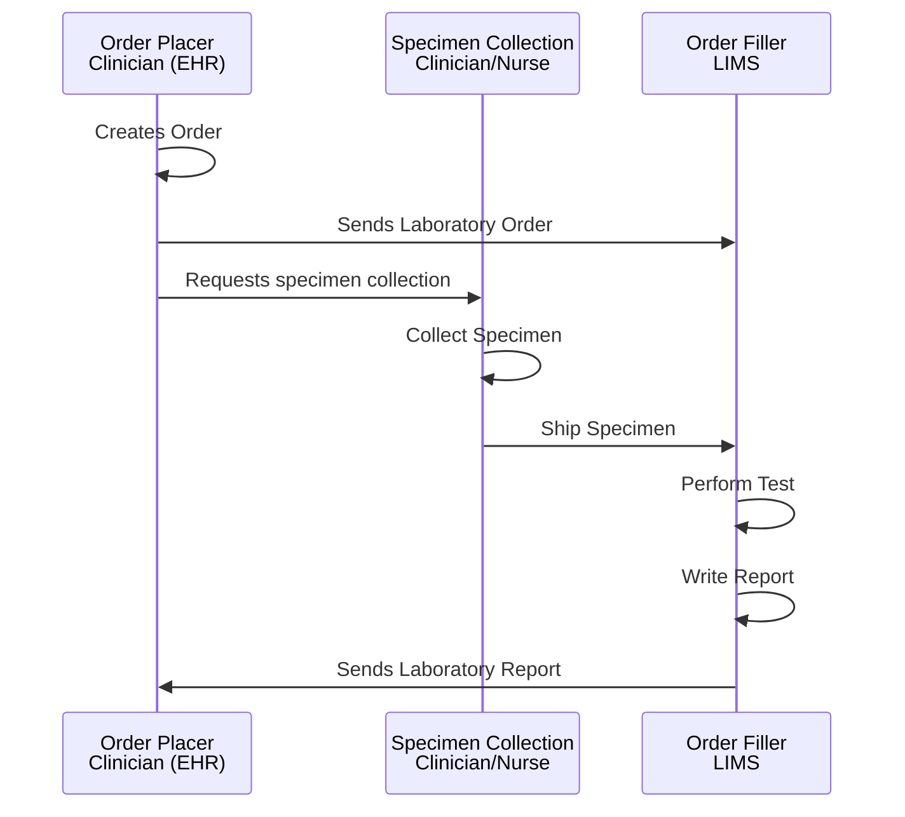

## Overview

Diagnostic testing is essential to modern clinical care, offering objective information that supports decision-making at every stage of a patient’s journey—from initial evaluation to long-term monitoring and assessment of outcomes.

Genomic diagnostic testing contributes to this process by examining a patient’s DNA or RNA to detect genetic variations that influence disease susceptibility, diagnosis, treatment choices, and prognosis. By delivering highly specific and personalised insights, genomic testing improves the accuracy and effectiveness of clinical management.

<!--
 -->

 

NHS North West Genomics is a new regional NHS service that consolidates clinical genomic testing across the North West of England. Although the service is delivered regionally, it also processes genomic test requests from across the UK. The service is hosted by Manchester University NHS Foundation Trust.

As part of the service transition, existing systems for electronic test ordering and reporting will be enhanced through the introduction of a Regional Integration Engine (RIE) and a Genomic Clinical Data Repository. These components enable seamless data exchange between local clinical systems and regional genomic laboratory services.

## Process Overview

## Design Overview

### Standardising HL7-based Workflows

Although NW GMSA is hosted by Manchester University NHS Foundation Trust, it operates in practice as a distinct organisation. It has its own Trust Integration Engine (TIE), referred to as the Regional Integration Engine (RIE).

 

At present, LIMS and EPR systems across the North West use a range of HL7 v2 Message based workflows, this remains the case with the RIE (centre and right of the above diagram). 
To reduce this variation, the IHE Laboratory Testing Workflow (LTW) profile and region-wide genomic messaging standards (HL7 v2.5.1 and FHIR R4) have been adopted. This standardisation applies to interactions between the NW GMSA Regional Integration Engine (RIE) and NHS Trust Integration Engines (TIEs). Interactions between LIMS and EPR systems, as well as the internal integration engine configurations within trusts, remain unchanged.

For external systems and NHS Trusts, NW Genomics LIMS will present as a single system with unified ordering and reporting interfaces. Direct point-to-point integrations between individual NHS Trust EPR systems and the NW LIMS will not be supported.

The NW Genomics HL7 v2 + FHIR specifications and the IHE LTW standards are detailed in this Implementation Guide.

In addition, NW Genomics is delivering a Genomic Clinical Repository (GCR) to support broader sharing of genomic test results across NHS Trusts, Integrated Care Systems (ICSs), and other Genomic Medicine Service Alliances (GMSAs). This GCR is populated by 'wire-taps' on existing workflows and solely HL7 FHIR R4 based plus IHE QEDm and MHD profiles to provide an additional layer of standardisation.

Although two HL7 standards are used, the data model is identical.

### Genomic Document Sharing

Genomic Document Sharing is a proposed new capability within NW Genomics that leverages the existing  [NHS England National Record Locator (NRL)](https://digital.nhs.uk/developer/api-catalogue/national-record-locator-fhir). 
The solution is aligned with the [IHE Mobile Health Document Sharing (MHDS)](https://profiles.ihe.net/ITI/MHDS/index.html) profile and so, follows a similar architectural approach to that used by the  [NHS England National Imaging Registry](https://digital.nhs.uk/services/national-imaging-registry) in its integration with the NRL.

 

For the initial phase, genomic reports will be published in **PDF format**. 
In later phases, the target format is the [HL7 Europe Laboratory Report](https://build.fhir.org/ig/hl7-eu/laboratory/en/), aligning with the (anticipated) strategic direction for [NHS England Pathology FHIR](https://digital.nhs.uk/data-and-information/information-standards/governance/latest-activity/standards-and-collections/dapb4101-pathology-and-laboratory-medicine-reporting-information-standard/implementation/pathology-fhir-specification/), which specifies FHIR-based pathology reporting.

## How to Read this IG

<table >
  <thead>
    <tr>
      <th></th>
      <th>Menu Item</th>
      <th>Description</th>
      <th>Audience</th>
    </tr>
  </thead>
  <tbody>
    <tr>
      <td style="background-color: #E1D5E7">&nbsp;&nbsp;</td>
      <td>Analysis and Design (Volume 1)</td>
      <td>Description of the processes and corresponding technical frameworks</td>
      <td>General</td>
    </tr>
    <tr>
      <td style="background-color: #F8CECC">&nbsp;&nbsp;</td>
      <td>Interfaces (Volume 2)</td>
      <td>Description of the processes and corresponding technical frameworks (HL7 v2 and FHIR Interactions)</td>
      <td>Detailed Technical (Integration Developer)</td>
    </tr>
    <tr>
      <td style="background-color: #DAE8FC">&nbsp;&nbsp;</td>
      <td>Data Models (Volume 3)</td>
      <td>NHS North West Forms, Templates, Reports, and Compositions</td>
      <td>Data Modeling (Detailed Technical)</td>
    </tr>
    <tr>
      <td style="background-color: #DAE8FC">&nbsp;&nbsp;</td>
      <td>Artefacts (Volume 4)</td>
      <td>NHS North West Common Data Models</td>
      <td>Detailed Technical</td>
    </tr>
    <tr>
      <td style="background-color: #DAE8FC">&nbsp;&nbsp;</td>
      <td>Development</td>
      <td>Testing, Suppport and Architecture</td>
      <td>Detailed Technical (Developer)</td>
    </tr>
  </tbody>
</table>

| Diagnostic Process         | Analysis and Design                                                  | Interfaces                                                                                                                         | Domain Archetype                                                        | Domain Entity (Resources)   Data Contract                                                     |
|----------------------------|----------------------------------------------------------------------|------------------------------------------------------------------------------------------------------------------------------------|-------------------------------------------------------------------------|---------------------------------------------------------------------------------------------------|
| <b>Workflow Management</b> | [FHIR Workflow](https://hl7.org/fhir/R4/workflow.html)                                                    |                                                                                                                                    |                                                                         | [Task](StructureDefinition-Task.html)
| <b>Laboratory Order</b>    | [Send Laboratory Order (IHE LTW)](LTW.html)                          | HL7 FHIR [IHE LTW LAB-1](LAB-1.html)                                                                                               | [North West Genomics Test Order](Questionnaire-GenomicTestOrder.html)   | [ServiceRequest](StructureDefinition-ServiceRequest.html)                                         |
|                            | [Read & Search Laboratory Order (HIE)](HIE.html)                     | HL7 FHIR [IHE QEDm PCC-44](QEDm.html)                                                                                              |                                                                         | Various [Resource Profiles](artifacts.html#7)                                                     |  
| <b>Laboratory Report<b/>   | [Laboratory Testing Workflow (LTW)](LTW.html)                        | HL7 FHIR [IHE LAB-3](LAB-3.html) and HL7 v2 ORU [LAB-3/R01](hl7v2.html#oru_r01-unsolicited-transmission-of-an-observation-message) | [North West Genomics Test Report](Questionnaire-GenomicTestReport.html) | [DiagnosticReport](StructureDefinition-DiagnosticReport.html)                                     |
|                            | [Inter Laboratory Workflow (ILW)](ILW.html)                          |                                                                                                                                    |                                                                         | 
|                            | [Send Laboratory Report Document (HIE)](HIE.html#publish-a-document) | HL7 v2 MDM [T02](hl7v2.html#mdm_t02-original-document-notification-and-content)                                                    | [North West Genomics Test Report](Questionnaire-GenomicTestReport.html) | [DocumentReference](StructureDefinition-DocumentReference.html)                                   |
|                            | [Read & Search Laboratory Report Data (HIE)](HIE.html)               | HL7 FHIR [IHE QEDm PCC-44](QEDm.html)                                                                                              |                                                                         | Various [Resource Profiles](artifacts.html#7)                                                     |                                                           
|                            | [Read & Seerch Laboratory Report Documents (HIE)](HIE.html)          | HL7 FHIR [IHE MHD ITI-66 and ITI-67](MHD.html)                                                                                     |                                                                         | [DocumentReference](StructureDefinition-DocumentReference.html)                                   | 
| <b>Specimen Collection</b> | [Specimen Event Tracking (SET)](SET.html)                            |                                                                                                                                    |                                                                         | [Specimen](StructureDefinition-Specimen.html)                                                     |
| Other                      | [Patient Administration](PAM.html)                                   | HL7 FHIR [IHE PDQm ITI-78](QEDm.html)                                                                                              |                                                                         | [Patient](StructureDefinition-Patient.html)   [Encounter](StructureDefinition-Encounter.html) |
|                            | [Authorisation (OAuth2](authorisation.html)                          | OAUth2 [IHE IUA ITI-103 ITI-71 ITI-102](IUA.html)                                                                                  |                                                                         |                                                                                                   | 
{:.grid}

## SNOMED CT

UK edition of SNOMED (83821000000107)

## Dependencies



## Credits

| Role(s)        | Contributor(s)                               | 
|----------------|----------------------------------------------|
|                | North West Genomic Medicine Service Alliance |
|                | Alder Hey Children's Hospital Trust          |
|                | Manchester University NHS Foundation Trust   |
|                | Liverpool Womens NHS Foundation Trust        |
|                | The Christie NHS Foundation Trust            |
|                | NHS England                                  |
| Staff Engineer | Kevin Mayfield, Aire Logic & Mayfield IS     |  
{:.grid}
