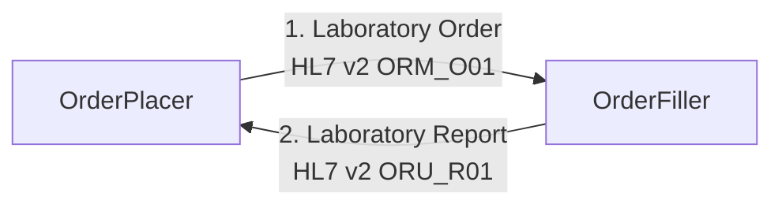
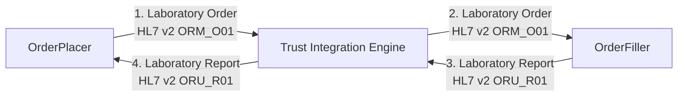

## Overview

NHS North West Genomics is a new NHS service that consolidates clinical diagnostic service for genomic testing across the North West of England. This service is available across the UK.
It is hosted by Manchester University NHS Foundation Trust.

As part of this transition, existing electronic order and reporting systems will be supported by a regional integration engine (RIE) and a genomic clinical data repository.

## Messaging

### Point To Point Messaging

The following diagram shows the [point to point](https://www.enterpriseintegrationpatterns.com/patterns/messaging/PointToPointChannel.html) messaging between the order placer and order filler. The `order filler` is typically a Laboratory Information Management System (LIMS) and the `order placer` is typically a clinical system such as a Electronic Patient Record (EPR). Not all of these interactions will be electronic, for example the reports may be emailed, the orders may also be sent via email or sent with the specimen. 

In many NHS Trusts, this will include the use of a Trust Integration Engine (TIE) to support the point to point messaging.

The TIE's will typically perform transformations between the different versions of HL7 v2 used by the Order Placer (e.g. EPR) and Order Filler (e.g. LIMS).

## How to Read this IG

<table >
  <thead>
    <tr>
      <th></th>
      <th>Menu Item</th>
      <th>Description</th>
      <th>Audience</th>
    </tr>
  </thead>
  <tbody>
    <tr>
      <td style="background-color: #E1D5E7">&nbsp;&nbsp;</td>
      <td>Analysis and Design (Volume 1)</td>
      <td>Description of the processes and corresponding technical frameworks</td>
      <td>General</td>
    </tr>
    <tr>
      <td style="background-color: #F8CECC">&nbsp;&nbsp;</td>
      <td>Interfaces (Volume 2)</td>
      <td>Description of the processes and corresponding technical frameworks (HL7 v2 and FHIR Interactions)</td>
      <td>Detailed Technical (Integration Developer)</td>
    </tr>
    <tr>
      <td style="background-color: #DAE8FC">&nbsp;&nbsp;</td>
      <td>Domain Archetype (Volume 3)</td>
      <td>NHS North West Forms, Templates, Reports and Compositions</td>
      <td>Data Modeling (Detailed Technical)</td>
    </tr>
    <tr>
      <td style="background-color: #DAE8FC">&nbsp;&nbsp;</td>
      <td>Artefacts (Volume 4)</td>
      <td>NHS North West Common Data Models</td>
      <td>Detailed Technical</td>
    </tr>
    <tr>
      <td style="background-color: #DAE8FC">&nbsp;&nbsp;</td>
      <td>Development</td>
      <td>Testing, Suppport and Architecture</td>
      <td>Detailed Technical (Developer)</td>
    </tr>
  </tbody>
</table>

| Diagnostic Process                          | Analysis and Design                                                  | Interfaces                                                                                                                         | Domain Archetype                                                        | Domain Entity (Resources)   Data Contract                                                     |
|---------------------------------------------|----------------------------------------------------------------------|------------------------------------------------------------------------------------------------------------------------------------|-------------------------------------------------------------------------|---------------------------------------------------------------------------------------------------|
| [Test Order](#test-order)                   | [Send Laboratory Order (IHE LTW)](LTW.html)                          | HL7 FHIR [IHE LTW LAB-1](LAB-1.html)                                                                                               | [North West Genomics Test Order](Questionnaire-GenomicTestOrder.html)   | [ServiceRequest](StructureDefinition-ServiceRequest.html)                                         |
|                                             | [Read & Search Laboratory Order (HIE)](HIE.html)                     | HL7 FHIR [IHE QEDm PCC-44](QEDm.html)                                                                                              |                                                                         | Various [Resource Profiles](artifacts.html#7)                                                     |  
| [DiagnosticTesting](#diagnostic-testing)    | [Laboratory Testing Workflow (LTW)](LTW.html)                        | HL7 FHIR [IHE LAB-3](LAB-3.html) and HL7 v2 ORU [LAB-3/R01](hl7v2.html#oru_r01-unsolicited-transmission-of-an-observation-message) | [North West Genomics Test Report](Questionnaire-GenomicTestReport.html) | [DiagnosticReport](StructureDefinition-DiagnosticReport.html)                                     |
|                                             | [Inter Laboratory Workflow (ILW)](ILW.html)                          |                                                                                                                                    |                                                                         | 
|                                             | [Send Laboratory Report Document (HIE)](HIE.html#publish-a-document) | HL7 v2 MDM [T02](hl7v2.html#mdm_t02-original-document-notification-and-content)                                                    | [North West Genomics Test Report](Questionnaire-GenomicTestReport.html) | [DocumentReference](StructureDefinition-DocumentReference.html)                                   |
|                                             | [Read & Search Laboratory Report Data (HIE)](HIE.html)               | HL7 FHIR [IHE QEDm PCC-44](QEDm.html)                                                                                              |                                                                         | Various [Resource Profiles](artifacts.html#7)                                                     |                                                             | 
|                                             | [Read & Seerch Laboratory Report Documents (HIE)](HIE.html)          | HL7 FHIR [IHE MHD ITI-66 and ITI-67](MHD.html)                                                                                     |                                                                         | [DocumentReference](StructureDefinition-DocumentReference.html)                                   | 
| [Specimen Collection](#specimen-collection) | [Specimen Event Tracking (SET)](SET.html)                            |                                                                                                                                    |                                                                         | [Specimen](StructureDefinition-Specimen.html)                                                     |
| Other                                       | [Patient Administration](PAM.html)                                   | HL7 FHIR [IHE PDQm ITI-78](QEDm.html)                                                                                              |                                                                         | [Patient](StructureDefinition-Patient.html)   [Encounter](StructureDefinition-Encounter.html) |
|                                             | [Authorisation (OAuth2](authorisation.html)                          | OAUth2 [IHE IUA ITI-103 ITI-71 ITI-102](IUA.html)                                                                                  |                                                                         |                                                                                                   | 

## SNOMED CT

UK edition of SNOMED (83821000000107)

## Dependencies



## Credits

| Role(s)        | Contributor(s)                               | 
|----------------|----------------------------------------------|
|                | North West Genomic Medicine Service Alliance |
|                | Alder Hey Children's Hospital Trust          |
|                | Manchester University NHS Foundation Trust   |
|                | Liverpool Womens NHS Foundation Trust        |
|                | The Christie NHS Foundation Trust            |
|                | NHS England                                  |
| Staff Engineer | Kevin Mayfield, Aire Logic & Mayfield IS     |      
