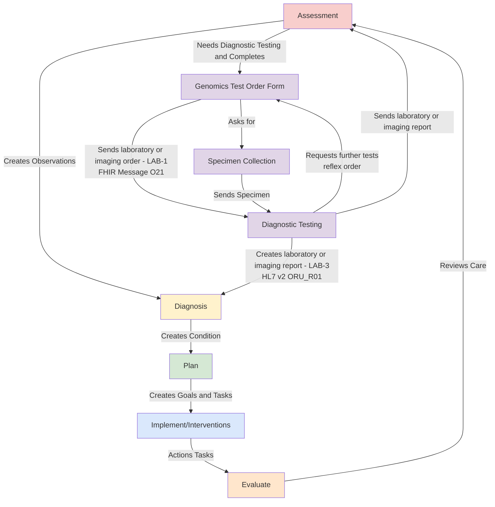

## Introduction

This guide is to support Genomic Testing Workflow at a regional level and is designed to be compatible with:

- [NHS England - FHIR Genomics Implementation Guide](https://simplifier.net/guide/fhir-genomics-implementation-guide/Home) which defines the conformance requirements for Genomics in England
- [NHS England - Genomic Order Management Service FHIR API](https://digital.nhs.uk/developer/api-catalogue/genomic-order-management-service-fhir) a [FHIR Workflow](https://hl7.org/fhir/R4/workflow.html) based service for managing orders and results at a national level.

The general workflow is based on IHE LTW profiles and HL7 v2 OML and ORU. 

### Clinical Process

Genomic Testing Workflow is part of Diagnostic Testing, which is also part of the general clinical process. 

Genomic diagnostic testing follows the same standardized process defined by the [IHE Laboratory Testing Workflow](https://wiki.ihe.net/index.php/Laboratory_Testing_Workflow) used in traditional laboratory testing.
This workflow has been enhanced to support the sharing of laboratory reports (documents) through Integrated Care Systems (ICS). In addition, a new mechanism for sharing laboratory reports has been introduced to establish a regional genomic data repository.

## How to Read this IG

<table >
  <thead>
    <tr>
      <th></th>
      <th>Menu Item</th>
      <th>Description</th>
      <th>Audience</th>
    </tr>
  </thead>
  <tbody>
    <tr>
      <td style="background-color: #E1D5E7">&nbsp;&nbsp;</td>
      <td>Analysis and Design (Volume 1)</td>
      <td>Description of the processes and corresponding technical frameworks</td>
      <td>General</td>
    </tr>
    <tr>
      <td style="background-color: #F8CECC">&nbsp;&nbsp;</td>
      <td>Interfaces (Volume 2)</td>
      <td>Description of the processes and corresponding technical frameworks (HL7 v2 and FHIR Interactions)</td>
      <td>Detailed Technical (Integration Developer)</td>
    </tr>
    <tr>
      <td style="background-color: #DAE8FC">&nbsp;&nbsp;</td>
      <td>Domain Archetype (Volume 3)</td>
      <td>NHS North West Forms, Templates, Reports and Compositions</td>
      <td>Data Modeling (Detailed Technical)</td>
    </tr>
    <tr>
      <td style="background-color: #DAE8FC">&nbsp;&nbsp;</td>
      <td>Artefacts (Volume 4)</td>
      <td>NHS North West Common Data Models</td>
      <td>Detailed Technical</td>
    </tr>
    <tr>
      <td style="background-color: #DAE8FC">&nbsp;&nbsp;</td>
      <td>Development</td>
      <td>Testing, Suppport and Architecture</td>
      <td>Detailed Technical (Developer)</td>
    </tr>
  </tbody>
</table>

| Analysis and Design                                    | Interfaces                                                                                                                 | Domain Archetype                                                        | Artefacts                             |
|--------------------------------------------------------|----------------------------------------------------------------------------------------------------------------------------|-------------------------------------------------------------------------|---------------------------------------|
| [Send Laboratory Order (LTW)](LTW.html)                | HL7 FHIR [LAB-1](LAB-1.html)                                                                                               | [North West Genomics Test Order](Questionnaire-GenomicTestOrder.html)   |                                       |
| [Send Laboratory Report Data (LTW)](LTW.html)          | HL7 FHIR [LAB-3](LAB-3.html) and HL7 v2 ORU [LAB-3](hl7v2.html#oru_r01-unsolicited-transmission-of-an-observation-message) | [North West Genomics Test Report](Questionnaire-GenomicTestReport.html) |                                       |
| [Send Laboratory Report Document (HIE)](HIE.html)      | HL7 v2 MDM [LAB-3](hl7v2.html#mdm_t02-original-document-notification-and-content)                                          | [North West Genomics Test Report](Questionnaire-GenomicTestReport.html) |                                       |
| [Read Laboratory Order or Report Data (HIE)](HIE.html) | HL7 FHIR [QEDm](QEDm.html)                                                                                                 | | [Resource Profiles](artifacts.html#7) |                                                              | 
| [Read Laboratory Report Documents (HIE)](HIE.html)     | HL7 FHIR [MHD](MHD.html)                                                                                                   | | [Resource Profiles](artifacts.html#7) | 

## Data Modelling

The data model used in this guide is a combination of data and workflow requirements from a variety of other guides.

 

North West GMSA IG
 
 

## Testing 

This implementation guide will also enable use of FHIR Testing tools such as [Command Line FHIR Validation](https://confluence.hl7.org/display/FHIR/Using+the+FHIR+Validator) and [Online FHIR Validation](https://validator.fhir.org/)

## SNOMED CT

UK edition of SNOMED (83821000000107)

## Dependencies



## Credits

| Role(s)              | Contributor(s)                               | 
|----------------------|----------------------------------------------|
|                      | North West Genomic Medicine Service Alliance |
|                      | Alder Hey Children's Hospital Trust          |
|                      | Manchester University NHS Foundation Trust   |
|                      | Liverpool Womens NHS Foundation Trust        |
|                      | The Christie NHS Foundation Trust            |
|                      | NHS England                                  |
| Enterprise Architect | **Kevin Mayfield** (Aire Logic/Mayfield IS)  |      

