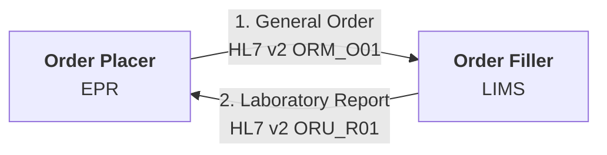
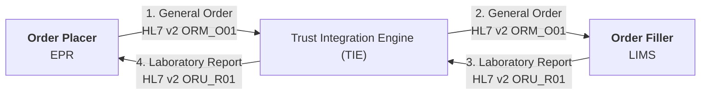
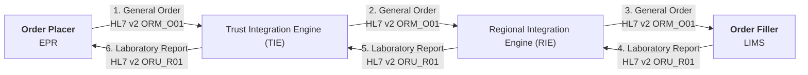
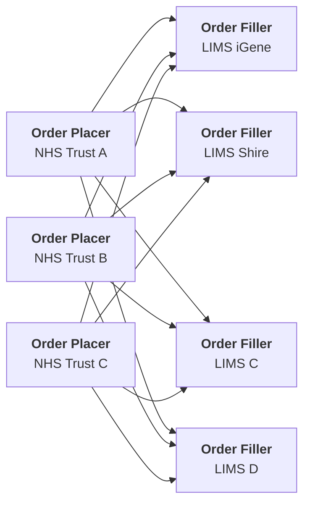
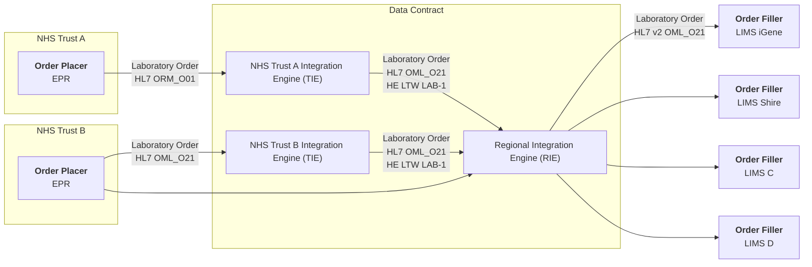
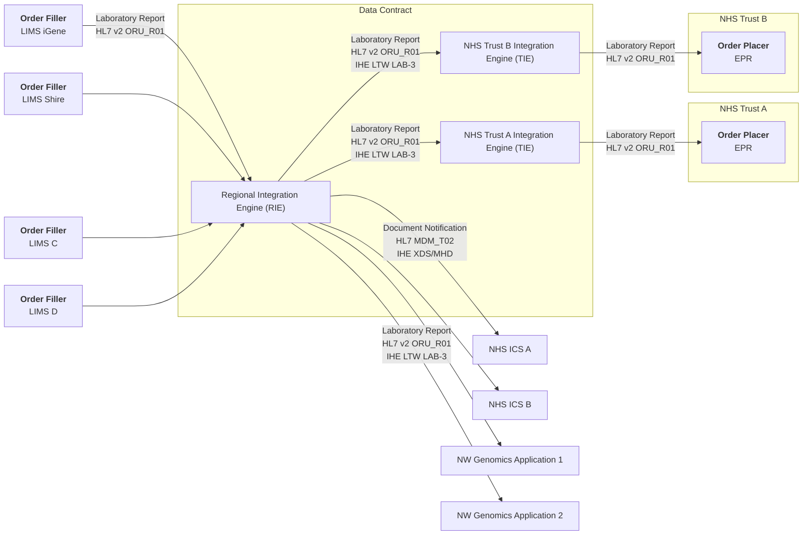
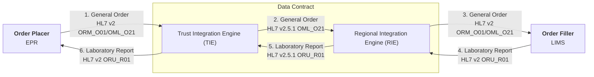
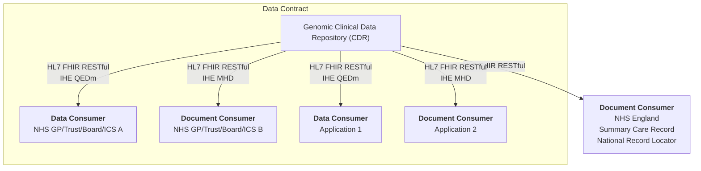

## Overview

Diagnostic testing is essential to modern clinical care, offering objective information that supports decision-making at every stage of a patient’s journey—from initial evaluation to long-term monitoring and assessment of outcomes.

Genomic diagnostic testing contributes to this process by examining a patient’s DNA or RNA to detect genetic variations that influence disease susceptibility, diagnosis, treatment choices, and prognosis. By delivering highly specific and personalised insights, genomic testing improves the accuracy and effectiveness of clinical management.

 

NHS North West Genomics is a new regional NHS service that consolidates clinical genomic testing across the North West of England. Although the service is delivered regionally, it also processes genomic test requests from across the UK. The service is hosted by Manchester University NHS Foundation Trust.

As part of the service transition, existing systems for electronic test ordering and reporting will be enhanced through the introduction of a Regional Integration Engine (RIE) and a Genomic Clinical Data Repository. These components enable seamless data exchange between local clinical systems and regional genomic laboratory services.

## Technical Overview

 

### Traditional Point-To-Point Messaging Transformation

The diagram below illustrates [point to point](https://www.enterpriseintegrationpatterns.com/patterns/messaging/PointToPointChannel.html) messaging between an `Order Placer` and an `Order Filler`. The `Order Filler` is typically a Laboratory Information Management System (LIMS), while the `Order Placer` is usually a clinical system such as an Electronic Patient Record (EPR).

Not all interactions will necessarily be electronic. For example, reports may be sent by email, and orders may be submitted via email or physically accompany the specimen.

In many NHS Trusts, a Trust Integration Engine (TIE) is used to facilitate this point-to-point messaging.

TIEs typically handle transformations between the different HL7 v2 variants used by Order Placers (e.g. EPRs) and Order Fillers (e.g. LIMS).

### Initial Interoperability For Existing Messaging Flows

Existing interfaces to NW Genomics LIMS will be migrated to use the Regional Integration Engine (RIE). The RIE performs similar functions to NHS Trust TIEs, and in the interim phase will perform pass through routing of messages only.

### Regional Interoperability - Regional Integration Engine (RIE)

The regional service may support more than 20 NHS Trusts, each using different clinical systems. Within NHS North West Genomics itself, multiple LIMS and supporting clinical systems are in use. Following traditional point-to-point messaging, we can quickly end up with interoperability looking like this:

To reduce this complexity, the RIE will route orders and reports between NHS Trusts ordering systems and North West Genomcis LIMS. Standards will be introduced between the RIE and the NHS Trust TIEs, for all message formats and interactions. The different formats will follow a single data model which is called a 'Data Contract'. 

The diagram shows a subset of these interactions for laboratory orders:

Equivalent patterns apply to laboratory reports.

The main distinction between a Regional Integration Engine (RIE) and a Trust Integration Engine is that the RIE functions as a central routing hub. Each participant connects only to the RIE rather than individually integrating with multiple other systems. This significantly reduces integration complexity. Trust TIEs will still be responsible for transforming messages between their internal EPR systems and the RIE.

Because the RIE operates at a regional level, certain HL7 v2 message components must be standardised or updated. These changes ensure global uniqueness for identifiers such as:

- Patient identifiers: NHS Number (England and Wales), CHI Number (Scotland), HSCN Number (Northern Ireland), and individual NHS Trusts medical record numbers
- Order numbers (placer and filler)
- Report numbers
- Visit Numbers (Spell or Episode Number)
- Specimen identifiers (inc. ascension and pathology specimen identifiers)

Standard terminology sets such as SNOMED CT and LOINC will be used to define observations and orderable items. These requirements are outlined in the [Data Contract](data-intro.html). HL7 v2 message exchanges are aligned with HL7 v2.5.1 and the following IHE profiles (**API Contracts**):

- [IHE Laboratory Testing Workflow (LTW)](TLW.html) profile
- [IHE Inter Laboratory Workflow (ILW)](ILW.mw) profile (Future)
- [IHE Specimen Event Tracking (SET)](SET.html) profile (Future)

#### Practical Implementation

From a practical perspective, the RIE is introduced into the existing point-to-point messaging flow. It is at this boundary—between the TIE and the RIE—that the use of the [Data Contracts](data-intro.html)
, including HL7 v2.5.1 and adoption of IHE LTW, is mandated.

Data Contracts are not mandated between the RIE and LIMS, nor between the TIE and EPR. For practical reasons, these systems may require changes in the future to align with the central Data Contracts.

NHS Trust TIEs do not interface directly with the LIMS within NHS North West Genomics and, going forward, will not interface directly with LIMS from other regional genomic systems and NHS England Genomic Order Management Service. All such interactions will be managed by the RIE.

### Regional Data and Document Sharing - Clinical Data Repository (CDR)

Traditional messaging focuses solely on communication between two systems—the order placer and the order filler—and does not support wider sharing of genomic data across multiple organisations such as NHS Trusts, GP practices, or other clinical teams.

To address this, a central Genomic Clinical Data Repository (CDR) will be established. This repository will provide a read-only [FHIR RESTful (read only API)](https://hl7.org/fhir/R4/http.html) and will be populated via data flows through the RIE.

The [Data Contract](datta-intro.html) and data structures used in the FHIR interfaces follow the same conventions as those used in the HL7 v2 message exchanges.

The CDR is expected to adopt emerging IHE Europe standards for clinical data and document sharing. These currently include (**API Contract**):

- [IHE Mobile access to Health Documents (MHD) ITI-66 and ITI-67](MHD.html) HL7 FHIR
- [IHE Query for Existing Data for Mobile (QEDm) PCC-44](QEDm.html) HL7 FHIR
- [IHE Patient Demographics Query for Mobile (PDQm) ITI-78](PDQm.html) HL7 FHIR
- [IHE Internet User Authorization (IUA)](IUA.md) OAuth2
- [IHE Basic Audit Log Patterns (BALP)](https://profiles.ihe.net/ITI/BALP/index.html) HL7 FHIR

### Health Information Exchange (HIE)

Collectively, the Regional Integration Engine (RIE) and the Genomic Clinical Data Repository (CDR) form a Health Information Exchange (HIE) system.

<figure>


Health Information Exchange (HIE)

</figure>
 

## How to Read this IG

<table >
  <thead>
    <tr>
      <th></th>
      <th>Menu Item</th>
      <th>Description</th>
      <th>Audience</th>
    </tr>
  </thead>
  <tbody>
    <tr>
      <td style="background-color: #E1D5E7">&nbsp;&nbsp;</td>
      <td>Analysis and Design (Volume 1)</td>
      <td>Description of the processes and corresponding technical frameworks</td>
      <td>General</td>
    </tr>
    <tr>
      <td style="background-color: #F8CECC">&nbsp;&nbsp;</td>
      <td>Interfaces (Volume 2)</td>
      <td>Description of the processes and corresponding technical frameworks (HL7 v2 and FHIR Interactions)</td>
      <td>Detailed Technical (Integration Developer)</td>
    </tr>
    <tr>
      <td style="background-color: #DAE8FC">&nbsp;&nbsp;</td>
      <td>Data Models (Volume 3)</td>
      <td>NHS North West Forms, Templates, Reports and Compositions</td>
      <td>Data Modeling (Detailed Technical)</td>
    </tr>
    <tr>
      <td style="background-color: #DAE8FC">&nbsp;&nbsp;</td>
      <td>Artefacts (Volume 4)</td>
      <td>NHS North West Common Data Models</td>
      <td>Detailed Technical</td>
    </tr>
    <tr>
      <td style="background-color: #DAE8FC">&nbsp;&nbsp;</td>
      <td>Development</td>
      <td>Testing, Suppport and Architecture</td>
      <td>Detailed Technical (Developer)</td>
    </tr>
  </tbody>
</table>

| Diagnostic Process         | Analysis and Design                                                  | Interfaces                                                                                                                         | Domain Archetype                                                        | Domain Entity (Resources)   Data Contract                                                     |
|----------------------------|----------------------------------------------------------------------|------------------------------------------------------------------------------------------------------------------------------------|-------------------------------------------------------------------------|---------------------------------------------------------------------------------------------------|
| <b>Laboratory Order</b>    | [Send Laboratory Order (IHE LTW)](LTW.html)                          | HL7 FHIR [IHE LTW LAB-1](LAB-1.html)                                                                                               | [North West Genomics Test Order](Questionnaire-GenomicTestOrder.html)   | [ServiceRequest](StructureDefinition-ServiceRequest.html)                                         |
|                            | [Read & Search Laboratory Order (HIE)](HIE.html)                     | HL7 FHIR [IHE QEDm PCC-44](QEDm.html)                                                                                              |                                                                         | Various [Resource Profiles](artifacts.html#7)                                                     |  
| <b>Laboratory Report<b/>   | [Laboratory Testing Workflow (LTW)](LTW.html)                        | HL7 FHIR [IHE LAB-3](LAB-3.html) and HL7 v2 ORU [LAB-3/R01](hl7v2.html#oru_r01-unsolicited-transmission-of-an-observation-message) | [North West Genomics Test Report](Questionnaire-GenomicTestReport.html) | [DiagnosticReport](StructureDefinition-DiagnosticReport.html)                                     |
|                            | [Inter Laboratory Workflow (ILW)](ILW.html)                          |                                                                                                                                    |                                                                         | 
|                            | [Send Laboratory Report Document (HIE)](HIE.html#publish-a-document) | HL7 v2 MDM [T02](hl7v2.html#mdm_t02-original-document-notification-and-content)                                                    | [North West Genomics Test Report](Questionnaire-GenomicTestReport.html) | [DocumentReference](StructureDefinition-DocumentReference.html)                                   |
|                            | [Read & Search Laboratory Report Data (HIE)](HIE.html)               | HL7 FHIR [IHE QEDm PCC-44](QEDm.html)                                                                                              |                                                                         | Various [Resource Profiles](artifacts.html#7)                                                     |                                                           
|                            | [Read & Seerch Laboratory Report Documents (HIE)](HIE.html)          | HL7 FHIR [IHE MHD ITI-66 and ITI-67](MHD.html)                                                                                     |                                                                         | [DocumentReference](StructureDefinition-DocumentReference.html)                                   | 
| <b>Specimen Collection</b> | [Specimen Event Tracking (SET)](SET.html)                            |                                                                                                                                    |                                                                         | [Specimen](StructureDefinition-Specimen.html)                                                     |
| Other                      | [Patient Administration](PAM.html)                                   | HL7 FHIR [IHE PDQm ITI-78](QEDm.html)                                                                                              |                                                                         | [Patient](StructureDefinition-Patient.html)   [Encounter](StructureDefinition-Encounter.html) |
|                            | [Authorisation (OAuth2](authorisation.html)                          | OAUth2 [IHE IUA ITI-103 ITI-71 ITI-102](IUA.html)                                                                                  |                                                                         |                                                                                                   | 
{:.grid}

## SNOMED CT

UK edition of SNOMED (83821000000107)

## Dependencies



## Credits

| Role(s)        | Contributor(s)                               | 
|----------------|----------------------------------------------|
|                | North West Genomic Medicine Service Alliance |
|                | Alder Hey Children's Hospital Trust          |
|                | Manchester University NHS Foundation Trust   |
|                | Liverpool Womens NHS Foundation Trust        |
|                | The Christie NHS Foundation Trust            |
|                | NHS England                                  |
| Staff Engineer | Kevin Mayfield, Aire Logic & Mayfield IS     |  
{:.grid}
