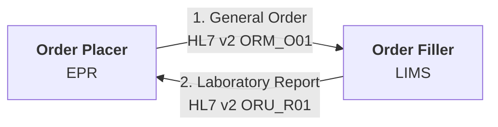
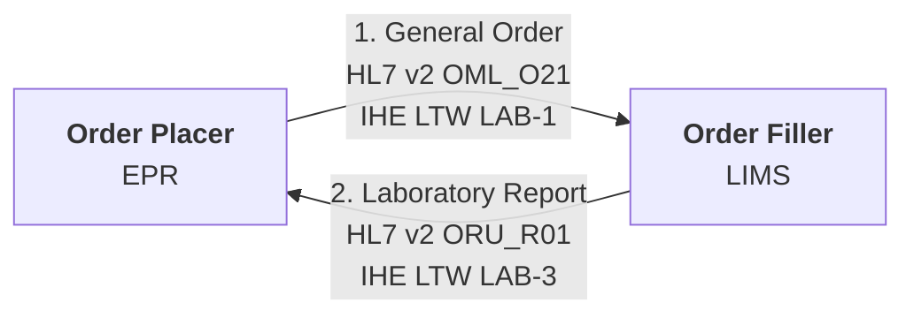
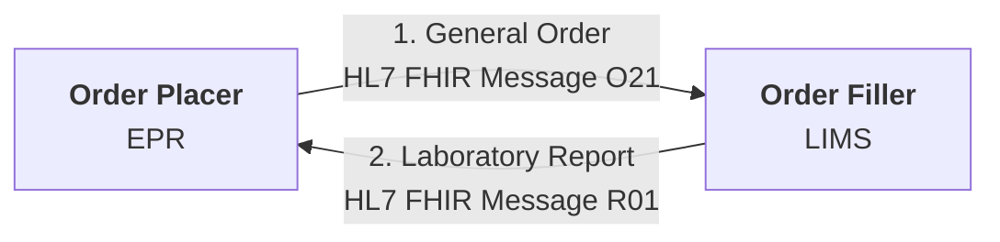
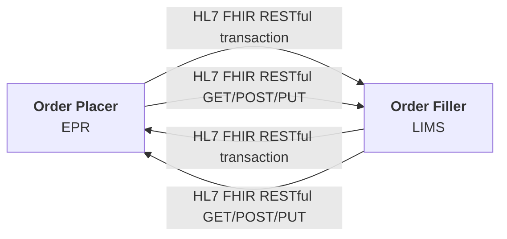
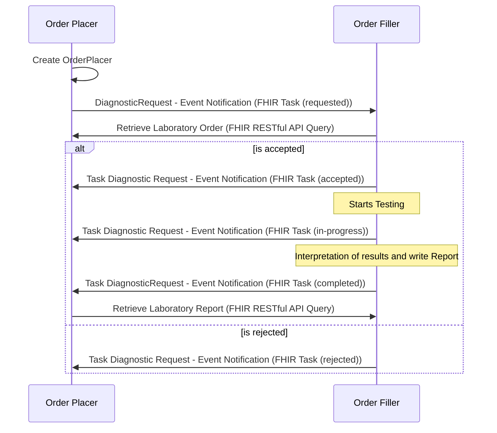
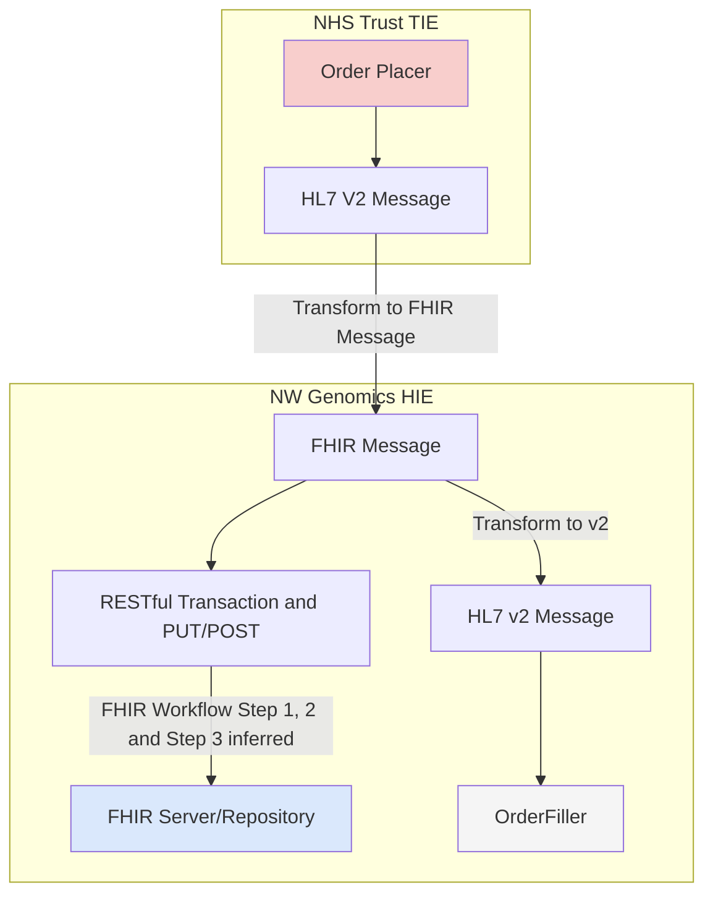
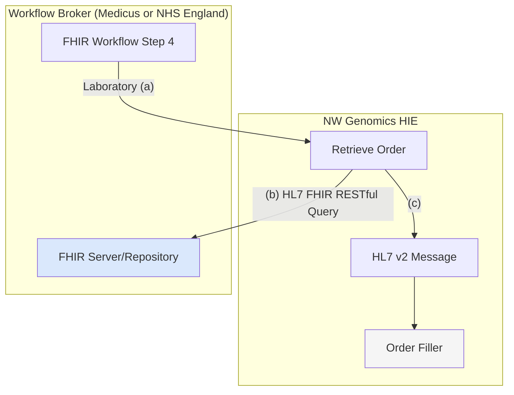
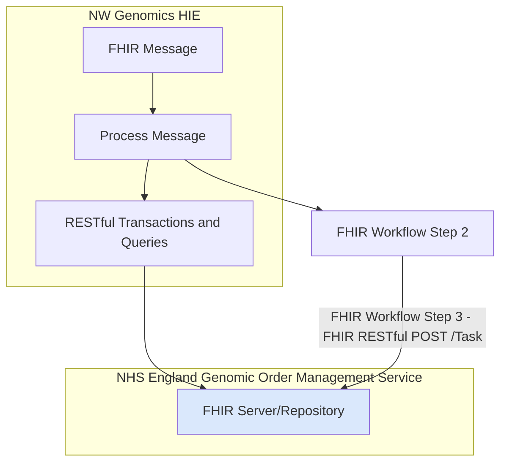
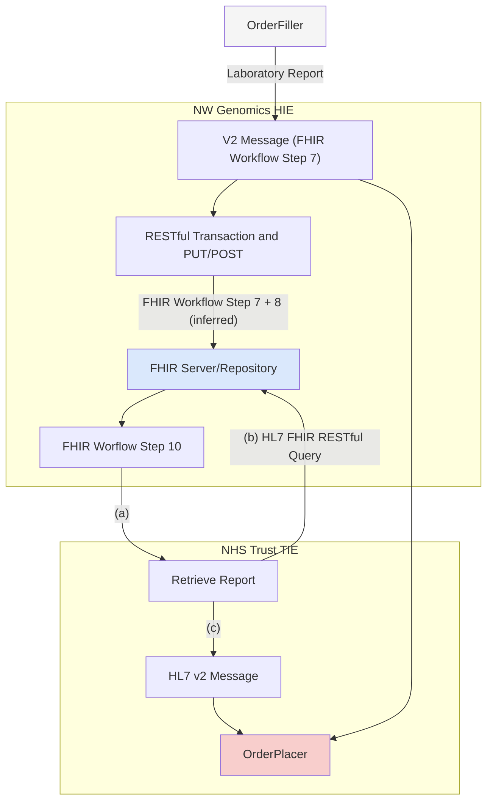

This is currently being elaborated and subject to change.

## HL7 v2 Message

Most common method

### Advantages

- Well supported by EPR and LIMS
- Well understood by delivery teams
- Can be scaled up to enterprise use by addition of IHE LTW which defines cross organisation behaviour.

### Scaling to Enterprise

### Disadvantages

- Many variations exist
- Often using early HL7 v2 and this often excludes Specimen/SPM information. Differences in v2 versions are handled by Trust Integration Engines, lack of Specimen/SPM information may be more problematic.
- Difficult for new market entrants to adopt

## HL7 FHIR Message

FHIR version of the HL7 v2 Message

### Advantages

- A modern format using JSON
- Can have same definition as HL7 v2 which helps with adoption.
- Consumer decides how to file the message.

### Disadvantages

- Not a common pattern used internationally for 3rd party interoperability
- Is not defined in the UK (i.e. HL7 UK Core) to the level of HL7 v2
- More variations exist than HL7 v2
- Endpoint systems are likely to be on v2 and so middleware is required to perform v2 to/from FHIR conversions

## HL7 FHIR RESTful Transaction and POST/PUT

Similar to the previous options but without the definition of payloads.

### Advantages

- A modern format using JSON

### Disadvantages

- Consumer business processing is moved the producer and this can be quite difficult to follow 
- Can be a very `chatty` interface due to lookups (GET) needed for POST or PUT requests. 
- Not a common pattern used internationally for 3rd party interoperability
- Not easy to define payloads, conformance is often done at resource level
- Resources are not defined in the UK (i.e. HL7 UK Core) to the level of HL7 v2
- More variations exist than HL7 v2
- Endpoint systems are likely to be on v2 and so middleware is required to perform v2 to/from FHIR conversions

## HL7 FHIR Workflow and HL7 FHIR REST read only APIs

Is a modernisation of all the previous methods, full FHIR workflow requires both the Order Placer and Order Filler to have a FHIR Repository. Examples:

- Order Placer EPR systems: EPIC, Oracle and Meditech
- Order Filler LIMS: Magentus.
- Order Filler Middleware: NW Genomics Data Repository + Regional Integration Engine and NHS England Genomic Order Management System.

Note: FHIR workflow described is based on the same FHIR Workflow described in [FHIR Genomics Implementation Guide - Interactions](https://simplifier.net/guide/fhir-genomics-implementation-guide/Home/Design/Interactions), in FHIR Worflow documentation this is known as [Option H: POST of Task to a workflow broker](https://build.fhir.org/workflow-management.html#optionh)

 

### Advantages

- Many EPR and LIMS within the region are capable of adopting this standard.
- A modern format using JSON
- Allows more conversational workflows and better order + specimen management.
- Is the HL7 suggested method for modernising HL7 v2.
- Can be combined with existing workflow, the query to get laboratory order/report can still be HL7 v2
- Works with [FHIR Subscription](https://build.fhir.org/ig/HL7/fhir-subscription-backport-ig/) for Pub/Sub

### Disadvantages

- Data standards followed in EPR and LIMS are mostly based on US Gov and HL7 Australia standards.
  - Note: these are all UK Core conformant as this is defined at base level.
- Limited understanding of this workflow, most NHS adoptions of FHIR has been FHIR Messaging
- No event-notification has been defined, expect NHS Trusts to favour traditional routing such as distribution lists, etc.
- Endpoint systems are likely to be on v2 and so middleware is required to perform v2 to/from FHIR conversions, this is less effort than FHIR Message and Transaction.

## Practical Implementation

North West Genomics has used multiple interaction styles to populate the FHIR Repository.
This is using a combination of all the above options.

At a high level there are two workflow styles:

- IHE Laboratory Testing Workflow (LTW) - which at the implmentation level is HL7 v2 Message.
- FHIR Workflow - which at the implmentation level is event based Messages and uses FHIR RESTful APIs.
  - event-based messages are mostly implemented using FHIR Subscription (Pub/Sub), other message distribution (i.e. using FHIR Message) options have not been defined by IHE or HL7.

In the following section, North West Genomics Health Information Exchange (HIE), Laboratory/Medicus and NHS England England can all act as the <b>Workflow Broker</b>. This is all use case specific: 
<ul>
<li>Laboratory Order Placer to Genomic Order Filler: Medicus is the Workflow Broker</li>
<li>NHS Trust Order Placaer to North West Genomic Order Filler: Medicus is the Workflow Broker</li>
<li>North Genomic Order Placer to out of area Genomics Order Filler : Medicus is the Workflow Broker</li>
</ul>
It is possible that these use cases can be combined, for example, an order from Medicus Order Placer can go to an out-of-area Genomics Order Filler NHS England.

### Step 1 -> 6

#### Current Implementation (Step 1 -> 4)

Currently, the Health Information Exchange (HIE) is implemented as:

The NHS Trust TIE:
- Recieves an HL7 v2 Message from the Order Placer (EPR)
- Generates a FHIR Message
- Sends the FHIR Message to NW Genomic RIE (part of the HIE)

The NW Genomics HIE:
- Recieves an HL7 v2 Message from the Order Placer (EPR)
- Generates a FHIR Message
- Sends the v2 Message to the Order Filler (LIMS)
- Populates the FHIR Repository (GDR) with the FHIR Message
- Creates a FHIR Task within the FHIR Repository (FHIR Workflow Step 3) and can send an event notification (FHIR Workflow Step 4),

#### Retrieving Order Medicus and NHS England Genomic Order Management Service Implementation (Step 4 -> 6)

For orders originating from Laboratory, the following process is suggested:

The NW Genomics HIE:

- Recieves an event notification (FHIR Workflow Step 4) from the Worflow Broker (Medicus).
- Retrieves the order from the FHIR Repository and generates an event notification (FHIR Workflow Step 5 - Task (accepted))
- Processes the order and generates a V2 Message
- Sends the V2 Message to the Order Filler (LIMS)

#### Sending Order NHS England Genomic Order Management Server Implementation (Step 4 -> 6)

A suggestion design for working with the NHS England Genomic Order Management Server (GOMS) is:

The NW Genomics HIE:

- Recieves an HL7 FHIR Message from the Order Placer (EPR)
- Processes the Message 
  - Converts the FHIR Message into a data pipeline to copy the order into the GOMS using FHIR Transactions and Queries.
  - Performs FHIR Workflow Step 2 and POSTs the Task to the FHIR Repository (FHIR Workflow Step 3)

 
### Steps 7->10

