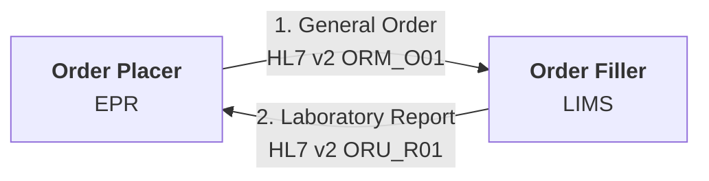
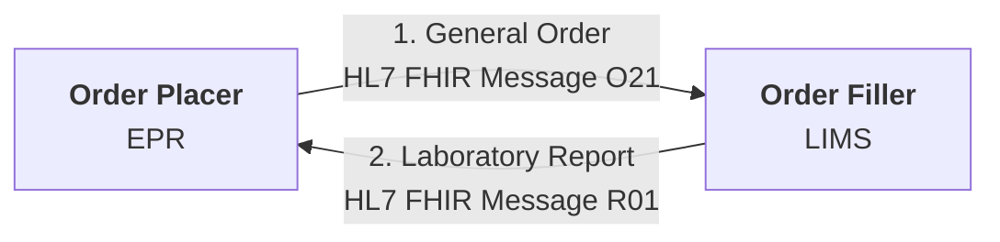
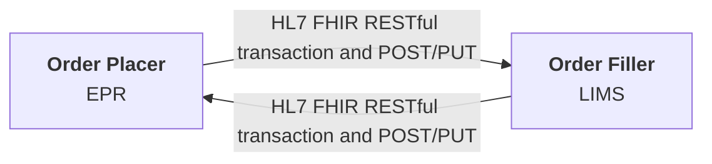
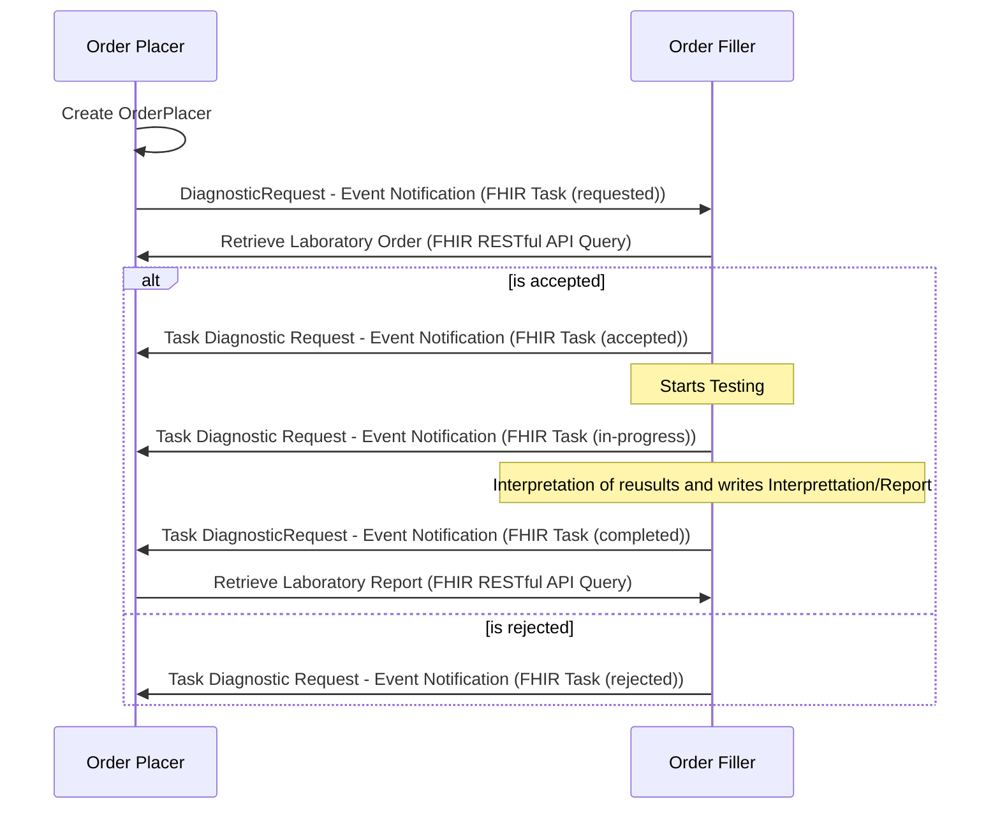

## HL7 v2 Message

Most common method

### Advantages

- Well supported by EPR and LIMS
- Well understood by delivery teams
- Can be scaled up to enterprise use by addition of IHE LTW which defines cross organisation behaviour.

### Disadvantages

- Many variations exist
- Often using early HL7 v2 and this often excludes Specimen/SPM information
- Difficult for new market entrants to adopt

## HL7 FHIR Message

FHIR version of the HL7 v2 Message

### Advantages

- A modern format using JSON
- Can have same definition as HL7 v2 which helps with adoption.
- Consumer decides how to file the message.

### Disadvantages

- Not a common pattern used internationally for 3rd party interoperability
- Is not defined in the UK to the level of HL7 v2
- More variations exist than HL7 v2

## HL7 FHIR RESTful Transaction and POST/PUT

Similar to the previous options but without the definition of payloads.

### Advantages

- A modern format using JSON

### Disadvantages

- Consumer business processing is moved the producer and this can be quite difficult to follow 
- Not a common pattern used internationally for 3rd party interoperability
- Not easy to define payloads, conformance is often done at resource level
- Resources are not defined in the UK to the level of HL7 v2
- More variations exist than HL7 v2

## HL7 FHIR Workflow

Is a modernisation of all the previous methods, it requires both the Order Placer and Order Filler to have a FHIR Repository. Examples:

- Order Placer EPR systems: EPIC, Oracle and Meditech
- Order Filler LIMS: Magentus.
- Order Filler Middleware: NW Genomics Data Repository + Regional Integration Engine and NHS England Genomic Order Management System.

### Advantages

- Many EPR and LIMS within the region are capable of adopting this standard.
- A modern format using JSON
- Allows more conversational workflows and better order + specimen management.
- Is the HL7 suggested method for modernising HL7 v2.
- Can be combined with existing workflow, the query to get laboratory order/report can still be HL7 v2

### Disadvantages

- Data standards followed in EPR and LIMS are mostly based on US Gov and HL7 Australia standards.
- Limited understanding of this workflow, most NHS adoptions of FHIR has been FHIR Messaging. 
