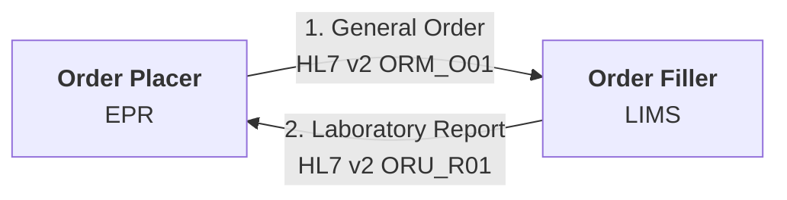
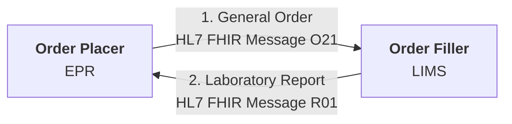
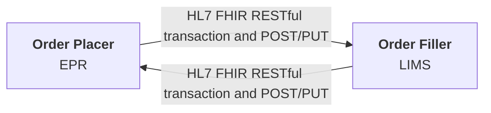
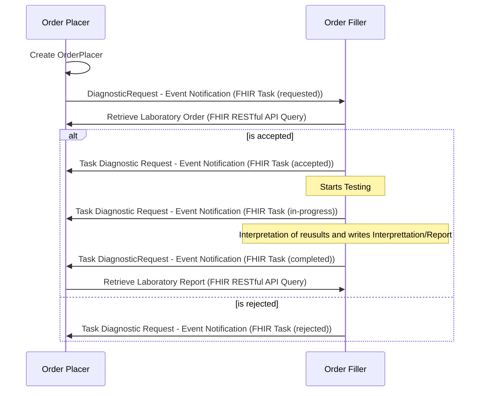

## IHE LTW & HL7 v2 Message

Most common method

## HL7 FHIR Message

FHIR version of the HL7 v2 Message

## HL7 FHIR RESTful Transaction and POST/PUT

Similar to the previous options but without the definition of payloads.

## HL7 FHIR Workflow

Is a modernisation of all the previous methods, it requires both the Order Placer and Order Filler to have a FHIR Repository. Example EPR systems include EPIC and Meditech, example LIMS include NW Genomics Data Repository and Magentus.

