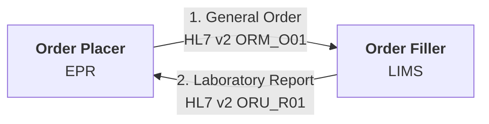
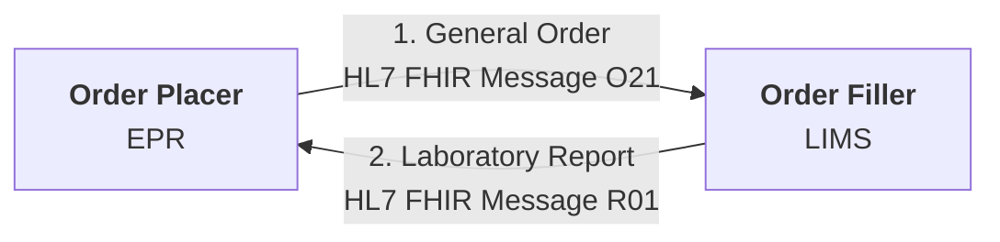
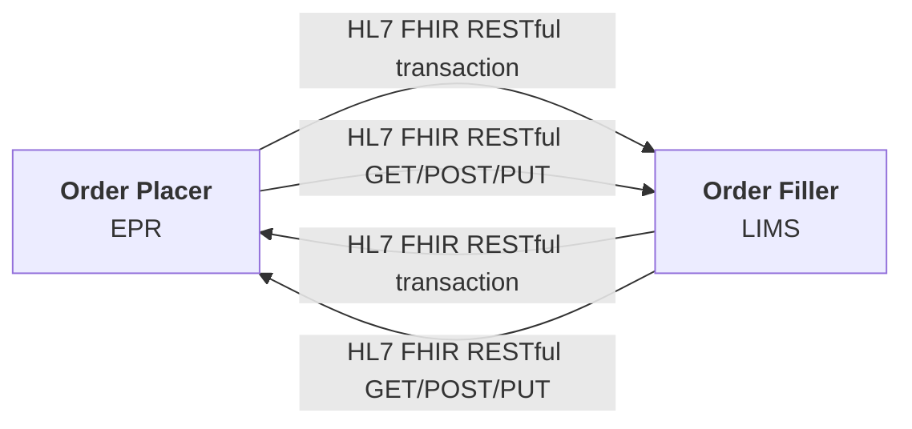
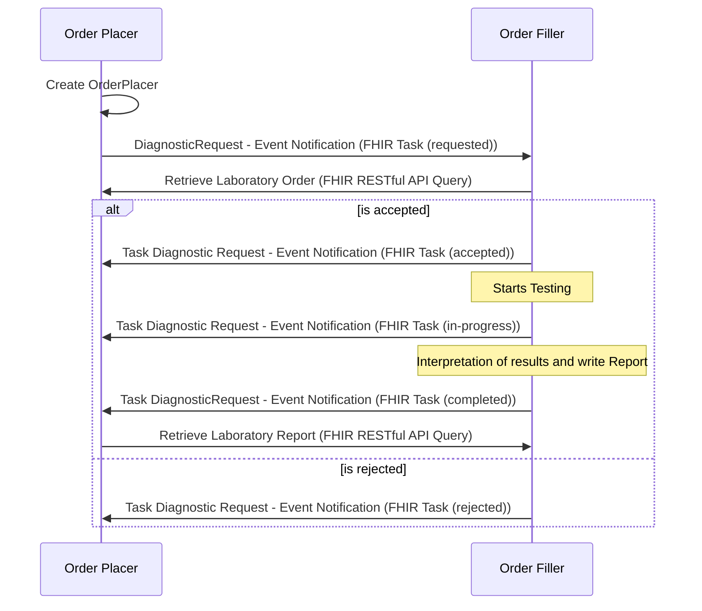

## HL7 v2 Message

Most common method

### Advantages

- Well supported by EPR and LIMS
- Well understood by delivery teams
- Can be scaled up to enterprise use by addition of IHE LTW which defines cross organisation behaviour.

### Disadvantages

- Many variations exist
- Often using early HL7 v2 and this often excludes Specimen/SPM information. Differences in v2 versions are handled by Trust Integration Engines, lack of Specimen/SPM information may be more problematic.
- Difficult for new market entrants to adopt

## HL7 FHIR Message

FHIR version of the HL7 v2 Message

### Advantages

- A modern format using JSON
- Can have same definition as HL7 v2 which helps with adoption.
- Consumer decides how to file the message.

### Disadvantages

- Not a common pattern used internationally for 3rd party interoperability
- Is not defined in the UK (i.e. HL7 UK Core) to the level of HL7 v2
- More variations exist than HL7 v2
- Endpoint systems are likely to be on v2 and so middleware is required to perform v2 to/from FHIR conversions

## HL7 FHIR RESTful Transaction and POST/PUT

Similar to the previous options but without the definition of payloads.

### Advantages

- A modern format using JSON

### Disadvantages

- Consumer business processing is moved the producer and this can be quite difficult to follow 
- Can be a very `chatty` interface due to lookups (GET) needed for POST or PUT requests. 
- Not a common pattern used internationally for 3rd party interoperability
- Not easy to define payloads, conformance is often done at resource level
- Resources are not defined in the UK (i.e. HL7 UK Core) to the level of HL7 v2
- More variations exist than HL7 v2
- Endpoint systems are likely to be on v2 and so middleware is required to perform v2 to/from FHIR conversions

## HL7 FHIR Workflow

Is a modernisation of all the previous methods, full FHIR workflow requires both the Order Placer and Order Filler to have a FHIR Repository. Examples:

- Order Placer EPR systems: EPIC, Oracle and Meditech
- Order Filler LIMS: Magentus.
- Order Filler Middleware: NW Genomics Data Repository + Regional Integration Engine and NHS England Genomic Order Management System.

Note: FHIR workflow described is based on the same FHIR Workflow described in [FHIR Genomics Implementation Guide - Interactions](https://simplifier.net/guide/fhir-genomics-implementation-guide/Home/Design/Interactions), in FHIR Worflow documentation this is known as [Option H: POST of Task to a workflow broker](https://build.fhir.org/workflow-management.html#optionh)

 

However the mechanisms for step 1 can vary. 

### Step 1 Variations

| Order Placer/Filler Options | Methods to post to NW Genomics FHIR Repository                  | Methods to post to NHS England Genomics Order Management System                        |
|-----------------------------|-----------------------------------------------------------------|----------------------------------------------------------------------------------------|
| No FHIR Repository          | Send [HL7 v2 Message](#hl7-v2-message)                          |                                                                                        | 
|                             | Send [HL7 FHIR Message](#hl7-fhir-message)                      |                                                                                        |
|                             | (FHIR Transaction is used internally to store v2/FHIR Messages) | [HL7 FHIR RESTful Transaction and POST/PUT](#hl7-fhir-restful-transaction-and-postput) |
| Has FHIR Repository         | not applicable                                                  | Not supported, FHIR Transaction and POST/PUT must be used (above).                     |
{:.grid}

### Advantages

- Many EPR and LIMS within the region are capable of adopting this standard.
- A modern format using JSON
- Allows more conversational workflows and better order + specimen management.
- Is the HL7 suggested method for modernising HL7 v2.
- Can be combined with existing workflow, the query to get laboratory order/report can still be HL7 v2
- Works with [FHIR Subscription](https://build.fhir.org/ig/HL7/fhir-subscription-backport-ig/) for Pub/Sub

### Disadvantages

- Data standards followed in EPR and LIMS are mostly based on US Gov and HL7 Australia standards.
  - Note: these are all UK Core conformant as this is defined at base level.
- Limited understanding of this workflow, most NHS adoptions of FHIR has been FHIR Messaging
- No event-notification has been defined, expect NHS Trusts to favour traditional routing such as distribution lists, etc.
- Endpoint systems are likely to be on v2 and so middleware is required to perform v2 to/from FHIR conversions, this is less effort than FHIR Message and Transaction.