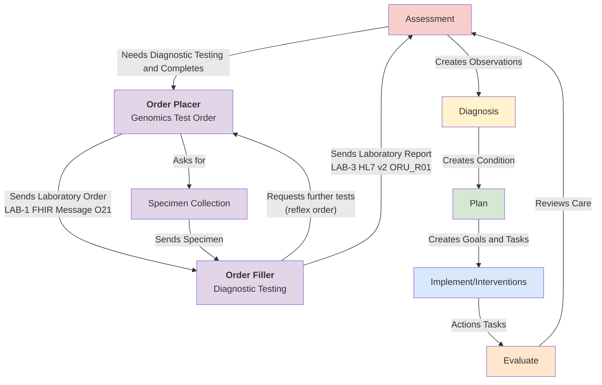
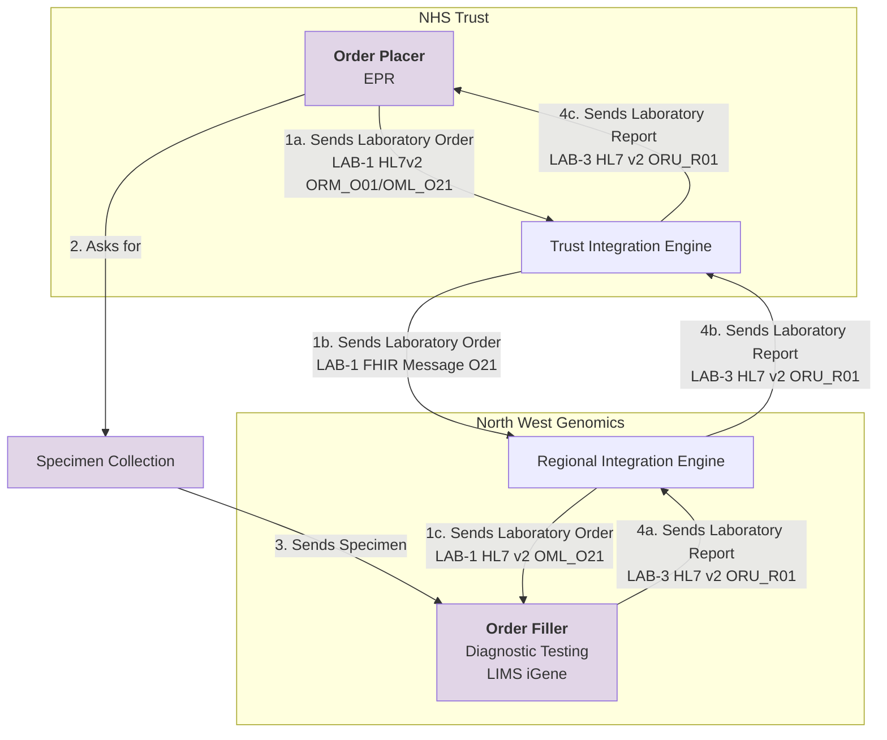
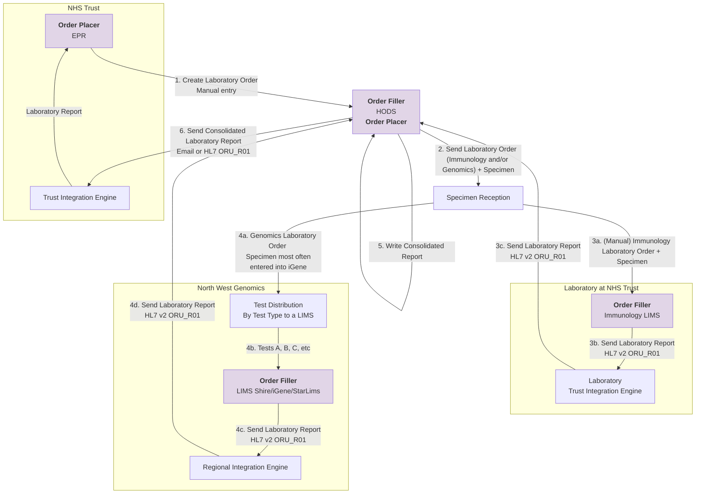
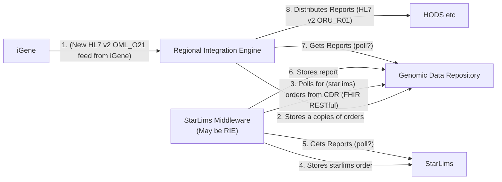
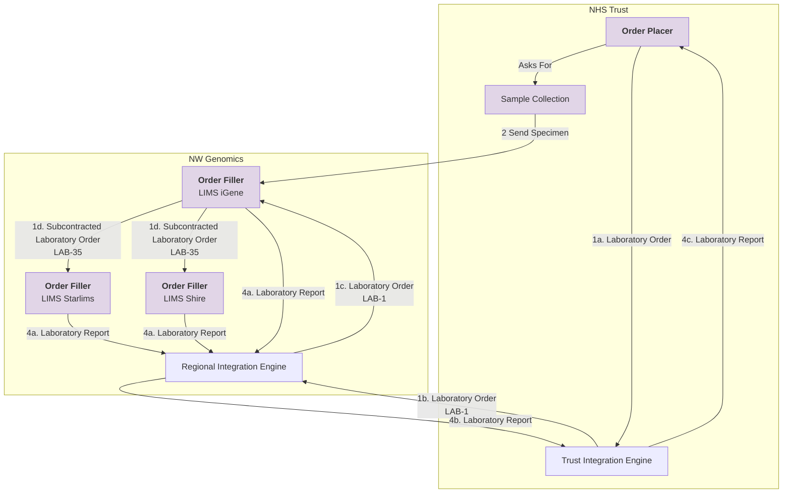
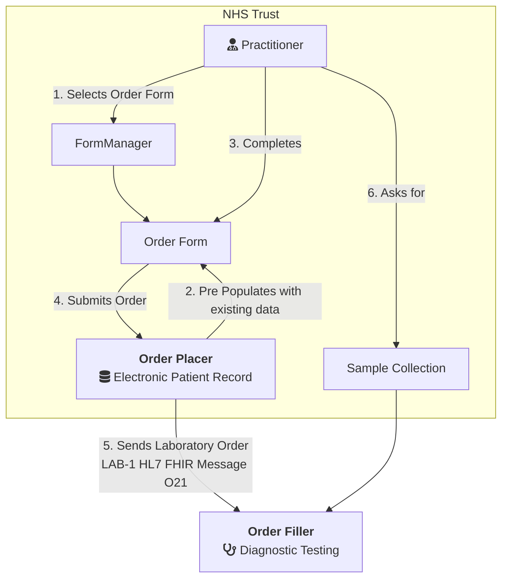
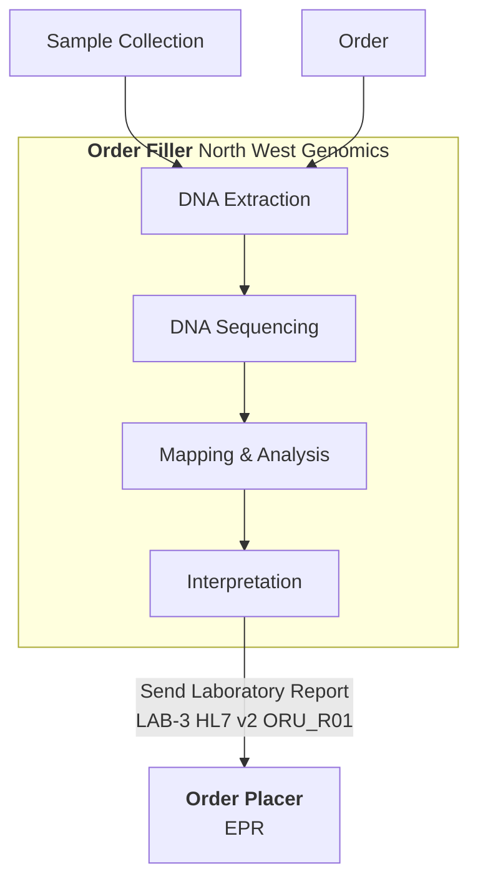

This guide is to support Genomic Testing Workflow at a regional level and is designed to be compatible with:

- [NHS England - FHIR Genomics Implementation Guide](https://simplifier.net/guide/fhir-genomics-implementation-guide/Home) which defines the conformance requirements for Genomics in England
- [NHS England - Genomic Order Management Service FHIR API](https://digital.nhs.uk/developer/api-catalogue/genomic-order-management-service-fhir) a [FHIR Workflow](https://hl7.org/fhir/R4/workflow.html) based service for managing orders and results at a national level.

The general workflow is based on IHE LTW profiles and HL7 v2 OML and ORU.

## Clinical Overview

### Clinical Process

Genomic Testing Workflow is part of Diagnostic Testing, which is also part of the general clinical process.

Genomic diagnostic testing follows the same standardized process defined by the [IHE Laboratory Testing Workflow](https://wiki.ihe.net/index.php/Laboratory_Testing_Workflow) used in traditional laboratory testing.
This workflow has been enhanced to support the sharing of laboratory reports (documents) through Integrated Care Systems (ICS). In addition, a new mechanism for sharing laboratory reports has been introduced to establish a regional genomic data repository.

## Use Case: Childrens Cancer and Genomics

THIS HAS NOT BEEN CLINICALLY VALIDATED 

### Actors

- PTC: A Principal Treatment Centre (PTC) is a specialized hospital unit, primarily in the UK, responsible for the comprehensive diagnosis, treatment planning, and management of cancer in children, teenagers, and young adults (0–24 years).
- POSCU: A Paediatric Oncology Shared Care Unit (POSCU) is a specialized unit within a local hospital in the UK that works alongside principal treatment centres to deliver care for children with cancer closer to home. POSCUs,, such as those within the NHS, manage treatment protocols, support services, and coordinate care for patients, often involving chemotherapy or management of complications. 

### Use case 

---
1. Test Request Initiation
   - PTC identifies the need for genomic testing (e.g. somatic mutation analysis, cytogenetics, NGS panels, minimal residual disease testing) as part of haematology oncology diagnosis, risk stratification, or treatment planning.
   - Genomic test request may be initiated:
     - At diagnosis
     - At relapse
     - During treatment response monitoring
2. Consent and Clinical Information Capture
   - Explicit patient/guardian consent for genomic testing is confirmed and recorded (where required).
   - Additional clinical context is documented to support interpretation, including:
     - Diagnosis and disease phase
     - Prior therapies
     - Relevant phenotypic findings
     - Family history (if applicable)
3. Sample Collection
   - Sample type may include:
     - Peripheral blood
     - Bone marrow aspirate
     - Tissue biopsy
   - Sample collected by Community Nurse, POSCU, or hospital-based clinical team.
   - Specimen details recorded, including:
     - Sample type and volume
     - Collection time
     - Handling and storage requirements specific to genomic assays
4. Genomic Laboratory Order Creation
   - A **genomic laboratory order** is created and sent to the designated genomic or specialist haematology oncology laboratory.
   - Order includes:
     - Requested genomic assay(s)
     - Clinical indication
     - Urgency (routine vs urgent)
     - Linked phenotypic laboratory results (if available)
5. Sample Transport and Accessioning
   - Specimen is transported according to genomic testing requirements.
   - Receiving laboratory performs:
     - Sample accessioning
     - Quality and suitability checks (e.g. DNA/RNA integrity, tumour content)
6. Genomic Testing and Analysis
   - Laboratory performs genomic testing (e.g. sequencing, cytogenetic analysis, bioinformatics processing).
   - Results undergo:
     - Technical validation
     - Clinical interpretation by qualified molecular pathologists or scientists
7. Genomic Results Reporting
   - Laboratory produces a genomic diagnostic report, which may include:
     - Identified variants or abnormalities
     - Clinical significance and classification
     - Diagnostic, prognostic, or therapeutic implications
     - Limitations of testing
   - Report is issued electronically where possible.
8. Distribution of Genomic Results
   - Genomic report is sent to:
     - PTC
     - POSCU or Community Nurse (if involved in shared care)
     - Where systems are not interoperable, results may be supplemented via secure messaging or agreed alternative formats.
9. Communication and Acknowledgement
   - POSCU or Community Nurse notifies PTC that genomic results have been sent and confirms receipt (mirroring the existing blood test process).
   - Any issues with report readability, format, or completeness are escalated.
10. Clinical Review and Multidisciplinary Interpretation
    - PTC reviews genomic results, often within a:
      - Multidisciplinary Team (MDT)
      - Molecular Tumour Board (if applicable)
    - Genomic findings are interpreted alongside existing laboratory and clinical data.
11. Clinical Decision Making
    - PTC may:
      - Confirm or refine diagnosis
      - Adjust risk stratification
      - Amend treatment regimen (e.g. targeted therapy eligibility)
      - Request additional genomic or phenotypic tests
12. Patient Recall and Follow-Up
    - If genomic findings necessitate action:
      - Patient may be recalled for additional testing or treatment changes.
    - Any prescription or care plan changes are communicated to POSCU.
13. Ongoing Data Use and Re-analysis (Where Applicable)
    - Genomic data may be:
      - Re-interpreted as knowledge evolves
      - Referenced for future treatment decisions
    - PTC may request amended reports if variant classification changes
---

## Use Case: Colorectal Diagnostic Pathway (Derby → Nottingham University Hospitals NHS Trust → North West Genomics)

THIS HAS NOT BEEN CLINICALLY VALIDATED 

Ref: [NHS Impact - Best Practice Timed Diagnostic Cancer pathways](https://gettingitrightfirsttime.co.uk/wp-content/uploads/2024/03/BestPracticeTimedDiagnosticCancerPathwayssummary-guide-March-24-V3.pdf)

---
### Patient Profile

- Name: Mr. Kumar (example)
- Location: Derby, UK
- Age: 62
- Symptoms: Persistent change in bowel habits, intermittent rectal bleeding, unexplained weight loss
- GP Registered With: Derby GP Practice
- Referring NHS Trust: Derbyshire (primary care)
- Receiving NHS Trust: Nottingham University Hospitals NHS Trust (NUH)
- Genomics Laboratory Hub (GLH): North West Genomics for any advanced molecular/genomic testing

### Step-by-Step Pathway in Line with Best Practice Timed Diagnostic Guidance

(Based on the 28-day Faster Diagnosis Standard and best practice principles summarised in the GIRFT 2024 guide.)

#### Day 0 — GP Referral (Urgent Suspected Cancer)

- Mr. Kumar visits his GP in Derby with symptoms matching NG12 suspected colorectal cancer criteria (weight loss, bleeding, change in bowel habits).
- GP performs initial assessments including FIT (Faecal Immunochemical Test) and basic blood tests (FBC, iron studies).
- Based on high-risk FIT results, the GP makes an urgent suspected cancer referral to Nottingham University Hospitals NHS Trust via e-Referral Service (eRS).
- Referral includes minimum dataset: symptoms, FIT result, bloods, family history, medications, performance status, and communication preferences.

**Goal:** Enable straight to test routing where possible.

####  Day 1–7 — Triage & Navigation

- NUH cancer services receive the referral and initiate clinical triage within 7 days:
- Review of referral data by a clinical nurse specialist (CNS) and colorectal team.
- Determine the most appropriate diagnostic route (e.g., colonoscopy, CT colonography, flexible sigmoidoscopy).
- A cancer navigator is assigned to coordinate all appointments, track progress, and communicate with the patient.

**Goal:** Efficient prioritisation and sequencing to support rapid diagnostics and minimise wasted clinic waits.

#### Day 7–14 — Diagnostic Testing

- Mr. Kumar is scheduled for:
  - Colonoscopy (primary definitive test)
  - CT colonography if incomplete colonoscopy or contraindications
- Parallel pathology work (e.g., biopsy testing) is initiated if suspicious lesions are found.
- Test reports are expedited back to the colorectal MDT and referring clinician.

**Goal:** Complete key diagnostic investigations early in pathway to support 28-day standard.

#### Day 14–21 — Multidisciplinary Team (MDT) Review

- If cancer is confirmed on biopsy, NUH MDT review diagnosis, stage, and immediate next steps.
- Genomic profiling may be indicated (e.g., if advanced disease or targeted therapy considerations). Here, **North West Genomics** GLH receives tumour samples or sequencing requests for actionable genomic tests.
  - Example work: mismatch repair (MMR) status, RAS/BRAF profiling (if colorectal cancer confirmed) as per clinical indications.
- Genomics results are expected shortly after initial pathology to inform precision treatment planning.

**Goal:** Early integration of genomics into treatment planning where indicated.

#### Day 21–28 — Communication & Decision to Treat

- The diagnosis (cancer confirmed or ruled out) is communicated to Mr. Kumar within 28 days of referral — meeting the Faster Diagnosis Standard.
- If cancer: a decision to treat is made, and care planning begins (surgical referral, oncology, or multidisciplinary care).
- If no cancer: Mr. Kumar receives a non-cancer diagnosis and appropriate routing back to primary care or symptomatic management.

#### Outcomes & Benefits of Following the Best Practice Timed Pathway

- ✔ Reduces waiting time from referral to diagnosis to within 28 days.
- ✔ Prioritises high-risk patients for early, appropriate diagnostics (e.g., straight to test).
- ✔ Supports coordinated care across primary care, secondary care, MDT, and genomics services.
- ✔ Improves patient experience with earlier communication and streamlined navigation.
- ✔ Aligns with national quality standards and GIRFT-endorsed best practice.

--- 

## Genomic Orders and Reports

## Usecase: Haematological Malignancy Diagnostic Services

- Trusts will place their orders directly in HODS (1). HODS prints a request form, this is sent with the samples to Central specimen reception at MFT (2a).
- Specimen reception then route the samples to the appropriate labs for testing, e.g. Genomics (4a), Immunology (3a), Christie via transport, etc.
- The orders are manually booked into LIMS (Beaker (3a), iGene (4a + 4b), Shire (4a + 4b), etc). Which Genomic LIMS is used is determined by Genomic Test Type.
- Results are sent electronically from LIMS (3b and 4c) to HODS (with exception of iGene PDFs, these are manually uploaded)
- Reporting consultant writes the final combined report within HODS itself when all results are in (5)
- When report is marked Closed , requesting clinicians are alerted by email (6) to log into HODS and view/export the PDF of the final report

### Cheshire and Mersey Test Distribution

For information purposes only. This is a more detailed breakdown of the Genomic Tests are distributed.

 

HODS Genomic Tests - Mersey and Cheshire GLH
 
 

### Technical Implementation Option

This relates to points 4a->4d in the diagram above.

This infers automated order distribution between LIMS. This has questions around genomic specimen management, if the specimen management for genomics is going to be iGene, then orders to others LIMS are more accurately described as subcontracted orders. 

#### Subcontracted Orders

The RIE routes orders to a master LIMS (assumed to be iGene), which then subcontracts them to the other LIMS.

See also [Inter Laboratory Workflow (ILW)](ILW.html)

## Technical Workflow Overview

### Laboratory Workflow (LTW)

#### Test Order

For more details see:

- [Send Laboratory Order (IHE LTW)](LTW.html) NHS Trust
- [Read & Search Laboratory Order (HIE)](HIE.html)

#### Diagnostic Testing

- Sample Collection: A sample of blood, saliva, skin, or tumor tissue is collected.
- DNA Extraction: In a lab, DNA is separated from the cells in the sample.
- DNA Sequencing: The DNA is broken into small pieces, copied, and then "read" by a machine, revealing the order of its building blocks (bases).
- Mapping & Analysis: Powerful computers match these short DNA "reads" to a reference genome (mapping) and then identify any variations or mutations.
- Interpretation: Expert scientists analyze these variants to understand their potential impact on health, looking for links to diseases or responses to treatment.

For more details see:

- [Send Laboratory Report Data (IHE LTW)](LTW.html) - NHS Trust
- [Send Laboratory Report Document (HIE)](HIE.html#publish-a-document) - ICS/ICB
- [Read & Search Laboratory Report Data (HIE)](HIE.html)
- [Read & Seerch Laboratory Report Documents (HIE)](HIE.html)

### Inter Laboratory Workflow (ILW)

For illustration purposes only, see [Inter Laboratory Workflow](ILW.html)

### Specimen Event Tracking (SET)

For illustration purposes only, see [Specimen Event Tracking](SET.html)
