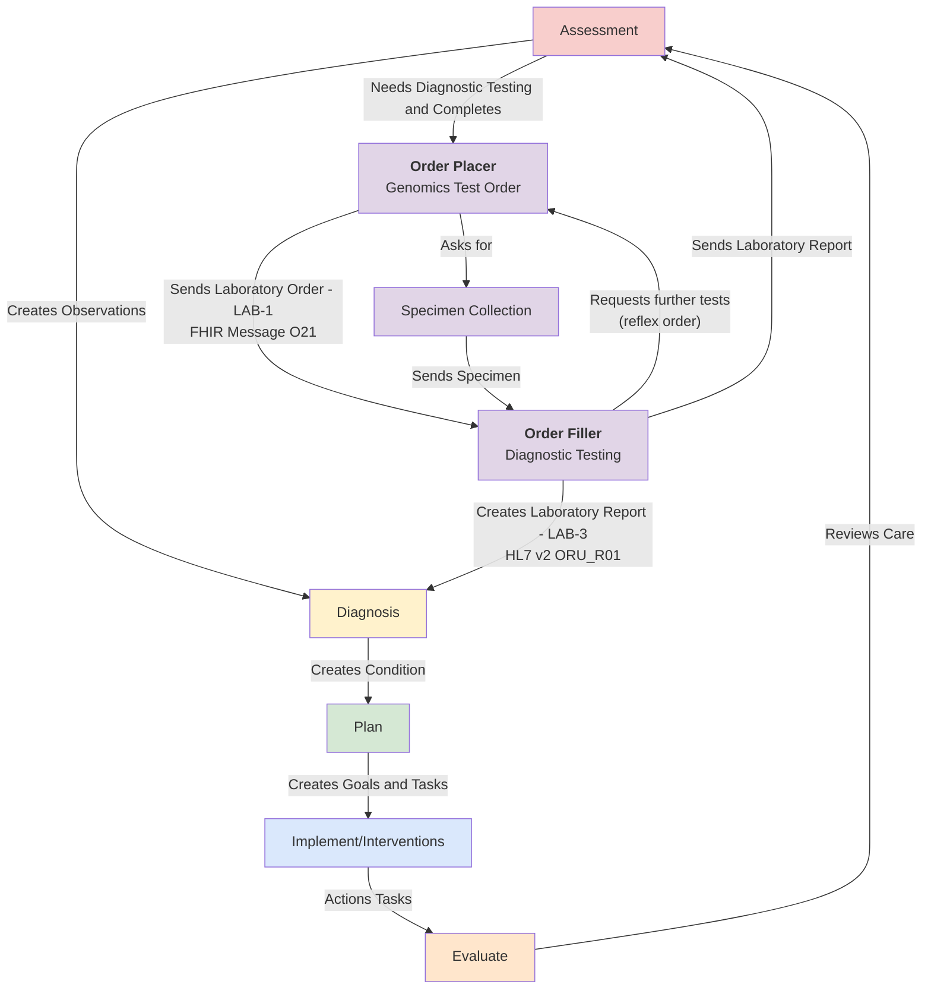
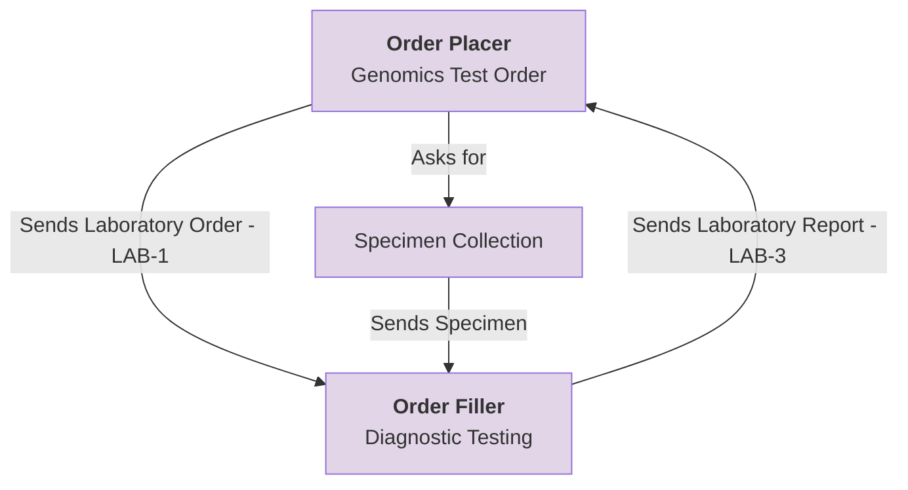
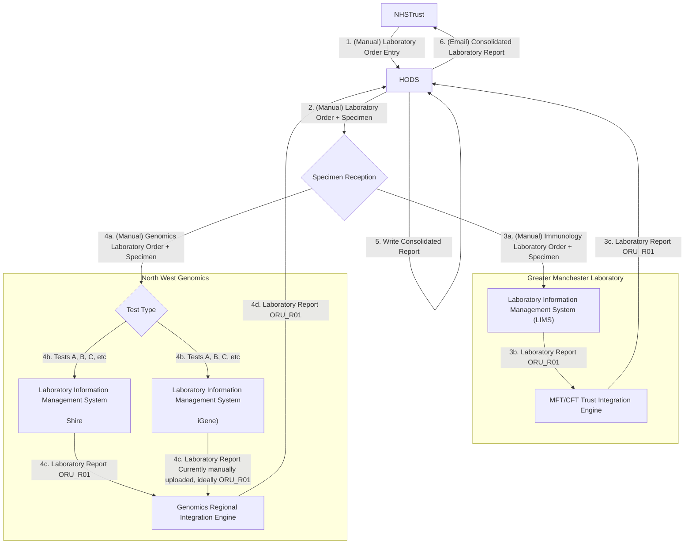
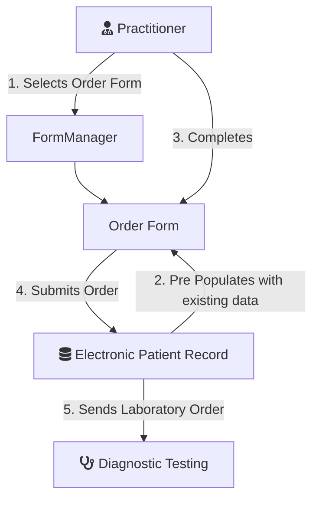
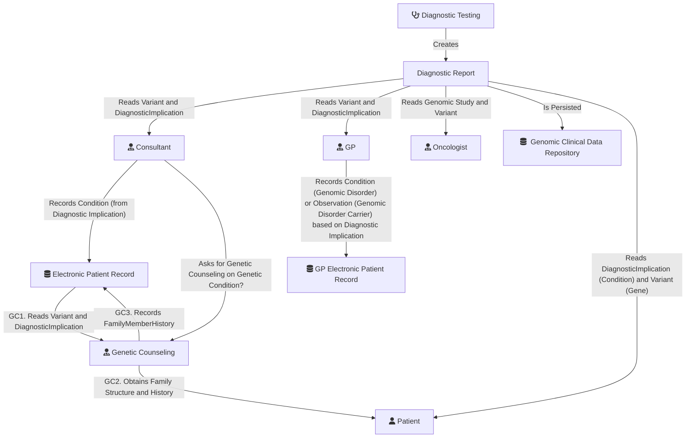

This guide is to support Genomic Testing Workflow at a regional level and is designed to be compatible with:

- [NHS England - FHIR Genomics Implementation Guide](https://simplifier.net/guide/fhir-genomics-implementation-guide/Home) which defines the conformance requirements for Genomics in England
- [NHS England - Genomic Order Management Service FHIR API](https://digital.nhs.uk/developer/api-catalogue/genomic-order-management-service-fhir) a [FHIR Workflow](https://hl7.org/fhir/R4/workflow.html) based service for managing orders and results at a national level.

The general workflow is based on IHE LTW profiles and HL7 v2 OML and ORU.

## Clinical Overview

### Clinical Process

Genomic Testing Workflow is part of Diagnostic Testing, which is also part of the general clinical process.

Genomic diagnostic testing follows the same standardized process defined by the [IHE Laboratory Testing Workflow](https://wiki.ihe.net/index.php/Laboratory_Testing_Workflow) used in traditional laboratory testing.
This workflow has been enhanced to support the sharing of laboratory reports (documents) through Integrated Care Systems (ICS). In addition, a new mechanism for sharing laboratory reports has been introduced to establish a regional genomic data repository.

### Genomic Testing

### Haematological Malignancy Diagnostic Services

#### Greater Manchester

After move of HODS from The Christie to Manchester Foundation Trust.

- Trusts will place their orders directly in HODS (1). HODS prints a request form, this is sent with the samples to Central specimen reception at MFT (2a).
- Specimen reception then route the samples to the appropriate labs for testing, e.g. Genomics (4a), Immunology (3a), Christie via transport, etc.
- The orders are manually booked into LIMS (Beaker (3a), iGene (4a + 4b), Shire (4a + 4b), etc). Which Genomic LIMS is used is determined by Genomic Test Type.
- Results are sent electronically from LIMS (3b and 4c) to HODS (with exception of iGene PDFs, these are manually uploaded)
- Reporting consultant writes the final combined report within HODS itself when all results are in (5)
- When report is marked Closed , requesting clinicians are alerted by email (6) to log into HODS and view/export the PDF of the final report

#### Cheshire and Mersey

For elaboration purposes only. This is a more detailed breakdown the the Genomic Tests.

 

HODS Genomic Tests - Mersey and Cheshire GLH
 
 

### Chimerism

TBD

## Technical Overview

### Laboratory Workflow (LTW)

#### Test Order

For more details see:

- [Send Laboratory Order (IHE LTW)](LTW.html) NHS Trust
- [Read & Search Laboratory Order (HIE)](HIE.html)

#### Diagnostic Testing

A detailed example of this process can be found in the [Example Scenario - Clinical and Genomic Workflow](ExampleScenario-ClinicalAndGenomicWorkflow.html).

For more details see:

- [Send Laboratory Report Data (IHE LTW)](LTW.html) - NHS Trust
- [Send Laboratory Report Document (HIE)](HIE.html#publish-a-document) - ICS/ICB
- [Read & Search Laboratory Report Data (HIE)](HIE.html)
- [Read & Seerch Laboratory Report Documents (HIE)](HIE.html)

### Inter Laboratory Workflow (ILW)

For illustration purposes only, see [Inter Laboratory Workflow](ILW.html)

### Specimen Event Tracking (SET)

For illustration purposes only, see [Specimen Event Tracking](SET.html)
