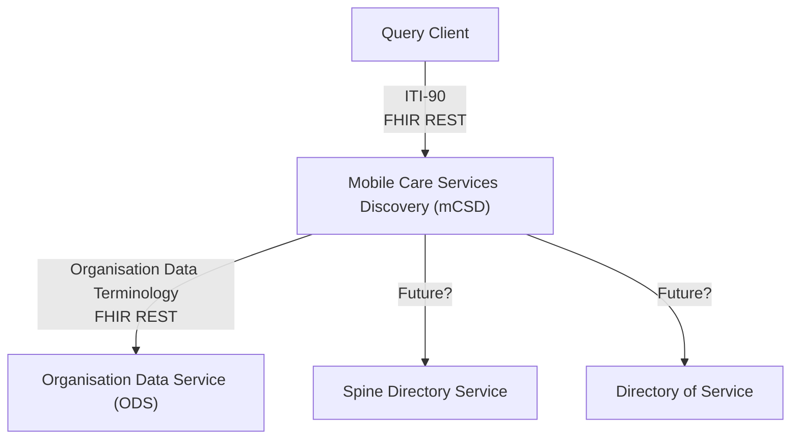

This is currently being elaborated and subject to change.

## Reference Standards

- [IHE Mobile Care Services Discovery (mCSD)](https://profiles.ihe.net/ITI/mCSD/index.html)
- NHS England APIs
  - Organisation Data Service (ODS) [Organisation Data Terminology - FHIR API](https://digital.nhs.uk/developer/api-catalogue/organisation-data-terminology)
  - See also Spine Directory Service (SDS) and Directory of Services (DOS)

## Overview

The mCSD interface will initially be used to route Laboratory Reports to interfaces associated with NHS Acute Trusts and Patients Surgery (retrieved via NHS England Personal Demographics Service - FHIR API).

