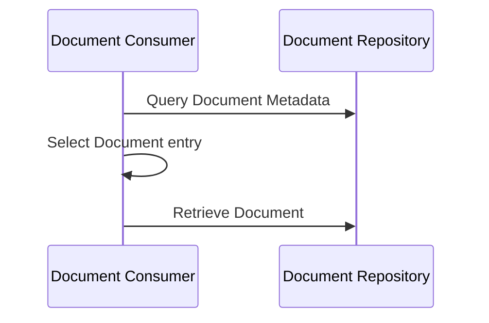
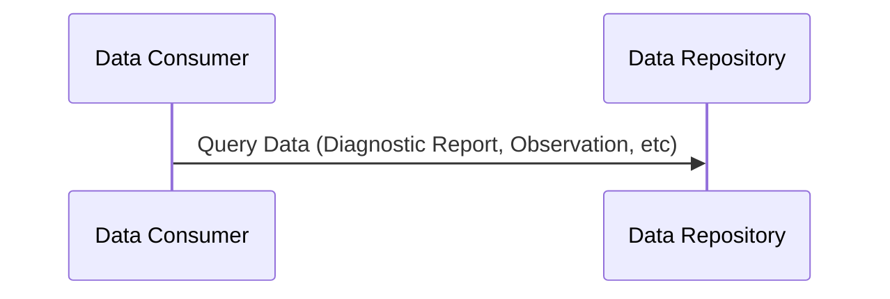
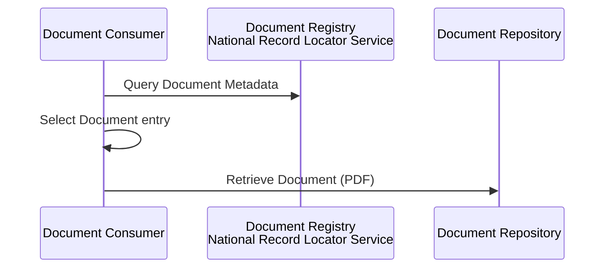
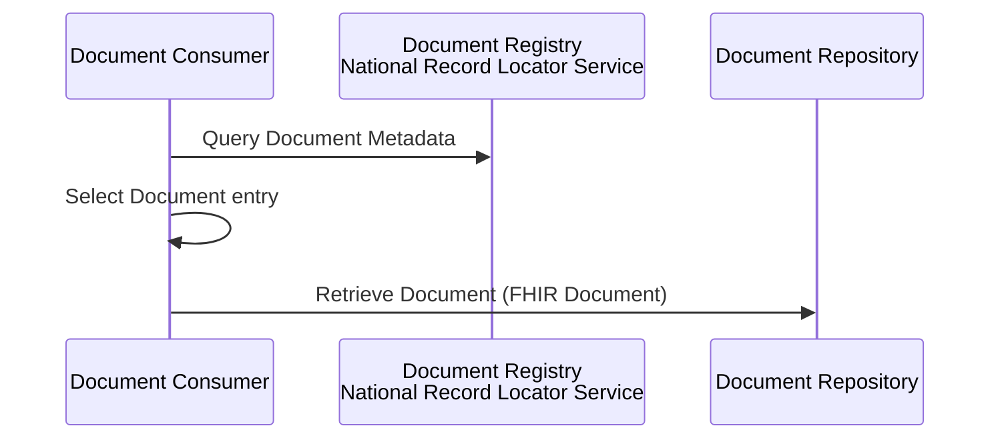
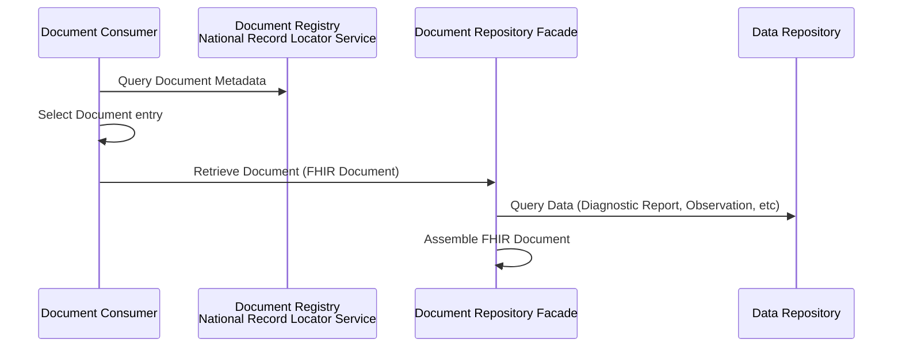

## Local Genomic Reports

Allows a consumer to retrieve genomic reports either as structured or unstructured

### Unstructured Documents

Pattern: FHIR RESTful + IHE [Mobile access to Health Documents (MHD)](https://profiles.ihe.net/ITI/MHD/index.html) 

### Structured Data

Pattern: FHIR RESTful + IHE [Query for Existing Data for Mobile (QEDm)](https://profiles.ihe.net/PCC/QEDm/index.html) also following [HL7 Genomic Report](https://build.fhir.org/ig/HL7/genomics-reporting/)

## National Genomic Reports

### Unstructured Documents

Pattern: FHIR RESTful + IHE [Mobile Health Document Sharing](https://profiles.ihe.net/ITI/MHDS/index.html) - this is essentially the same as the local genomic reports but the registry is now a seperate service.

### Structured Data (Composition)

Pattern: FHIR RESTful + IHE [Mobile Health Document Sharing](https://profiles.ihe.net/ITI/MHDS/index.html) - as above but the document is now a FHIR Document, probably [HL7 Europe Laboratory Report](https://build.fhir.org/ig/hl7-eu/laboratory/en/index.html) combined with [HL7 Genomic Report](https://build.fhir.org/ig/HL7/genomics-reporting/) 

Technically this would likely be implemented as a aggregation using the local structured API's (this is how YHCR is implementing International Patient Summary which is also a FHIR Document)
Unified Genomic Registry (UGR) has not decided on a specific option yet.

### Workflow Modifications

With the laboratory report shared, workflow can be altered to be event based. When a laboratory report is shared, a notification to the order placer and others who have subscribed to the event.
This allows HL7 v2 ORU_R01 messages to be phased out. 

Pattern: FHIR RESTful + IHE [Document Subscription for Mobile (DSUBm)](https://profiles.ihe.net/ITI/DSUBm/index.html)

### Security Considerations

For local this would be using an OAuth2 Authorisation flow - see [Authorisation (OAuth2)](authorisation.html)
In addition all queries would be audited e.g. follow IHE [Basic Audit Log Patterns (BALP)](https://profiles.ihe.net/ITI/BALP/index.html)

For national, access to local repositories would be required would again use IHE BALP. The authentication is likely to be [SSP Retrieval](https://developer.nhs.uk/apis/nrl/retrieval_ssp.html)