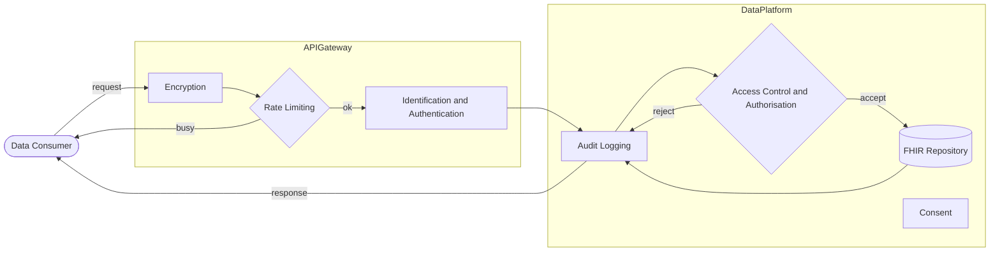
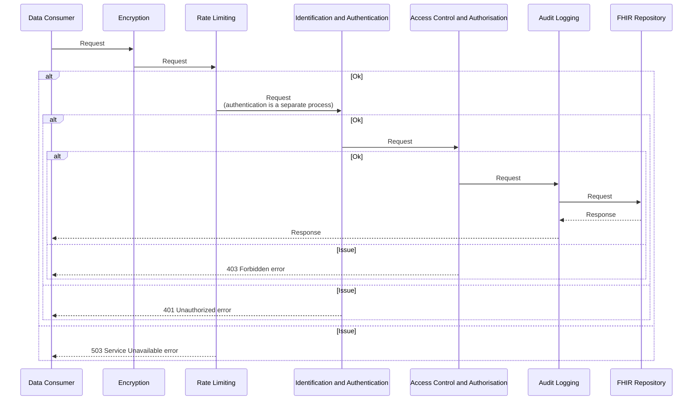
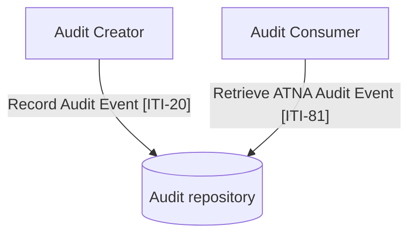

## Encryption

- Protocols: TLS 1.2 is the minimum; TLS 1.3 is recommended.
- Prohibitions: TLS 1.0, 1.1, and SSL are forbidden.
- Authentication: Mutual authentication (TLS-MA) is frequently required for API interactions. Note NHS England APIM recommends using Signed JWT Authentication.

## Rate Limiting

TODO 

## Identification and Authentication

Only system-to-system identification is currently supported.
NHS England identification: 

- Pracitioner openID [NHS England CIS2 Authentication](https://digital.nhs.uk/services/care-identity-service/applications-and-services/cis2-authentication)
- Patient openID [NHS England NHS login](https://digital.nhs.uk/services/nhs-login)

## Access Control and Authorisation

### OAuth2

Is based on [IHE Internet User Authorization (IUA)](https://profiles.ihe.net/ITI/IUA/index.html) but using `client-credentials` grant only (at present).

The authorisation will be hosted on the Regional Integration Engine. This is responsible for maintaining all the clients for the region.

Any Trust Integration can act as the Authorisation Client or Resource Server in the diagram below.

<figure>


OAuth2 - Client Credentials Grant

</figure>
 

- **Authorisation Server Metadata Request (ITI-103)** is an optional step to retrieve the metadata for the Authorisation Server
- **Get Access Token (ITI-71)** is used to obtain the `Access Token`, the request uses basic authentication using the client id as username and client secret as the password.
- The client then performs requests to the resource server using the `Access Token` (authorisation = Bearer {accessToken})
- The resource **MUST** check the token is valid using **Introspect Token (ITI-102)**, invalid tokens will be rejected using a 403 Forbidden http code.

### Self Contained Tokens and JWT

See also [NHS England Security and authorisation](https://digital.nhs.uk/developer/guides-and-documentation/security-and-authorisation)

FHIR Resource Scopes are used to define the permissions a client has to access a FHIR resource. See [SMART - App Launch: Scopes and Launch Context](https://build.fhir.org/ig/HL7/smart-app-launch/scopes-and-launch-context.html)

## Audit Logging

See [IHE Basic Audit Log Patterns (BALP)](https://profiles.ihe.net/ITI/BALP/volume-1.html)

