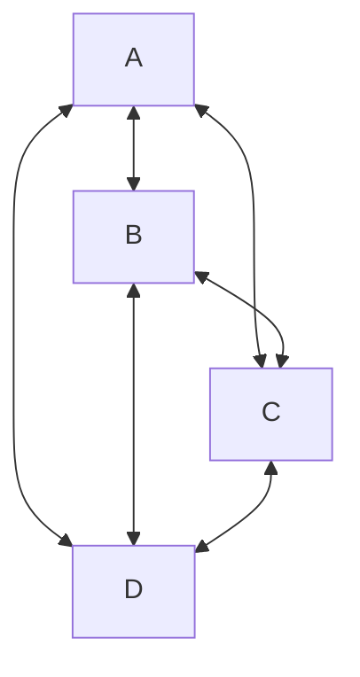
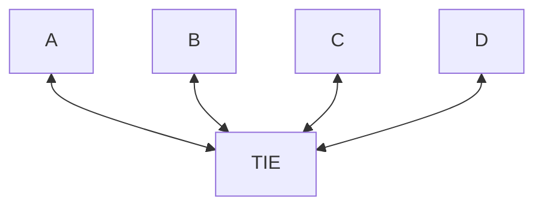

## Patient Safety Benefits

### Elimination of Transcription Errors

- Removes handwritten order issues that plague traditional pathology requesting
- Ensures standardized, legible test requests reach the genomic laboratory hubs
- Reduces wrong-patient identification errors through automated validation

### Clinical Decision Support

- Automated checking of test appropriateness against National Genomic Test Directory eligibility criteria
- Ensures correct clinical indication codes (R-codes) are captured
- Validates that all required clinical information is present before submission

### Enhanced Patient Matching

- Gen-HIE integration enables PDS (Personal Demographics Service) lookup for verification
- Supports complex patient identifier scenarios (Scotland CHI numbers, Northern Ireland H&SC numbers)
- Adds gender, DOB, and postcode for robust matching across trust boundaries

### Workflow Efficiency Improvements Faster Order Processing

- Direct electronic routing from EPR systems (Liverpool Women's, Alder Hey, MFT) through Gen-Tie to regional genomic laboratory hubs
- Eliminates manual paper-based workflows and fax transmissions
- Real-time order tracking and status visibility

### Standardized Message Transformation

- Gen-Tie handles HL7 v2 to FHIR R4 transformation automatically
- Ensures consistent data quality regardless of source EPR system
- Manages different message formats between trusts (Liverpool Women's vs Alder Hey variations)

### Regional Integration

- RIE (Regional Integration Engine) provides centralized routing for multiple trusts
- Supports out-of-region ordering (~10% orders from Scotland, NI, Wales, Midlands)
- Enables seamless connectivity via HSCN infrastructure

### Data Quality and Governance Complete Clinical Context

- Captures comprehensive family history and phenotype information required for variant interpretation
- Ensures appropriate consent documentation accompanies orders
- Maintains full audit trail of ordering decisions for DCB0160 compliance

### Interoperability

- FHIR-based Gen-HIE repository enables nationwide record discovery through National Record Locator integration
- Supports cascade testing coordination across multiple trusts
- Facilitates result sharing back to referring clinicians via multiple channels (HODS, direct EPR integration)

### Diagnostic Accuracy Appropriate Test Selection

- Integration with genomic test directory ensures correct gene panels selected
- Reduces inappropriate test requests through built-in eligibility checking
- Supports complex ordering scenarios requiring specialist genomic input

### Result Integration

- Results flow automatically back through RIE → Gen-HIE → EPR systems
- Genomic findings accessible at point of care across the region
- Supports clinical decision-making with timely access to test results

The Gen-Tie/Gen-HIE architecture you've implemented effectively bridges the gap between traditional EPR systems and specialized genomic medicine services, bringing computerized provider order entry (CPOE) benefits specifically to the complex world of genomic testing.

## Understanding the Role of a Regional Integration Engine (RIE)

Imagine you have many people who all need to talk to each other

If every person had to call every other person directly, it would get messy fast:

- Everyone needs everyone else’s phone number
- Every time someone changes their phone or language, all callers must adjust
- The number of connections grows extremely quickly

This is what happens when hospital systems try to connect directly to many lab systems, services, and external partners.

The RIE works like a switchboard operator

Instead of everyone calling everyone:

- Each system only needs one connection: to the TIE.
- The TIE listens, understands, and passes messages to the correct destination.
- If one system speaks a different “language,” the RIE or RIE translates.

So instead of:



You get:



How this makes scaling easier

1. Fewer connections to manage

Every new system only needs to connect to the TIE—not to every other system.

2. Changes don’t break everything

If one system updates its format or introduces a new ID field, the TIE handles it.
No other systems need to change.

3. Standardisation happens in one place

The TIE ensures that messages follow the right format, so each system can send messages the way it knows how.

4. It becomes easier to add new services

Want to add a new lab, test type, or clinical system?

Plug it into the TIE once, and it can talk to everybody immediately.

5. Better monitoring and reliability

The TIE can:

retry failed messages

alert when something breaks

queue messages during downtime

This makes the whole network more resilient.

## Understanding the Role of a Central Clinical Data Repository

Let’s extend the earlier analogy.

We already said the TIE is like a switchboard operator that connects different hospital and lab systems so they don’t all need to talk directly to each other.

Now we add:

**A Central Clinical Data Repository**

Think of this as a shared library where copies of important messages and results are stored so everyone can reference them later.

### How it fits into the workflow

1. Systems still send messages to each other through the TIE

For example:

- A hospital sends a test order
- A lab sends back the results

The TIE routes these messages between the right systems.

2. At the same time, the TIE also sends a copy to the clinical data repository

So while it passes the message along, it also files a copy in the “shared library.”

This means:

```mermaid
graph TD; 
    EPR[Clinical System] --> TIE; 
    TIE --> LIMS[Lab System];
    TIE --> CDR["Clinical Data Repository (copy stored)"]

    LIMS --> TIE
    TIE --> EPR
    TIE --> CDR
 ```

Why this helps
1. Centralised patient history

Because every message is copied into the repository, it becomes a single source of truth for clinical events:

- orders
- results
- updates
- corrections

2. Systems don’t need to store everything

Individual systems don’t need to keep full long-term histories—they can rely on the shared repository.

3. Easier data access for new tools

Analytics teams, research tools, dashboards, and population health systems can read from one place, not dozens of separate systems.

4. Reduced duplication

Instead of every system creating its own version of patient data, the repository ensures consistency.

5. Future systems plug in more easily

Any new system that needs to use data doesn’t need to talk to all hospitals and labs.
It can simply read from the repository.

Putting it all together (simple view)

### Without TIE + Repository

- Many systems talk directly to many others
- No shared view of patient data
- Hard to add new systems
- Hard to maintain consistency

### With TIE + Repository

- TIE handles all system-to-system communication
- Repository stores all relevant clinical messages
- Every system has one connection (to TIE or to the repo)
- New systems can access the data easily
- Data becomes more complete and reliable


