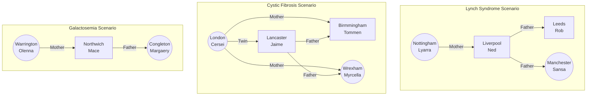

## Development Testing 

### FHIR Validation

For details see [FHIR Validation](https://hl7.org/fhir/R4/validation.html)

### Command Line Validation

See [Using the FHIR Validator](https://confluence.hl7.org/display/FHIR/Using+the+FHIR+Validator)

The FHIR Validator works best with individual FHIR Resources and this may be an easier why to start checking your FHIR is correct.
Due to API security requirements of the NHS England Ontology Service, this can not be used as a Terminology Server (the `-tx` parameter). This ig is configured to use the UK edition of SNOMED (83821000000107).

To use this Implementation Guide with the HL7 Validator, you will need to download this as a package (download link [package.tgz](package.tgz)) and then specify this NPM package file via the `-ig package.tgz` parameter.

The FHIR Validator defaults to validating individual FHIR resources (not FHIR Bundles), to validate FHIR resources in a Bundle see **Validating a single resource in a bundle** on the *Using the FHIR Validator* link above.

#### Examples to Validate a Bundle

##### laboratory-order O21 Validation Example

```aiignore
 java -jar validator_cli.jar c:\temp\bundle.json -version 4.0.1 -ig package.tgz -bundle ServiceRequest:0 https://fhir.nwgenomics.nhs.uk/StructureDefinition/ServiceRequest -tx n/a
```

##### unsolicited-observation R01 Validation Example

```aiignore
 java -jar validator_cli.jar c:\temp\bundle.json -version 4.0.1 -ig package.tgz -bundle DiagnosticReport:0 https://fhir.nwgenomics.nhs.uk/StructureDefinition/DiagnosticReport -tx n/a
```

### Asking a FHIR Server

[validator.fhir.org](https://validator.fhir.org/) provides a web-based interface to the Validator CLI jar. This defaults to international FHIR and the options tab can be used to specify specific packages and SNOMED editions (this is listed as `UK - 999000041000000102`). This IG is not currently published to the registry and so `ukcore` should be used instead using the latest release


## Integration Testing 

### Test Patients

All test patients (with a NHS Number) are on NHS England [Personal Demographics Service - FHIR API](https://digital.nhs.uk/developer/api-catalogue/personal-demographics-service-fhir) (Int environment).

The ODS code for GP Surgery MUST be a real code, this is used for routing reports to relevant ICS.

#### NHS North West Genomics Test Patients

EXAMPLE REMOVED - TODO PUT BACK IN

In HL7 [Lab Results Interface (LRI)](https://confluence.hl7.org/download/attachments/25559919/2018%2004%2003%20-%20V2%20LRI%20-%20Ch.%205%20CG%20and%20Code%20System%20Tables.pdf?api=v2), the Gene Variant examples are mapped to the following test patients:

- Example Gene Variant 1 Galactosemia (Not a UK Test Code) - 9737383281 Margaery CONGLETON
  - [HL7 v2 MDM_T02](https://github.com/nw-gmsa/Testing/blob/main/Outpyt/V2/TO2/MDM_T02_LRI-GeneVariant-1.txt)
  - [PDF Laboratory Report](https://github.com/nw-gmsa/Testing/blob/main/Output/PDF/R01/LRI-GeneVariant-1.txt.pdf)
  - **PROOF OF CONCEPT** [HL7 v2 ORU_R01 LRI](https://github.com/nw-gmsa/Testing/blob/main/Output/V2/R01/LRI-GeneVariant-1.txt)
  - **PROOF OF CONCEPT** [HL7 FHIR Message R01 Genomic Reporting](https://github.com/nw-gmsa/Testing/blob/main/Output/FHIR/R01/LRI-GeneVariant-1.txt.json)
- Example Gene Variant 2 Cystic Fibrosis (R185) - 9737383214 Jamie LANCASTER
  - [HL7 v2 MDM_T02](https://github.com/nw-gmsa/Testing/blob/main/Outpyt/V2/TO2/MDM_T02_LRI-GeneVariant-2.txt)
  - [PDF Laboratory Report](https://github.com/nw-gmsa/Testing/blob/main/Output/PDF/R01/LRI-GeneVariant-2.txt.pdf)
  - **PROOF OF CONCEPT** [HL7 v2 ORU_R01 LRI](https://github.com/nw-gmsa/Testing/blob/main/Output/V2/R01/LRI-GeneVariant-2.txt)
  - **PROOF OF CONCEPT** [HL7 FHIR Message R01 Genomic Reporting](https://github.com/nw-gmsa/Testing/blob/main/Output/FHIR/R01/LRI-GeneVariant-2.txt.json)
- Example Gene Variant 3 Lynch Syndrome (R210) - 9737383206 Ned LIVERPOOL
  - [HL7 v2 MDM_T02](https://github.com/nw-gmsa/Testing/blob/main/Outpyt/V2/TO2/MDM_T02_LRI-GeneVariant-3.txt)
  - [PDF Laboratory Report](https://github.com/nw-gmsa/Testing/blob/main/Output/PDF/R01/LRI-GeneVariant-3.txt.pdf)
  - **PROOF OF CONCEPT** [HL7 v2 ORU_R01 LRI](https://github.com/nw-gmsa/Testing/blob/main/Output/V2/R01/LRI-GeneVariant-3.txt)
  - **PROOF OF CONCEPT** [HL7 FHIR Message R01 Genomic Reporting](https://github.com/nw-gmsa/Testing/blob/main/Output/FHIR/R01/LRI-GeneVariant-3.txt.json)
- Example 4 Infantile Epilepsy (R59)- 9737383346 Ygritte HAWES
  - [HL7 v2 MDM_T02](https://github.com/nw-gmsa/Testing/blob/main/Outpyt/V2/TO2/MDM_T02_LRI-GeneVariant-4.txt)
  - [PDF Laboratory Report](https://github.com/nw-gmsa/Testing/blob/main/Output/PDF/R01/LRI-GeneVariant-4.txt.pdf)
  - **PROOF OF CONCEPT** [HL7 v2 ORU_R01 LRI](https://github.com/nw-gmsa/Testing/blob/main/Output/V2/R01/LRI-GeneVariant-4.txt)
  - **PROOF OF CONCEPT** [HL7 FHIR Message R01 Genomic Reporting](https://github.com/nw-gmsa/Testing/blob/main/Output/FHIR/R01/LRI-GeneVariant-4.txt.json)
- Example 5 Learning Disability (R377) - 9737383346 Hodor TAMESIDE
  - [HL7 v2 MDM_T02](https://github.com/nw-gmsa/Testing/blob/main/Outpyt/V2/TO2/MDM_T02_LRI-GeneVariant-5.txt)
  - [PDF Laboratory Report](https://github.com/nw-gmsa/Testing/blob/main/Output/PDF/R01/LRI-GeneVariant-5.txt.pdf)
  - **PROOF OF CONCEPT** [HL7 v2 ORU_R01 LRI](https://github.com/nw-gmsa/Testing/blob/main/Outpyt/V2/R01/LRI-GeneVariant-5.txt)
  - **PROOF OF CONCEPT** [HL7 FHIR Message R01 Genomic Reporting](https://github.com/nw-gmsa/Testing/blob/main/Output/FHIR/R01/LRI-GeneVariant-5.txt.json)



### NHS England EDI  Test Patients

These patients are created in the NHS England Test Data Repository (TDR) and were used for previous national programmes (from HSCIC and NHS Digital)

| NHS Number                                                      | Surname                                       | Forename | Middle name | Gender | Date Of Birth <br/> (SMSP) | Deceased | GP Surgery <br/> ODS Code                                                           | Address line 1        | Address line 2 | Address line 3 | Address line 4 <br/> city | Address line 5 <br/> district | Postcode |
|-----------------------------------------------------------------|-----------------------------------------------|----------|-------------|--------|----------------------------|----------|-------------------------------------------------------------------------------------|-----------------------|----------------|----------------|---------------------------|-------------------------------|----------|
| [999 999 9468](Patient-9999999468.html)                         | EDITESTPATIENT                                | ONE      | John        | M      | 1925-01-27                 |          | D82015                                                                              |                       |                |                |                           |                               | B6 5RQ   |
| [999 999 9476](Patient-9999999476.html)	                        | EDITESTPATIENT                                | TWO      |             | M (F)  | 1962-02-01 (1964-02-29)    |          | B85023                                                                              |                       |                |                |                           |                               | EX6 7JJ  |
| [999 999 9484](Patient-9999999484.html)	                        | EDITESTPATIENT                                | THREE    | ZOE         | M (F)  | 2007-05-05  (1978-07-19)   |          | -                                                                                   |                       |                |                |                           |                               | EX2 5SE  |
| [999 999 9492](Patient-9999999492.html)	                        | EDITESTPATIENT                                | FOUR     |             | M      | 1933-03-03 (1911-02-12)    |          | B85023                                                                              |                       |                |                |                           |                               | EX1 2SS  |
| [999 999 9506](Patient-9999999506.html)	                        | EDITESTPATIENT                                | FIVE     | LESLIE      | M      | 1990-10-19                 |          |                                                                                     |                       |                |                |                           |                               | LL1 1EQ  |
| [999 999 9514](Patient-9999999514.html)	                        | EDITESTPATIENT                                | SIX      |             | M      | 1988-01-14 (1960-06-24)    |          |                                                                                     |                       |                |                |                           |                               | CV35 8DU |
| [999 999 9522](Patient-9999999522.html)	                        | EDITESTPATIENT                                | SEVEN    |             | M      | 2007-05-05 (1945-01-01)    |          |                                                                                     |                       |                |                |                           |                               | EX2 5SE  |
| [999 999 9530](Patient-9999999530.html)	                        | EDITESTPATIENT                                | EIGHT    |             | M      | 1985-12-01 (1972-03-12)    |          |                                                                                     |                       |                |                |                           |                               | Retest T |
| [999 999 9549](Patient-9999999549.html)	                        | EDITESTPATIENT                                | NINE     |             | F      | 2002-02-02 (1950-11-13)    |          | B85023                                                                              |                       |                |                |                           |                               | EX1 2SS  |
| [999 999 9557](Patient-9999999557.html)	                        | EDITESTPATIENT                                | TEN      |             | F      | 1980-01-01 (1960-03-22)    |          |                                                                                     |                       |                |                |                           |                               | RG12 9AX |
| [999 999 9565](Patient-9999999565.html)	                        | EDITESTPATIENT                                | ELEVEN   |             | F      | 2008-05-05 (1930-04-14)    |          |                                                                                     |                       |                |                |                           |                               | BD16 1QB |
| [999 999 9573](Patient-9999999573.html)	                        | EDITESTPATIENT                                | TWELVE   |             | F (M)  | 1963-05-05 (1964-01-01)    |          |                                                                                     |                       |                |                |                           |                               | EX1 2SS  |
| [999 999 9581](Patient-9999999581.html)	                        | EDITESTPATIENT                                | THIRTEEN |             | F      | 1960-01-01 (1930-05-14)    |          | B85023                                                                              |                       |                |                |                           |                               | EX2 5SE  |
| [999 999 9603](Patient-9999999603.html)	                        | EDITESTPATIENT                                | FOURTEEN |             | M (F)  | 1984-11-06 (1939-07-05)    |          | B85023                                                                              |                       |                |                |                           |                               | ub4 0db  |
{:.grid}

## Environments

The APIs are available on the [Health and Social Care Network (HSCN)](https://digital.nhs.uk/services/health-and-social-care-network)


| Environment         | Service                                                                                  | Base Url                                                                         | Capability Statement 'OAS'                                                                                                  |
|---------------------|------------------------------------------------------------------------------------------|----------------------------------------------------------------------------------|-----------------------------------------------------------------------------------------------------------------------------|
| Development         |                                                                                          |                                                                                  |                                                                                                                             |
|                     | Genomics Regional Integration Engine (RIE)                                               | https://gen-tie-dev.nwgenomics.nhs.uk/gentiedev/ESB                              | See [Placer Order Management [LAB-1]](LAB-1.html) and [CapabilityStatement](https://10.165.194.216/gentiedev/ESB/metadata)  |
|                     | Genomics Regional Health Information Exchange (IHE) <br/> Genomics Clinical Data Repository (CDR) | https://gen-tie-dev.nwgenomics.nhs.uk/irishealth/csp/healthshare/clinicaldatarepository/fhir/r4 | See [Query Existing Data [PCC-44]](PCC-44.html)                                                                             |
| Integration Testing |                                                                                          |                                                                                  |                                                                                                                             |
|                     | Genomics Regional Integration Engine (RIE)                                                        | https://gen-tie-test.nwgenomics.nhs.uk/gentietest/ESB                            | See [Placer Order Management [LAB-1]](LAB-1.html) and [CapabilityStatement](https://10.165.194.217/gentietest/ESB/metadata) |
|                     | Genomics Regional OAuth2 Server                                                                   | https://gen-tie-test.nwgenomics.nhs.uk/gentietest/oauth2                                        |                                                                                                                             | 
{:.grid}

### Security and authorisation

This API has two access modes:

- Development - unrestricted access 
- Integration Testing - OAuth2 [client-credentials](https://www.oauth.com/oauth2-servers/access-tokens/client-credentials/)
