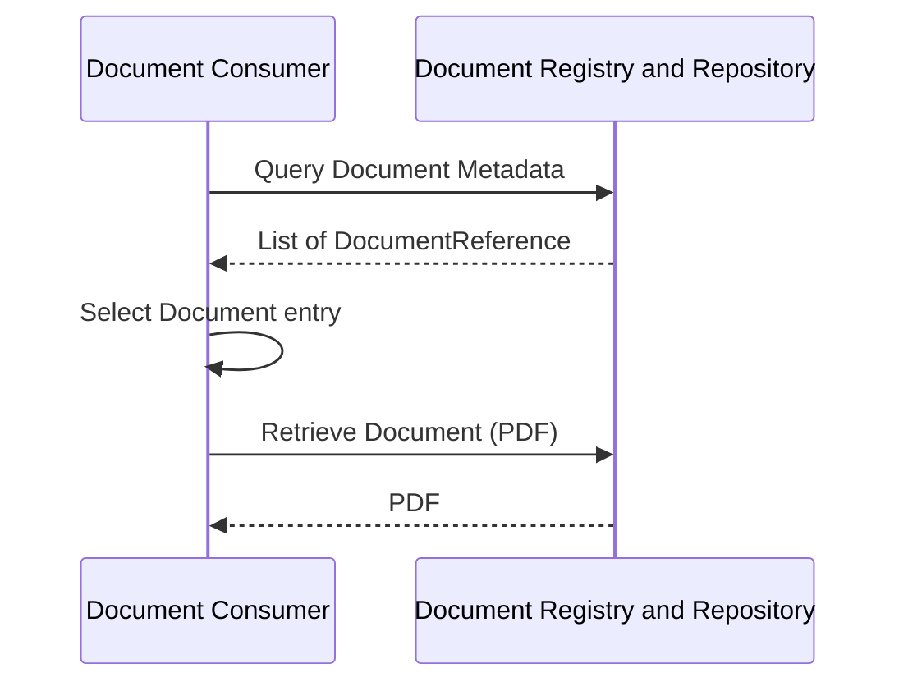
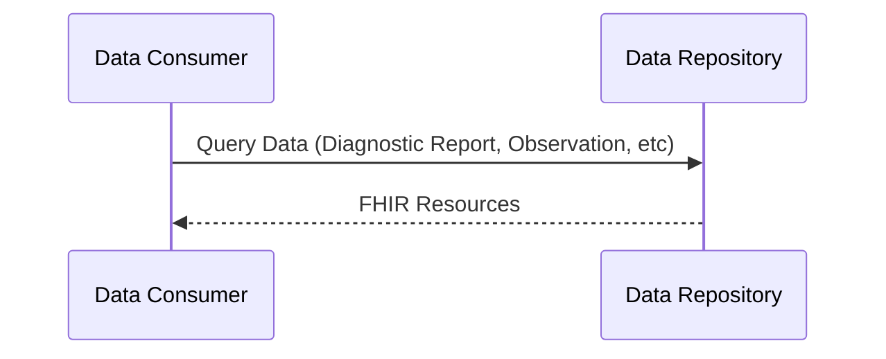
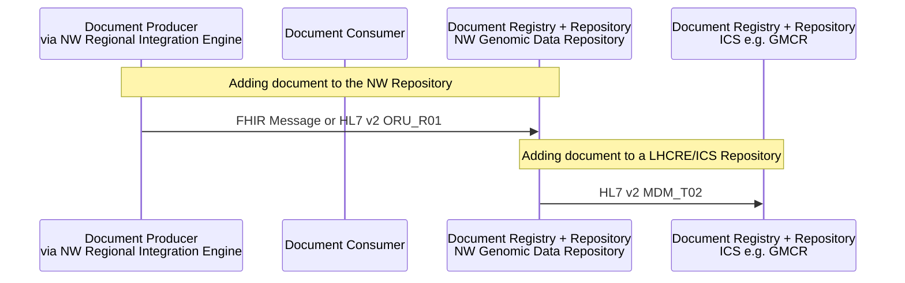
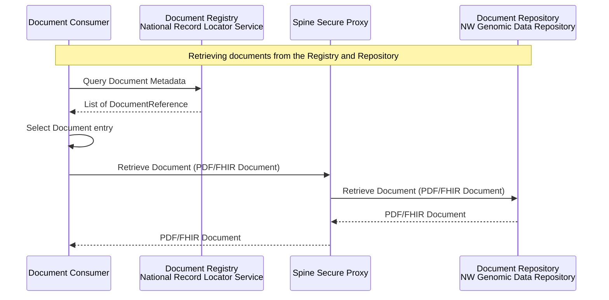
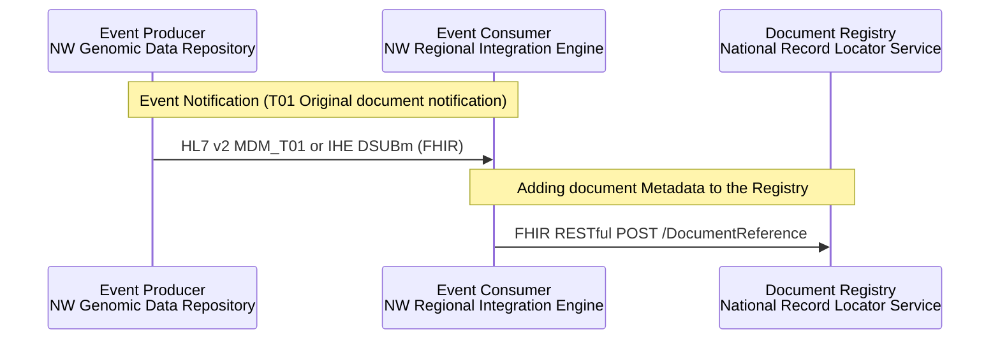
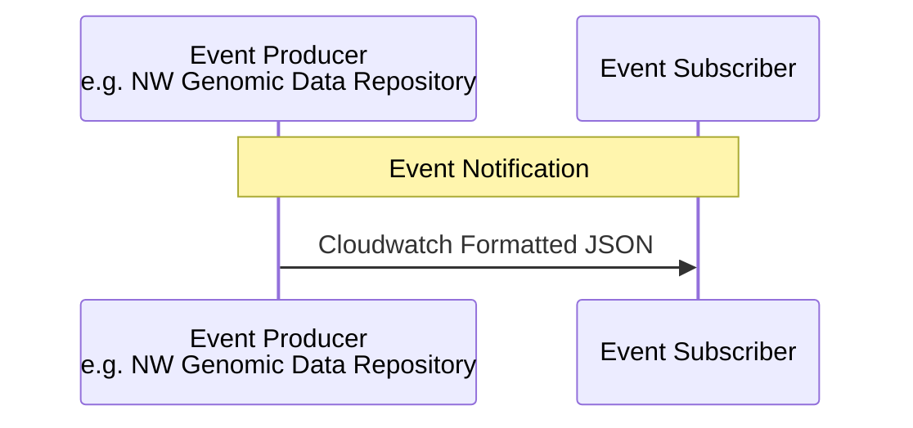

## Local/Regional Genomic Reports

Allows a consumer to retrieve genomic reports either as data or as an unstructured (PDF) document.

### Query Genomic Report - Documents (PDF)

Pattern: FHIR RESTful + IHE [Mobile access to Health Documents (MHD)](https://profiles.ihe.net/ITI/MHD/index.html) 

### Query Genomic Reports - Data

Pattern: FHIR RESTful + IHE [Query for Existing Data for Mobile (QEDm)](https://profiles.ihe.net/PCC/QEDm/index.html) also following [HL7 Genomic Report](https://build.fhir.org/ig/HL7/genomics-reporting/)

### Adding Genomic Report Documents to the Regional and LHCRE/ICS Repositories

Within NW Genomics the report is first shared with the NW Genomic Data Repository (most often this is in HL7 v2 ORU_R01 format, this is the most common format for laboratory reports in the NHS).
For document sharing within an ICS/LHCRE e.g. Greater Manchester Care Record (GMCR), this report is then converted to HL7 v2 MDM_T02 format and sent to the LHCRE/ICS Repository.

Examples:

- [HL7 v2 ORU_R01](https://github.com/nw-gmsa/Testing/blob/main/Input/V2/R01/ORU_R01_R125.1_R0A.txt)
- Conversion of this message to [HL7 v2 MDM_T02](https://github.com/nw-gmsa/Testing/blob/main/Output/V2/T02/MDM_T02_ORU_R01_R125.1_R0A.txt)

See also England national variation [Structured/Unstructured Documents + Events](#structuredunstructured-documents--events)

## National Genomic Reports

### ### Query Genomic Report - Nationaal Record Locator Service (NRL)

Pattern: FHIR RESTful + IHE [Mobile Health Document Sharing](https://profiles.ihe.net/ITI/MHDS/index.html) - this is essentially the same as [Query Genomic Report - Documents (PDF)](#query-genomic-report---documents-pdf), but the registry is now a separate service.

Initially, the report would be in PDF format, but this is likely to change to FHIR Document format (probably [HL7 Europe Laboratory Report](https://build.fhir.org/ig/hl7-eu/laboratory/en/index.html) combined with [HL7 Genomic Report](https://build.fhir.org/ig/HL7/genomics-reporting/)). A FHIR Document, like the previous Clinical Document Architecture (CDA) gives a document consumer the option of using an HTML representation of the report and/or a structured version. 
Note: Unified Genomic Registry (UGR) has not decided on a specific option yet. FHIR Document is expected to be the NHS England Single Patient Record preferred option as work to support this is already present in [NHS England Pathology](https://simplifier.net/guide/pathology-fhir-implementation-guide)

### Event Notifications and Adding Genomic Report Document Metadata to National Record Locator Service (NRL)

This is very similar to the [Adding Genomic Report Documents to the Repositories](#adding-genomic-report-documents-to-the-regional-and-lhcreics-repositories), this time the MDM_T02 message is converted to an **Event Notification** and then converted to a RESTful interaction.

Pattern: FHIR RESTful + IHE [Document Subscription for Mobile (DSUBm)](https://profiles.ihe.net/ITI/DSUBm/index.html)

Note NHS England is also support Event Notifications via the [Multicast Notification Service API](https://digital.nhs.uk/developer/api-catalogue/multicast-notification-service)

## Security Considerations

For local this would be using an OAuth2 Authorisation flow - see [Authorisation (OAuth2,)](authorisation.html)
In addition, all queries would be audited e.g. follow IHE [Basic Audit Log Patterns (BALP)](https://profiles.ihe.net/ITI/BALP/index.html)
