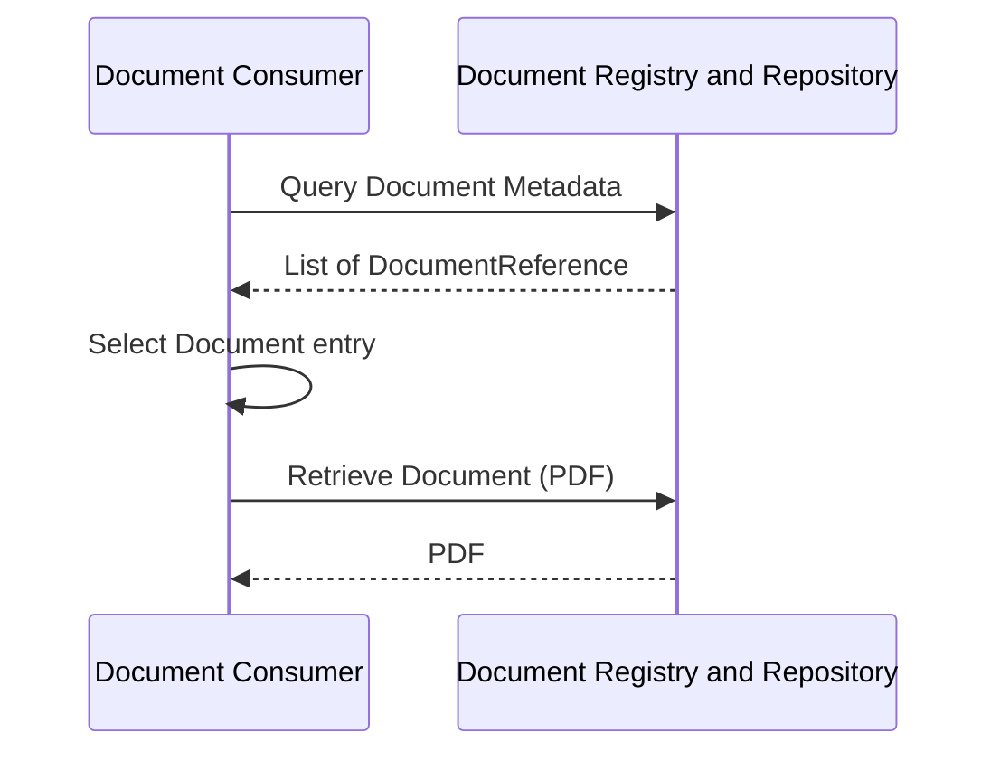
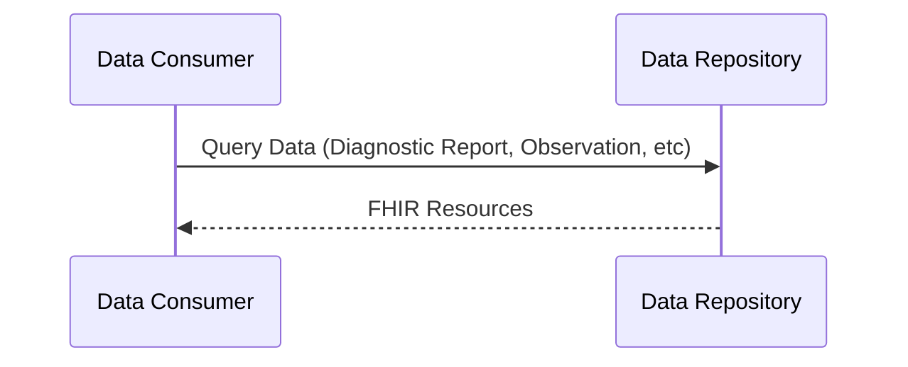
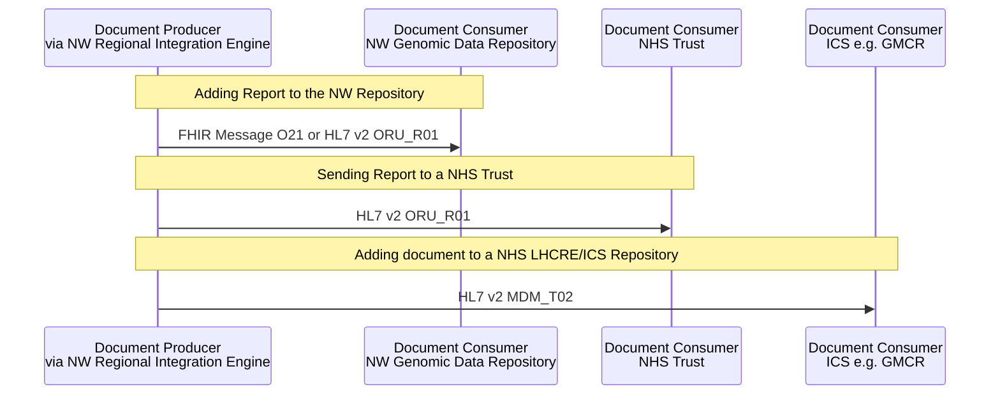
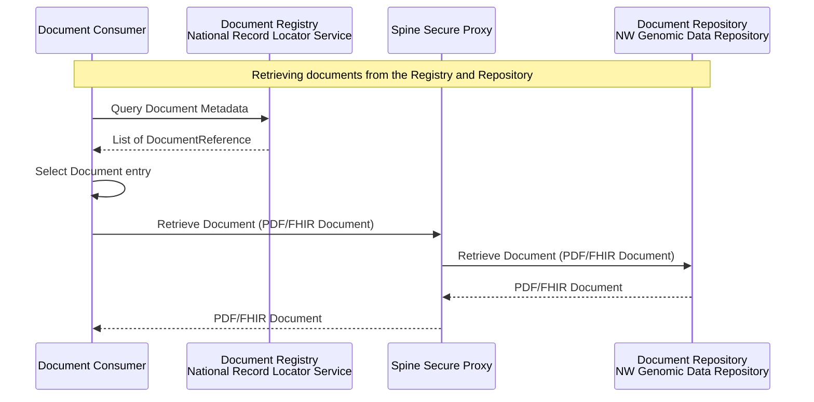
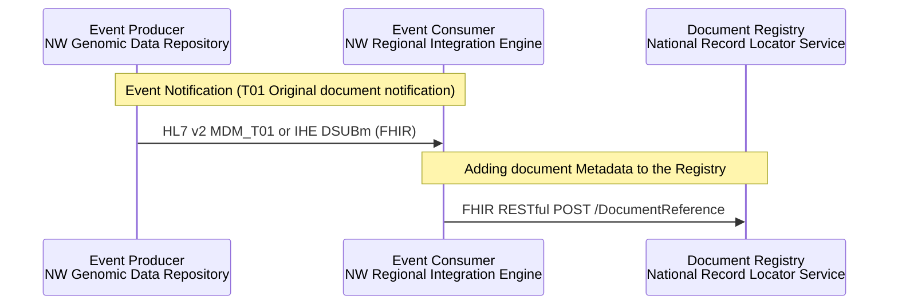
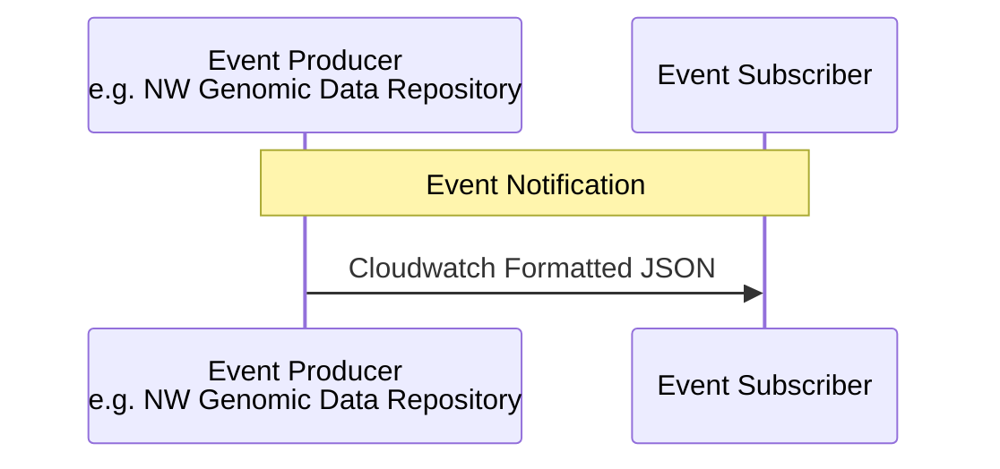

This section describes how genomic reports can be queried, retrieved, and distributed across regional and national systems. Reports may be available either as:

- Unstructured documents (typically PDF)
- Structured data using FHIR resources

The implementation patterns rely on FHIR RESTful APIs combined with HL7 v2 Events+Messages and IHE interoperability profiles.

## Local/Regional Genomic Reports

Local or regional systems allow consumers to retrieve genomic reports from the NW Genomic Data Repository or regional care records (for example ICS/LHCRE repositories).

Reports can be accessed either as documents (PDF) or as structured data.

### Query Genomic Report - Documents (PDF)

<b>Pattern:</b> <a href="https://profiles.ihe.net/ITI/MHD/index.html" _target="_blank">IHE Mobile access to Health Documents (MHD)</a> 

This approach allows a consumer to:

- Query available document metadata
- Select a document
- Retrieve the document content (typically a PDF)

### Query Genomic Reports - Data

<b>Pattern:</b> <a href="https://profiles.ihe.net/PCC/QEDm/index.html" _target="_blank">IHE Query for Existing Data for Mobile (QEDm)</a> 

Also following [HL7 Genomic Report](https://build.fhir.org/ig/HL7/genomics-reporting/)

Typical resources returned include:

- DiagnosticReport
- Observation
- Specimen
- ServiceRequest
- supporting genomic profiles (Diganotic Implication and Variants)

### Sending and Adding Genomic Report Documents to NHS Trusts, Regional and LHCRE/ICS Repositories

Within NW Genomics, reports are initially shared with the NW Genomic Data Repository.

<b>Pattern:</b> <a href="TLW.html" _target="_blank">IHE Laboratory Testing Workflow (LTW) [LAB-3]</a> for ORU_R01 

 

 
<b>Pattern:</b> <a href="https://profiles.ihe.net/ITI/MHD/ITI-105.html" _target="_blank">IHE MHD = Simplified Publish [ITI-105]</a> for MDM_T02 

The most common inbound format is:

- HL7 v2 ORU_R01

This format is widely used within the NHS for laboratory results reporting.

For document sharing within **Integrated Care Systems (ICS)** or **LHCRE platforms** (e.g. Greater Manchester Care Record), the report is converted to:

- HL7 v2 MDM_T02

This message type is used for clinical document distribution

Examples:

- [HL7 v2 ORU_R01](https://github.com/nw-gmsa/Testing/blob/main/Input/V2/R01/ORU_R01_R125.1_R0A.txt)
- Converted to [HL7 v2 MDM_T02](https://github.com/nw-gmsa/Testing/blob/main/Output/V2/T02/MDM_T02_ORU_R01_R125.1_R0A.txt)

## Future? National Diagnostic Reports

This is a collection of notes from a variety of sources - a current situation report. It does not represent a final decision.

At the national level, laboratory, genomics and imaging reports could be discoverable via the National Record Locator (NRL).
The NRL stores document metadata only, while the documents themselves remain within the originating repositories.

### Sending and Adding Diagnotic Report Documents to General Practice

Both the HL7 v2 ORU_R01 and HL7 v2 MDM_T02 messages are used in secondary, ICS and regional integrations. For integrations with General Practice these patterns are also followed with several variations including:

- Kettering XML using MESH (this is related to HL7 v2 MDM_T02)
- [GP Connect Send Document (FHIR STU3)](https://digital.nhs.uk/developer/api-catalogue/gp-connect-send-document-fhir) using MESH (this is related to HL7 v2 MDM_T02)
- NHS England Pathology API's including EDIFACT, ASTM and FHIR Document using MESH. Note HL7 v2 ORU_R01 is also supported by primary care systems.

Note: On a practical level, the majority of these interactions start in HL7 v2 ORU_R01 format and are converted to GP formats within Order Comms software.

### Query Diagnostic Report - Nationaal Record Locator Service (NRL)

<b>Pattern:</b> <a href="https://profiles.ihe.net/ITI/MHDS/index.html" _target="_blank">IHE Mobile Health Document Sharing (MHDS)</a> 

This is essentially the same as [Query Genomic Report - Documents (PDF)](#query-genomic-report---documents-pdf), but the registry is now a separate service.

This pattern is similar to the regional document query pattern but introduces a separate registry service.
The registry provides document metadata and indicates where the document can be retrieved.

Initially, genomic reports are expected to be shared as PDF documents.

#### Clinical Document Architecture (CDA) and FHIR Document

<b>Pattern:</b> <a href="https://wiki.ihe.net/index.php/Sharing_Laboratory_Reports" _target="_blank">IHE Sharing Laboratory Reports (XD-LAB)</a> 

However, this is likely to evolve toward FHIR Document format, which enables both:

- human-readable rendering (HTML)
- structured machine-readable content

FHIR Documents provide similar capabilities to **Clinical Document Architecture (CDA)**, but use FHIR resources.

Possible future standards include:

- [HL7 Europe Laboratory Report](https://build.fhir.org/ig/hl7-eu/laboratory/en/index.html) and [NHS England Pathology FHIR Implementation Guide](https://simplifier.net/guide/pathology-fhir-implementation-guide)
- [HL7 Genomics Reporting](https://build.fhir.org/ig/HL7/genomics-reporting/)

FHIR Documents are also expected to align with the NHS England Single Patient Record strategy, as support already exists within the NHS England Pathology FHIR Implementation Guide.
Note: The Unified Genomic Registry (UGR) has not yet selected a final document format.

### Event Notifications and Adding Genomic Report Document Metadata to National Record Locator Service (NRL)

When a genomic report is generated, an event notification is produced so that document metadata can be registered with the NRL.
This process is similar to the regional document distribution flow.

The existing HL7 v2 MDM_T02 message is transformed into:

- an event notification e.g. HL7 v2 T01 or IHE DSUBm (FHIR)
- a FHIR REST interaction

<b>Pattern:</b> <a href="https://profiles.ihe.net/ITI/DSUBm/index.html" _target="_blank">IHE Document Subscription for Mobile (DSUBm)</a> 

NHS England also supports event notifications using the [Multicast Notification Service API](https://digital.nhs.uk/developer/api-catalogue/multicast-notification-service)
These notifications are delivered as CloudWatch-formatted JSON events.

## Security Considerations

Local and regional integrations typically use an OAuth2 authorization flow.

- [Authorisation (OAuth2)](authorisation.html)

All access to genomic reports should also be audited.

- Recommended approach: [IHE Basic Audit Log Patterns (BALP)](https://profiles.ihe.net/ITI/BALP/index.html)

Auditing should capture:

- user identity
- system identity
- patient identifier
- accessed resource
- timestamp
- purpose of use
